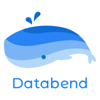

<div align="center">

<p align="center"></p>
<p align="center">A Modern Cloud Data Warehouse with the Elasticity and Performance both on Object Storage</p>
 
<h4 align="center">
  <a href="https://databend.rs/doc">Documentation</a>  |
  <a href="https://perf.databend.rs">Benchmarking</a>  |
  <a href="https://github.com/datafuselabs/databend/issues/4591">Roadmap(v0.8)</a>

</h4>

<div>
<a href="https://link.databend.rs/join-slack">

</a>

<a href="https://github.com/datafuselabs/databend/actions">

</a>


<a href="https://opensource.org/licenses/Apache-2.0">

</a>

</div>
</div>
<br>

- [What is Databend?](#what-is-databend)
- [Design Overview](#design-overview)
   - [Meta Service Layer](#meta-service-layer)
   - [Compute Layer](#compute-layer)
   - [Storage Layer](#storage-layer)
- [Getting Started](#getting-started)
- [Community](#community)
- [Roadmap](#roadmap)

## What is Databend?

Databend is an open-source **Elastic** and **Workload-Aware** modern cloud data warehouse.

Databend uses the latest techniques in vectorized query processing to allow you to do blazing-fast data analytics on object storage([S3](https://aws.amazon.com/s3/), [Azure Blob](https://azure.microsoft.com/en-us/services/storage/blobs/) or [MinIO](https://min.io)).

- __Instant Elasticity__

  Databend completely separates storage from compute, which allows you easily scale up or scale down based on your application's needs.

- __Blazing Performance__

  Databend leverages data-level parallelism(Vectorized Query Execution) and instruction-level parallelism(SIMD) technology, offering blazing performance data analytics.

- __Support for Semi-Structured Data__

  Databend supports [ingestion of semi-structured data](https://databend.rs/doc/load-data) in various formats like CSV, JSON, and Parquet, which are located in the cloud or your local file system; Databend also supports semi-structured data types: [ARRAY, MAP, JSON](https://databend.rs/doc/reference/data-types/data-type-semi-structured-types), which is easy to import and operate on semi-structured.

- __MySQL/ClickHouse Compatible__

  Databend is ANSI SQL compliant and MySQL/ClickHouse wire protocol compatible, making it easy to connect with existing tools([MySQL Client](https://databend.rs/doc/reference/api/mysql-handler), [ClickHouse Client](https://databend.rs/doc/reference/api/clickhouse-handler), [Vector](https://vector.dev/), [DBeaver](https://dbeaver.com/), [Jupyter](https://databend.rs/doc/integrations/gui-tool/jupyter), [JDBC](https://databend.rs/doc/develop), etc.).

- __Easy to Use__

  Databend has no indexes to build, no manual tuning required, no manual figuring out partitions or shard data, it’s all done for you as data is loaded into the table.
 
## Design Overview

This is the high-level architecture of Databend. It consists of three components:
- `meta service layer`
- `compute layer`
- `storage layer`


### Meta Service Layer

The meta service is a layer to service multiple tenants. This layer implements a persistent key-value store to store each tenant's state.
In the current implementation, the meta service has many components:

- Metadata, which manages all metadata of databases, tables, clusters, the transaction, etc.
- Administration, which stores user info, user management, access control information, usage statistics, etc.
- Security, which performs authorization and authentication to protect the privacy of users' data.

The code of `Meta Service Layer` mainly resides in the `metasrv` directory of the repository.

### Compute Layer

The compute layer is the layer that carries out computation for query processing. This layer may consist of many clusters,
and each cluster may consist of many nodes. Each node is a computing unit and is a collection of components:

- **Planner**

  The query planner builds an execution plan from the user's SQL statement and represents the query with different types of relational operators (such as `Projection`, `Filter`, `Limit`, etc.).

  For example:
  ```
  databend :) EXPLAIN SELECT avg(number) FROM numbers(100000) GROUP BY number % 3
  ┌─explain─────────────────────────────────────────────────────────────────────────────────────────────────────────────────────────────────────────────────────────────────────────────────┐
  │ Projection: avg(number):Float64                                                                                                                                                         │
  │   AggregatorFinal: groupBy=[[(number % 3)]], aggr=[[avg(number)]]                                                                                                                       │
  │     AggregatorPartial: groupBy=[[(number % 3)]], aggr=[[avg(number)]]                                                                                                                   │
  │       Expression: (number % 3):UInt8, number:UInt64 (Before GroupBy)                                                                                                                    │
  │         ReadDataSource: scan schema: [number:UInt64], statistics: [read_rows: 100000, read_bytes: 800000, partitions_scanned: 11, partitions_total: 11], push_downs: [projections: [0]] │
  └─────────────────────────────────────────────────────────────────────────────────────────────────────────────────────────────────────────────────────────────────────────────────────────┘
  ```

- **Optimizer**

  A rule-based optimizer, some rules like predicate push down or pruning of unused columns.

- **Processors**

  A Pull&Push-Based query execution pipeline, which is built by planner instructions.
  Each pipeline executor is a processor(such as `SourceTransform`, `FilterTransform`, etc.), it has zero or more inputs and zero or more outputs, and connected as a pipeline, it also can be distributed on multiple nodes judged by your query workload.

  For example:
  ```
  databend :) EXPLAIN PIPELINE SELECT avg(number) FROM numbers(100000) GROUP BY number % 3
  ┌─explain────────────────────────────────────────────────────────────────────────────────┐
  │ ProjectionTransform × 16 processors                                                    │
  │   Mixed (GroupByFinalTransform × 1 processor) to (ProjectionTransform × 16 processors) │
  │     GroupByFinalTransform × 1 processor                                                │
  │       Merge (GroupByPartialTransform × 16 processors) to (GroupByFinalTransform × 1)   │
  │         GroupByPartialTransform × 16 processors                                        │
  │           ExpressionTransform × 16 processors                                          │
  │             SourceTransform × 16 processors                                            │
  └────────────────────────────────────────────────────────────────────────────────────────┘
  ```

Node is the smallest unit of the compute layer. A set of nodes can be registered as one cluster via namespace.
Many clusters can attach the same database, so they can serve the query in parallel by different users.
When you add new nodes to a cluster, the currently running computational tasks can be scaled(known as work-stealing) guarantee.

The `Compute Layer` codes are mainly in the `query` directory.

### Storage Layer

Databend stores data in an efficient, columnar format as Parquet files.
Each Parquet file is sorted by the primary key before being written to the underlying shared storage.
For efficient pruning, Databend also creates indexes for each Parquet file:

- `min_max.idx` The index file stores the *minimum* and *maximum* value of this Parquet file.
- `sparse.idx` The index file store the <key, parquet-page> mapping for every [N] records granularity.

With the indexes, we can speed up the queries by reducing the I/O and CPU costs.
Imagine that Parquet file f1 has `min_max.idx` of `[3, 5)` and Parquet file f2 has `min_max.idx` of `[4, 6)` in column `x` if the query predicate is `WHERE x < 4`, only f1 needs to be accessed and processed.

## Getting Started

### Deployment

- [How to Deploy Databend With MinIO](https://databend.rs/doc/deploy/minio)
- [How to Deploy Databend With AWS S3](https://databend.rs/doc/deploy/s3)
- [How to Deploy Databend With Azure Blob Storage](https://databend.rs/doc/deploy/azure)
- [How to Deploy Databend With Wasabi Object Storage](https://databend.rs/doc/deploy/wasabi)
- [How to Deploy Databend With Scaleway OS](https://databend.rs/doc/deploy/scw)
- [How to Deploy Databend With Tencent COS](https://databend.rs/doc/deploy/cos)
- [How to Deploy Databend With Alibaba OSS](https://databend.rs/doc/deploy/oss)
- [How to Deploy Databend With QingCloud QingStore](https://databend.rs/doc/deploy/qingstore)
- [How to Deploy a Databend Local Cluster With MinIO](https://databend.rs/doc/deploy/local)
- [How to Deploy a Databend K8s Cluster With MinIO](https://databend.rs/doc/deploy/cluster-minio)
 
### Connect

- [How to Connect Databend With MySQL Client](https://databend.rs/doc/reference/api/mysql-handler)
- [How to Connect Databend With ClickHouse Client](https://databend.rs/doc/reference/api/clickhouse-handler)
- [How to Connect Databend With DBeaver SQL IDE](https://databend.rs/doc/integrations/gui-tool/dbeaver)
- [How to Execute Queries in Python](https://databend.rs/doc/develop/python)
- [How to Query Databend in Jupyter Notebooks](https://databend.rs/doc/integrations/gui-tool/jupyter)
- [How to Execute Queries in Golang](https://databend.rs/doc/develop/golang)
- [How to Work With Databend in Node.js](https://databend.rs/doc/develop/nodejs)


### Users

- [How to Create a User](https://databend.rs/doc/reference/sql/ddl/user/user-create-user)
- [How to Grant Privileges to a User](https://databend.rs/doc/reference/sql/ddl/user/grant-privileges)
- [How to Revoke Privileges From a User](https://databend.rs/doc/reference/sql/ddl/user/revoke-privileges)
- [How to Create a Role](https://databend.rs/doc/reference/sql/ddl/user/user-create-role)
- [How to Grant Privileges to a Role](https://databend.rs/doc/reference/sql/ddl/user/grant-privileges)
- [How to Grant Role to a User](https://databend.rs/doc/reference/sql/ddl/user/grant-role)
- [How to Revoke Role From a User](https://databend.rs/doc/reference/sql/ddl/user/revoke-role)
 
### Tables

- [How to Create a Database](https://databend.rs/doc/reference/sql/ddl/database/ddl-create-database)
- [How to Drop a Database](https://databend.rs/doc/reference/sql/ddl/database/ddl-drop-database)
- [How to Create a Table](https://databend.rs/doc/reference/sql/ddl/table/ddl-create-table)
- [How to Drop a Table](https://databend.rs/doc/reference/sql/ddl/table/ddl-drop-table)
- [How to Rename a Table](https://databend.rs/doc/reference/sql/ddl/table/ddl-rename-table)
- [How to Truncate a Table](https://databend.rs/doc/reference/sql/ddl/table/ddl-truncate-table)

### Views

- [How to Create a View](https://databend.rs/doc/reference/sql/ddl/view/ddl-create-view)
- [How to Drop a View](https://databend.rs/doc/reference/sql/ddl/view/ddl-drop-view)
- [How to Alter a View](https://databend.rs/doc/reference/sql/ddl/view/ddl-alter-view)
 
### Load Data

- [How to Load Data From Local File System](https://databend.rs/doc/load-data/local)
- [How to Load Data From Amazon S3](https://databend.rs/doc/load-data/s3)
- [How to Load Data From Databend Stages](https://databend.rs/doc/load-data/stage)
- [How to Load Data From MySQL](https://databend.rs/doc/load-data/mysql)

### Use Case

- [Analyzing Github Repository With Databend](https://databend.rs/doc/learn/analyze-github-repo-with-databend)
- [Analyzing Nginx Access Logs With Databend](https://databend.rs/doc/learn/analyze-nginx-logs-with-databend-and-vector)
- [User Retention Analysis With Databend](https://databend.rs/doc/learn/analyze-user-retention-with-databend)
- [Conversion Funnel Analysis With Databend](https://databend.rs/doc/learn/analyze-funnel-with-databend)

### Performance

- [How to Benchmark Databend](https://databend.rs/doc/learn/analyze-ontime-with-databend-on-ec2-and-s3)


## Community

For general help in using Databend, please refer to the official documentation. For additional help, you can use one of these channels to ask a question:

- [Slack](https://link.databend.rs/join-slack) (For live discussion with the Community)
- [Github](https://github.com/datafuselabs/databend) (Feature/Bug reports, Contributions)
- [Twitter](https://twitter.com/Datafuse_Labs) (Get the news fast)
- [Weekly](https://weekly.databend.rs/) (A weekly newsletter about Databend)
- [I'm feeling lucky](https://link.databend.rs/i-m-feeling-lucky) (Pick up a good first issue now!)

## Roadmap
- [Roadmap v0.8](https://github.com/datafuselabs/databend/issues/4591)
- [Roadmap 2022](https://github.com/datafuselabs/databend/issues/3706)

## License

Databend is licensed under [Apache 2.0](LICENSE).

## Acknowledgement

- Databend is inspired by [ClickHouse](https://github.com/clickhouse/clickhouse) and [Snowflake](https://docs.snowflake.com/en/user-guide/intro-key-concepts.html#snowflake-architecture), its computing model is based on [apache-arrow](https://arrow.apache.org/).
- The [documentation website](https://databend.rs) hosted by [Vercel](https://vercel.com/?utm_source=databend&utm_campaign=oss).
