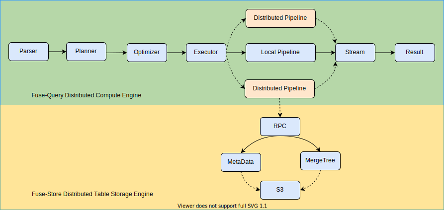

# FuseQuery
[](https://github.com/datafusedev/fuse-query/actions?query=workflow%3A%22FuseQuery+Lint%22)
[](https://github.com/datafusedev/fuse-query/actions?query=workflow%3A%22FuseQuery+Test%22)
[](https://github.com/datafusedev/fuse-query/actions?query=workflow%3A%22FuseQuery+Docker+build%22)
[](https://codecov.io/gh/datafusedev/fuse-query/branch/master)

[](https://opensource.org/licenses/AGPL-3.0)


FuseQuery is a Cloud Distributed SQL Query Engine at scale.

Distributed ClickHouse from scratch in Rust.

Give thanks to [ClickHouse](https://github.com/ClickHouse/ClickHouse) and [Arrow](https://github.com/apache/arrow).

## Features

* **High Performance** 
  - Everything is Parallelism
  
* **High Scalability**
  - Everything is Distributed
  
* **High Reliability**
  - True Separation of Storage and Compute

## Architecture



## Crates

| Crate     | Description |  Status |
|-----------|-------------|-------------|
| distributed | Distributed scheduler and executor for planner | WIP |
| [optimizers](src/optimizers) | Optimizer for Distributed&Local plan | WIP |
| [datablocks](src/datablocks) | Vectorized data processing unit | WIP |
| [datastreams](src/datastreams) | Async streaming iterators | WIP |
| [datasources](src/datasources) | Interface to the datasource([system.numbers for performance](src/datasources/system)/Fuse-Store) | WIP|
| [execturos](src/executors) | Executor([EXPLAIN](src/executors/executor_explain.rs)/[SELECT](src/executors/executor_select.rs)) for the Pipeline | WIP |
| [functions](src/functions) | Scalar and Aggregation Functions | WIP |
| [processors](src/processors) | Dataflow Streaming Processor| WIP |
| [planners](src/planners) | Distributed&Local planners for transforming to pipeline| WIP |
| [servers](src/servers) | Server handler([MySQL](src/servers/mysql)/HTTP) | MySQL |
| [transforms](src/transforms) | Data Stream Transform([Source](src/transforms/transform_source.rs)/[Filter](src/transforms/transform_filter.rs)/[Projection](src/transforms/transform_projection.rs)/[AggregatorPartial](src/transforms/transform_aggregate_partial.rs)/[AggregatorFinal](src/transforms/transform_aggregate_final.rs)/[Limit](src/transforms/transform_limit.rs)) | WIP |

## Status
#### SQL Support

- [x] Projection
- [x] Filter
- [x] Limit
- [x] Aggregate
- [x] Functions
- [x] Filter Push-Down
- [ ] Projection Push-Down
- [ ] Distributed Query
- [ ] Sorting
- [ ] Joins
- [ ] SubQueries


## Performance

* **Memory SIMD-Vector processing performance only**
* Dataset: 10,000,000,000 (10 Billion)
* Hardware: 8vCPUx16G Cloud Instance
* Rust: rustc 1.50.0-nightly (f76ecd066 2020-12-15)

|Query |FuseQuery Cost| ClickHouse Cost|
|-------------------------------|---------------| ----|
|SELECT avg(number) FROM system.numbers_mt | [2.02s] | [1.70s], 5.90 billion rows/s., 47.16 GB/s|
|SELECT sum(number) FROM system.numbers_mt | [1.77s] | [1.34s], 7.48 billion rows/s., 59.80 GB/s|
|SELECT max(number) FROM system.numbers_mt | [2.83s] | [2.33s], 4.34 billion rows/s., 34.74 GB/s|
|SELECT max(number+1) FROM system.numbers_mt | [6.13s] | [3.29s], 3.04 billion rows/s., 24.31 GB/s|
|SELECT count(number) FROM system.numbers_mt | [1.55s] | [0.67s], 15.00 billion rows/s., 119.99 GB/s|
|SELECT sum(number) / count(number) FROM system.numbers_mt | [2.04s] | [1.28s], 7.84 billion rows/s., 62.73 GB/s|
|SELECT sum(number) / count(number), max(number), min(number) FROM system.numbers_mt | [6.40s] | [4.30s], 2.33 billion rows/s., 18.61 GB/s|

Note:
* ClickHouse system.numbers_mt is <b>8-way</b> parallelism processing
* FuseQuery system.numbers_mt is <b>8-way</b> parallelism processing

## How to Run?

#### Fuse-Query Server

***Run from source***
```shell
$ make run

12:46:15 [ INFO] Options { log_level: "debug", num_cpus: 8, mysql_handler_port: 3307 }
12:46:15 [ INFO] Fuse-Query Cloud Compute Starts...
12:46:15 [ INFO] Usage: mysql -h127.0.0.1 -P3307
```

or ***Run with docker***(Recommended):

```shell
$ docker pull datafusedev/fuse-query
...

$ docker run --init --rm -p 3307:3307 datafusedev/fuse-query
05:12:36 [ INFO] Options { log_level: "debug", num_cpus: 6, mysql_handler_port: 3307 }
05:12:36 [ INFO] Fuse-Query Cloud Compute Starts...
05:12:36 [ INFO] Usage: mysql -h127.0.0.1 -P3307
```

#### Query with MySQL client

###### Connect

```shell
$ mysql -h127.0.0.1 -P3307
```

###### Explain

```shell
mysql> explain select (number+1) as c1, number/2 as c2 from system.numbers_mt(10000000) where (c1+c2+1) < 100 limit 3;
+-----------------------------------------------------------------------------------------------------------------------------------------------------------------------------------------------------------------------------------------------------------------------------------------------------------------------+
| explain                                                                                                                                                                                                                                                                                                               |
+-----------------------------------------------------------------------------------------------------------------------------------------------------------------------------------------------------------------------------------------------------------------------------------------------------------------------+
| └─ Limit: 3
  └─ Projection: (number + 1) as c1:UInt64, (number / 2) as c2:UInt64
    └─ Filter: (((c1 + c2) + 1) < 100)
      └─ ReadDataSource: scan parts [8](Read from system.numbers_mt table)                                                                                                                   |
| 
  └─ LimitTransform × 1 processor
    └─ Merge (LimitTransform × 8 processors) to (MergeProcessor × 1)
      └─ LimitTransform × 8 processors
        └─ ProjectionTransform × 8 processors
          └─ FilterTransform × 8 processors
            └─ SourceTransform × 8 processors                                |
+-----------------------------------------------------------------------------------------------------------------------------------------------------------------------------------------------------------------------------------------------------------------------------------------------------------------------+
2 rows in set (0.00 sec)
```

###### Select

```shell
mysql> select (number+1) as c1, number/2 as c2 from system.numbers_mt(10000000) where (c1+c2+1) < 100 limit 3;
+------+------+
| c1   | c2   |
+------+------+
|    1 |    0 |
|    2 |    0 |
|    3 |    1 |
+------+------+
3 rows in set (0.06 sec)
```

## How to Test?

```shell
$ make test
```
