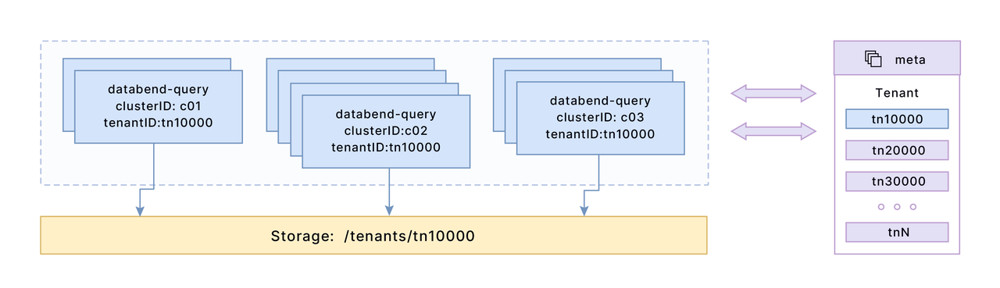

## Databend Node Types

In a Databend deployment, two types of nodes are utilized: Meta and Query.

The Meta node is responsible for storing and managing various types of metadata. This includes information related to databases, tables, and clusters. Additionally, the Meta node handles user information, such as authorization and authentication. It serves as a central repository for managing and organizing metadata and user-related data.

On the other hand, the Query node is dedicated to processing queries. It is responsible for executing user queries, retrieving data from the underlying storage, and returning the results to the user. The Query node handles the computational aspect of Databend, ensuring efficient and accurate query processing.

Please note that, when we mention "nodes," it refers to individual servers that host and run specific components of the Databend system. Each node, such as a Meta node or a Query node, usually serves a distinct purpose in processing data and executing queries.

## Deployment Modes

Databend deployment provides two modes: standalone and cluster, each with different application scenarios and node configurations. 

### Standalone Deployment

In standalone mode, a standard configuration consists of a single Meta node and a single Query node. This minimal setup is suitable for testing purposes or small-scale deployments. However, it is important to note that standalone mode is not recommended for production environments due to its limited scalability and the absence of high availability features.

In a Standalone Databend Deployment, it is possible to host both the Meta and Query nodes on a single server. The following topics in the documentation assist you in setting up and deploying a standalone Databend:

- [Deploying a Standalone Databend](02-deploying-databend.md)
- [Local and Docker Deployments](05-deploying-local.md)

### Cluster Deployment

Cluster mode is designed for larger-scale deployments and provides enhanced capabilities. In a Databend cluster, it is recommended to have a minimum of three Meta nodes, forming a Meta cluster to ensure high availability and fault tolerance. For production purposes, Databend recommends having a Meta cluster consisting of three to five Meta nodes.

In a Databend cluster, multiple Query nodes can be deployed, and it is possible to create a more powerful Query cluster by grouping specific Query nodes together (using Cluster IDs) for different query performance requirements. A Databend cluster has the capacity to accommodate multiple Query clusters. By default, Databend leverages computational concurrency to its maximum potential, allowing a single SQL query to utilize all available CPU cores within a single Query node. However, when utilizing a Query cluster, Databend takes advantage of concurrent scheduling and executes computations across the entire cluster. This approach maximizes system performance and provides enhanced computational capabilities.

#### Query Cluster Size

Databend does not have a specific best practice or recommended number of nodes for a Query cluster. The number of nodes in a Query cluster can vary based on your specific requirements and workload.

The primary goal of a Query cluster is to ensure that the query processing speed meets your needs and provides optimal performance. The number of nodes in the cluster can be adjusted accordingly to achieve the desired query performance and throughput.

#### Tenant Management

A tenant refers to an entity or organization that utilizes the services or resources provided by a system. In Databend, a tenant is associated with a unique tenant ID, which serves as an identifier to differentiate and manage their data, users, and resources within Databend. 

In the case of a query cluster, when a SQL request is received by a query node, the computational workload is efficiently distributed among query nodes that share the same tenant ID and cluster ID. Please note that query nodes with the same tenant ID but different cluster IDs provide a mechanism for workload isolation while still sharing the same data and user lists.

## Deployment Environments

This topic provides information on the recommended hardware specifications for Databend nodes and the supported object storage platforms.

### Hardware Recommendations

Databend nodes can be deployed either on-premises servers or in the cloud. Databend is compatible with various public cloud platforms, such as Amazon EC2, Azure VMs, Tencent Cloud, and Alibaba Cloud. The table below outlines the recommended hardware specifications for servers running Databend nodes:

| Hardware Specification  	| Standalone Mode  	| Cluster Mode (Meta Node) 	| Cluster Mode (Query Node) 	|
|-------------------------	|------------------	|--------------------------	|---------------------------	|
| CPU                     	| 16-cores or above	| 4-cores or above         	| 16-cores or above          	|
| Memory                  	| 32 GB or above   	| 16 GB or above           	| 32 GB or above            	|
| Hard Disk (SSD)         	| 200-600 GB       	| 100-200 GB               	| 100-200 GB                	|
| Network Interface Card  	| 10 Gbps or above 	| 10 Gbps or above         	| 10 Gbps or above          	|

### Supported Object Storage

Databend supports for self-hosted and cloud object storage solutions. Prepare your own object storage before deploying Databend. The following is a list of supported object storage solutions:

- Amazon S3
- Azure Blob Storage
- Google Cloud Storage
- MinIO
- Ceph
- Wasabi
- SeaweedFS
- Cloudflare R2
- Tencent COS
- Alibaba OSS
- QingCloud QingStor
