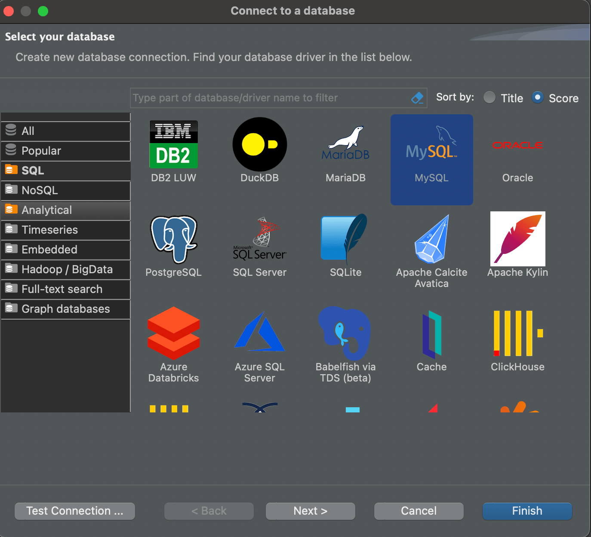
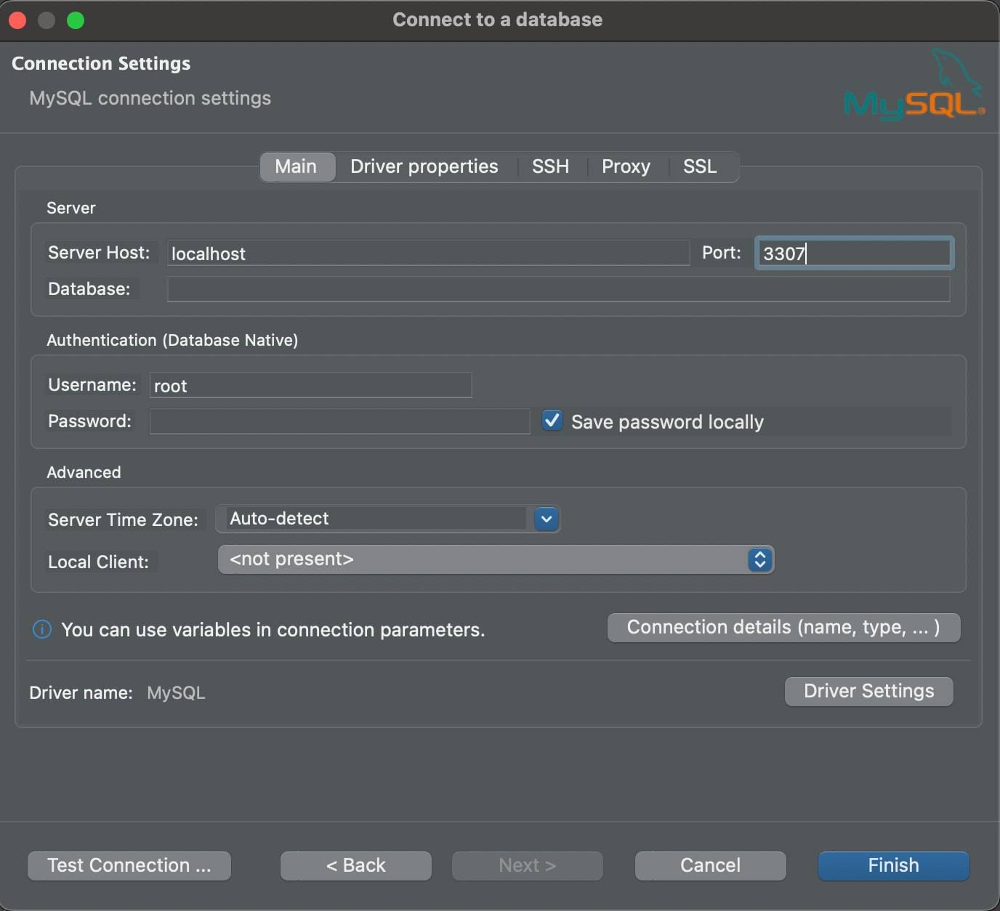
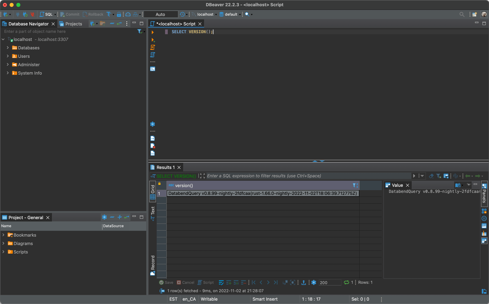

To evaluate Databend and get some hands-on experience, you can deploy Databend locally and use the file system as storage if you don't have object storage yet. This topic explains how to deploy Databend on MacOS and connect Databend from a MySQL client.

:::note
Object storage is required for production. Use the file system only for evaluation, testing, and other non-production purposes.
:::

## Before You Begin

Make sure you have installed a MySQL client on your Mac. This topic uses DBeaver to connect to Databend. To download and install DBeaver, refer to https://dbeaver.com/2022/02/17/how-to-download-and-install-dbeaver/.

## Download Databend

1. Go to https://databend.rs/download and download the installation package for your platform.

    If you're using a Mac with an Apple Silicon CPU, select the package named `databend-<version>-nightly-aarch64-apple-darwin.tar.gz`.

2. Extract the installation package to a local directory.

## Start Databend

1. Open a terminal and navigate to the folder where the extracted files and folders are stored.

2. Run the script `start.sh` in the folder `scripts`:

```shell
./scripts/start.sh
```

Your Mac might prompt an error saying "*databend-meta can't be opened because Apple cannot check it for malicious software.*". To proceed, open **System Settings** on your Mac, select **Privacy & Security** on the left menu, and click **Open Anyway** for databend-meta in the **Security** section on the right side. Do the same for the warning on databend-query.

3. Run the following command to verify Databend has been started successfully:

```shell
ps aux | grep databend

---
eric             12789   0.0  0.0 408495808   1040 s003  U+    2:16pm   0:00.00 grep databend
eric             12781   0.0  0.5 408790416  38896 s003  S     2:15pm   0:00.05 bin/databend-query --config-file=configs/databend-query.toml
eric             12776   0.0  0.3 408654368  24848 s003  S     2:15pm   0:00.06 bin/databend-meta --config-file=configs/databend-meta.toml
```

## Connect to Databend

1. Open DBeaver on your Mac, and select **Database** > **New Database Connection** in the top menu.

2. In the database connection wizard, select **MySQL**, then click **Next**.



3. Set `Port` to `3307`, then click **Finish**.



4. Query the Databend version to verify the connection:

