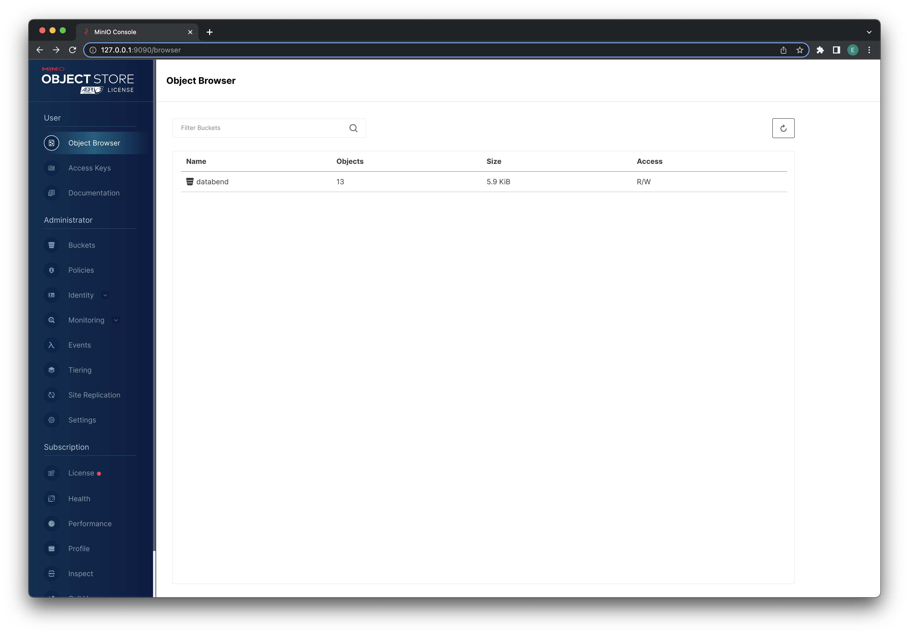

To assess Databend and gain practical expertise, you have two deployment choices. You can opt for a local deployment and use the file system as storage if object storage is unavailable. Alternatively, you can deploy Databend along with [MinIO](https://min.io/) on Docker for a containerized setup.

:::note non-production use only
- Object storage is a requirement for production use of Databend. The file system should only be used for evaluation, testing, and non-production scenarios. 

- It is not recommended to deploy Databend on top of MinIO for production environments or performance testing purposes.
:::

## Deploying a local Databend

The following steps will guide you through the process of locally deploying Databend.

### Step 1. Downloading Databend

1. Go to https://databend.rs/download and download the installation package for your platform.

2. Extract the installation package to a local directory.

### Step 2. Starting Databend

1. Open a terminal and navigate to the folder where the extracted files and folders are stored.

2. Run the script **start.sh** in the folder **scripts**:

    MacOS might prompt an error saying "*databend-meta can't be opened because Apple cannot check it for malicious software.*". To proceed, open **System Settings** on your Mac, select **Privacy & Security** on the left menu, and click **Open Anyway** for databend-meta in the **Security** section on the right side. Do the same for the error on databend-query.

```shell
./scripts/start.sh
```

:::tip
In case you encounter the subsequent error messages while attempting to start Databend:

```shell
==> query.log <==
: No getcpu support: percpu_arena:percpu
: option background_thread currently supports pthread only
Databend Query start failure, cause: Code: 1104, Text = failed to create appender: Os { code: 13, kind: PermissionDenied, message: "Permission denied" }.
```
Run the following commands and try starting Databend again:

```shell
sudo mkdir /var/log/databend
sudo mkdir /var/lib/databend
sudo chown -R $USER /var/log/databend
sudo chown -R $USER /var/lib/databend
```
:::

3. Run the following command to verify Databend has started successfully:

```shell
ps aux | grep databend

---
eric             12789   0.0  0.0 408495808   1040 s003  U+    2:16pm   0:00.00 grep databend
eric             12781   0.0  0.5 408790416  38896 s003  S     2:15pm   0:00.05 bin/databend-query --config-file=configs/databend-query.toml
eric             12776   0.0  0.3 408654368  24848 s003  S     2:15pm   0:00.06 bin/databend-meta --config-file=configs/databend-meta.toml
```

### Step 3. Connecting to Databend

To establish a connection with Databend, you'll use the BendSQL CLI tool in this step. For instructions on how to install and operate BendSQL, see [BendSQL](../11-integrations/30-access-tool/01-bendsql.md).

1. To establish a connection with a local Databend, execute the following command:

```shell
(base) eric@Erics-iMac ~ % bendsql
Connected to Databend on Host: localhost
Version: DatabendQuery v1.1.3-nightly-f9a0c3e5025e95d121acde426181d0d675475821(rust-1.70.0-nightly-2023-04-16T16:35:59.085130000Z)
```

2. Query the Databend version to verify the connection:

```shell
(base) eric@Erics-iMac ~ % bendsql query
Connected with driver databend (DatabendQuery v1.1.3-nightly-f9a0c3e5025e95d121acde426181d0d675475821(rust-1.70.0-nightly-2023-04-16T16:35:59.085130000Z))
Type "help" for help.

dd:root@localhost/default=> SELECT VERSION();
+---------------------------------------------------------------------------------------------------------------------------+
|                                                         version()                                                         |
+---------------------------------------------------------------------------------------------------------------------------+
| DatabendQuery v1.1.3-nightly-f9a0c3e5025e95d121acde426181d0d675475821(rust-1.70.0-nightly-2023-04-16T16:35:59.085130000Z) |
+---------------------------------------------------------------------------------------------------------------------------+
(1 row)
```

## Deploying Databend on Docker

To deploy Databend along with [MinIO](https://min.io/) on Docker, please follow the steps outlined below. Prior to starting, ensure that you have Docker installed on your system.

### Step 1. Deploying MinIO

1. Pull and run the MinIO image as a container with the following command:

```shell
mkdir -p ${HOME}/minio/data

docker run \
   -p 9000:9000 \
   -p 9090:9090 \
   --user $(id -u):$(id -g) \
   --name minio1 \
   -e "MINIO_ROOT_USER=ROOTUSER" \
   -e "MINIO_ROOT_PASSWORD=CHANGEME123" \
   -v ${HOME}/minio/data:/data \
   quay.io/minio/minio server /data --console-address ":9090"
```
Please be aware that the command above also sets the root user credentials (ROOTUSER/CHANGEME123) which you will need to provide for authentication in the next steps. If you make changes to the root user credentials at this point, ensure that you maintain consistency throughout the entire process.

You can confirm that the MinIO container has started successfully by checking for the following message in the terminal:

```shell
Unable to find image 'quay.io/minio/minio:latest' locally
latest: Pulling from minio/minio
68c8102008d3: Pull complete 
be9f9df177bb: Pull complete 
3af46996e2ef: Pull complete 
c8b0b68d12b4: Pull complete 
4273a1648411: Pull complete 
2fd0bc041cb4: Pull complete 
Digest: sha256:ab5296018bfca75d45f451e050f6c79c6e8b9927bbc444274a74123ea7921021
Status: Downloaded newer image for quay.io/minio/minio:latest
Formatting 1st pool, 1 set(s), 1 drives per set.
WARNING: Host local has more than 0 drives of set. A host failure will result in data becoming unavailable.
MinIO Object Storage Server
Copyright: 2015-2023 MinIO, Inc.
License: GNU AGPLv3 <https://www.gnu.org/licenses/agpl-3.0.html>
Version: RELEASE.2023-04-13T03-08-07Z (go1.20.3 linux/arm64)

Status:         1 Online, 0 Offline. 
API: http://172.17.0.2:9000  http://127.0.0.1:9000 
Console: http://172.17.0.2:9090 http://127.0.0.1:9090 

Documentation: https://min.io/docs/minio/linux/index.html
Warning: The standard parity is set to 0. This can lead to data loss.
```

2. Open your web browser and visit http://127.0.0.1:9090/ (login credentials: ROOTUSER/CHANGEME123). Create a bucket named **databend**.

### Step 2. Deploying Databend

Pull and run the Databend image as a container with the following command:

```shell
docker run \
    -p 8000:8000 \
    -p 3307:3307 \
    -e QUERY_DEFAULT_USER=databend \
    -e QUERY_DEFAULT_PASSWORD=databend \
    -e QUERY_STORAGE_TYPE=s3 \
    -e AWS_S3_ENDPOINT=http://172.17.0.2:9000 \
    -e AWS_S3_BUCKET=databend \
    -e AWS_ACCESS_KEY_ID=ROOTUSER \
    -e AWS_SECRET_ACCESS_KEY=CHANGEME123 \
    datafuselabs/databend
```

Please be aware that the command above also creates a SQL user (databend/databend) which you will need to use to connect to Databend in the next step. If you make changes to the SQL user at this point, ensure that you maintain consistency throughout the entire process.

### Step 3. Connecting to Databend

To establish a connection with Databend, you'll use the BendSQL CLI tool in this step. For instructions on how to install and operate BendSQL, see [BendSQL](../11-integrations/30-access-tool/01-bendsql.md).

1. To establish a connection with Databend using the SQL user (databend/databend), run the following command:

```shell
(base) eric@Erics-iMac Downloads % bendsql -u databend -p databend
Connected to Databend on Host: localhost
Version: DatabendQuery v1.0.26-nightly-d9b7f4a8080b54d2b4c4a515296ee7557fc135f1(rust-1.70.0-nightly-2023-03-21T04:39:27.097687988Z)
```

2. To verify the deployment, you can create a table and insert some data with BendSQL:

```shell
(base) eric@Erics-iMac Downloads % bendsql query
Connected with driver databend (DatabendQuery v1.0.26-nightly-d9b7f4a8080b54d2b4c4a515296ee7557fc135f1(rust-1.70.0-nightly-2023-03-21T04:39:27.097687988Z))
Type "help" for help.
dd:databend@localhost/default=> create database eric;
CREATE DATABASE
dd:databend@localhost/default=> CREATE TABLE mytable(a int);
CREATE TABLE
dd:databend@localhost/default=> INSERT INTO mytable VALUES(1);
INSERT
dd:databend@localhost/default=> INSERT INTO mytable VALUES(2);
INSERT
dd:databend@localhost/default=> INSERT INTO mytable VALUES(3);
INSERT
```

As the table data is stored in the bucket, you will notice an increase in the bucket size from 0.


