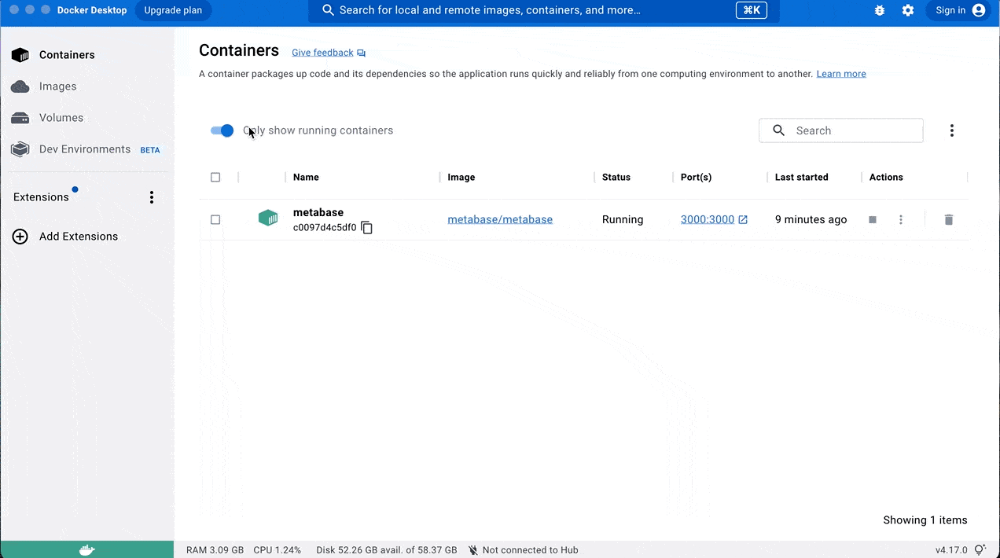
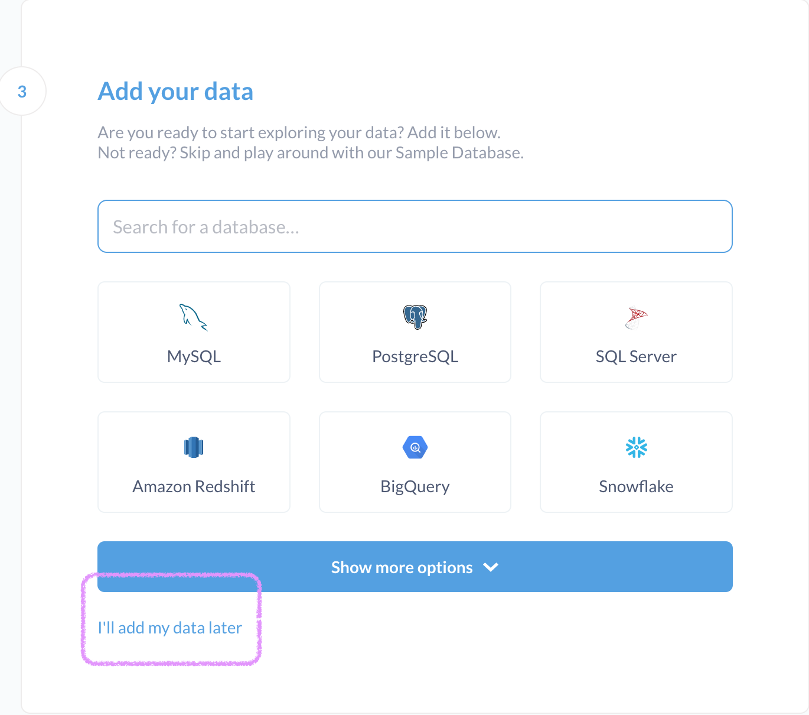
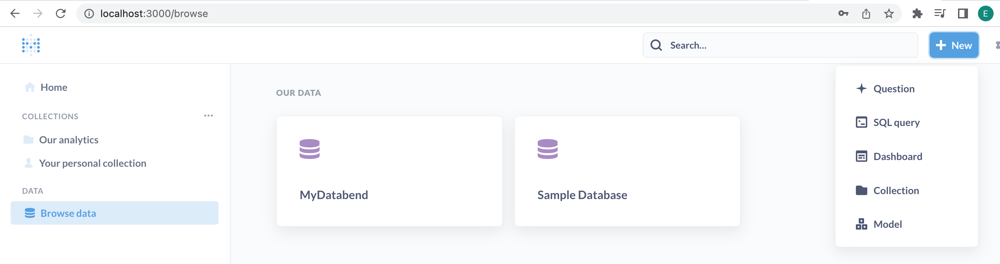

[Metabase](https://www.metabase.com/) is an open-source business intelligence platform. You can use Metabase to ask questions about your data, or embed Metabase in your app to let your customers explore their data on their own. Databend provides a JDBC driver named [Metabase Databend Driver](https://github.com/databendcloud/metabase-databend-driver/releases/latest), enabling you to connect to Metabase and dashboard your data in Databend. For more information about the Metabase Databend Driver, refer to https://github.com/databendcloud/metabase-databend-driver

## Downloading and Installing Metabase Databend Driver

To download and install the Metabase Databend Driver: 

1. Create a folder named **plugins** in the directory where the file **metabase.jar** is stored.

```bash
$ ls
metabase.jar
$ mkdir plugins
```
2. [Download](https://github.com/databendcloud/metabase-databend-driver/releases/latest) the Metabase Databend Driver, then save it in the **plugins** folder.

3. To start Metabase, run the following command:

```bash
java -jar metabase.jar
```

## Tutorial: Integrate with Metabase

The following tutorial shows you how to integrate Databend with Metabase through the Metabase Databend Driver. In this tutorial, you'll deploy a local Databend and install Metabase with Docker. Before you start, ensure that you have Docker installed.

### Step 1. Deploy Databend

Follow the [Deployment Guide](https://databend.rs/doc/deploy) to deploy a local Databend.

### Step 2. Deploy Metabase

The steps below describe how to install and deploy Metabase using Docker.

1. Pull the latest Docker image of Metabase from the Docker Hub registry.

```bash
docker pull metabase/metabase
```

2. Deploy Metabase.

```bash
docker run  -d -p 3000:3000 --name metabase metabase/metabase
```
3. [Download](https://github.com/databendcloud/metabase-databend-driver/releases/latest) the Metabase Databend Driver, then import it to the **plugins** folder of the Metabase container in Docker.



4. Restart the Metabase container.

### Step 3. Connect Databend to Metabase

1. Open your web browser, and go to http://localhost:3000/.

2. Complete the initial sign-up process. Select **I'll add my data later** in step 3.



3. On the Metabase homepage, select **Add your own data** to establish the connection to Databend:

  - Database type: `Databend`
  - Host: `host.docker.internal`
  - Port: `8000`
  - Username: `root`. No password is required if you log into a local instance of Databend with `root`.
  - Database: `default`

4. Click **Save changes**, then click **Exit admin**.

You're all set! You can now start creating a query against Databend and building a dashboard. For more information, please refer to the Metabase documentation: https://www.metabase.com/docs/latest/index.html

