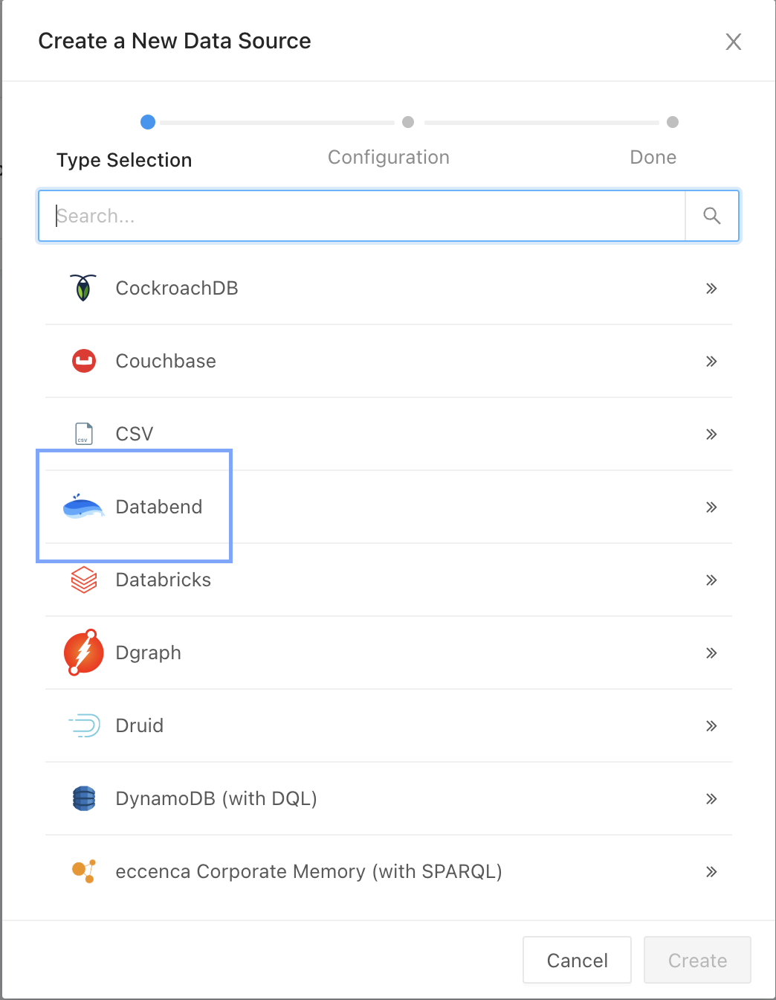
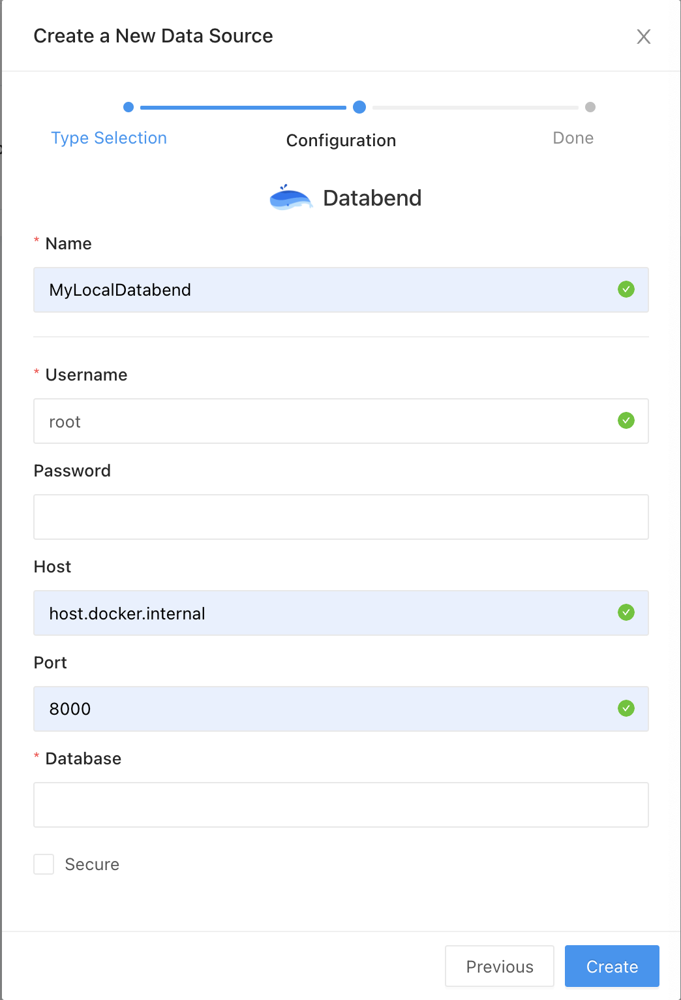

[Redash](https://redash.io/) is designed to enable anyone, regardless of the level of technical sophistication, to harness the power of data big and small. SQL users leverage Redash to explore, query, visualize, and share data from any data sources. Their work in turn enables anybody in their organization to use the data. Every day, millions of users at thousands of organizations around the world use Redash to develop insights and make data-driven decisions.

Databend offers integration with Redash as a data source. The following tutorial guides you through deploying and integrating Redash with Databend. 

## Tutorial: Integrate with Redash

In this tutorial, you'll deploy a local Databend and install Redash with Docker. Before you start, ensure that you have Docker installed.

### Step 1. Deploy Databend

Follow the [Deployment Guide](https://databend.rs/doc/deploy) to deploy a local Databend.

### Step 2. Deploy Redash

The steps below describe how to deploy Redash with Docker.

1. Clone the Redash repository first, and then create an .env file with the following commands:

```shell
git clone https://github.com/getredash/redash.git
cd redash
touch .env && echo REDASH_COOKIE_SECRET=111 > .env
```
2. Install dependencies and build the frontend project:

:::note
This requires Node.js version between 14.16.0 and 17.0.0. To install Node.js, for example, version 14.16.1:

```shell
# Install nvm
brew install nvm
export NVM_DIR="$([ -z "${XDG_CONFIG_HOME-}" ] && printf %s "${HOME}/.nvm" || printf %s "${XDG_CONFIG_HOME}/nvm")"
[ -s "$NVM_DIR/nvm.sh" ] && \. "$NVM_DIR/nvm.sh"
# Install and switch to Node.js 14.16.1
nvm install 14.16.1
nvm use 14.16.1
```
:::

```shell
cd viz-lib & yarn install
cd ..
yarn install 
yarn build
```

3. Build the server and initialize the database dependencies before starting Redash in Docker Compose:

```shell
docker-compose build server
docker-compose run --rm server create_db
```

4. Start Redash:

```shell
docker-compose up
```

### Step 3. Add Databend as a Data Source

1. Sign up for Redash by completing the initial process at http://localhost:5000 in your web browser.

2. Select `Databend` from the list on **Settings** > **New Data Source**.



3. Configure your Databend data source.

    - Username: `root`. No password is required if you log into a local instance of Databend with `root`.
    - Host: `host.docker.internal`
    - Port: `8000`
    - Database: `default`
    - Secure: Enable this option if you enabled HTTPS on your Databend server.



4. Click **Create**, then **Test Connection** to see check if the connection is successful.

You're all set! You can now write a query and add your visualizations. For more information, refer to the Redash Getting Started guide: https://redash.io/help/user-guide/getting-started#2-Write-A-Query