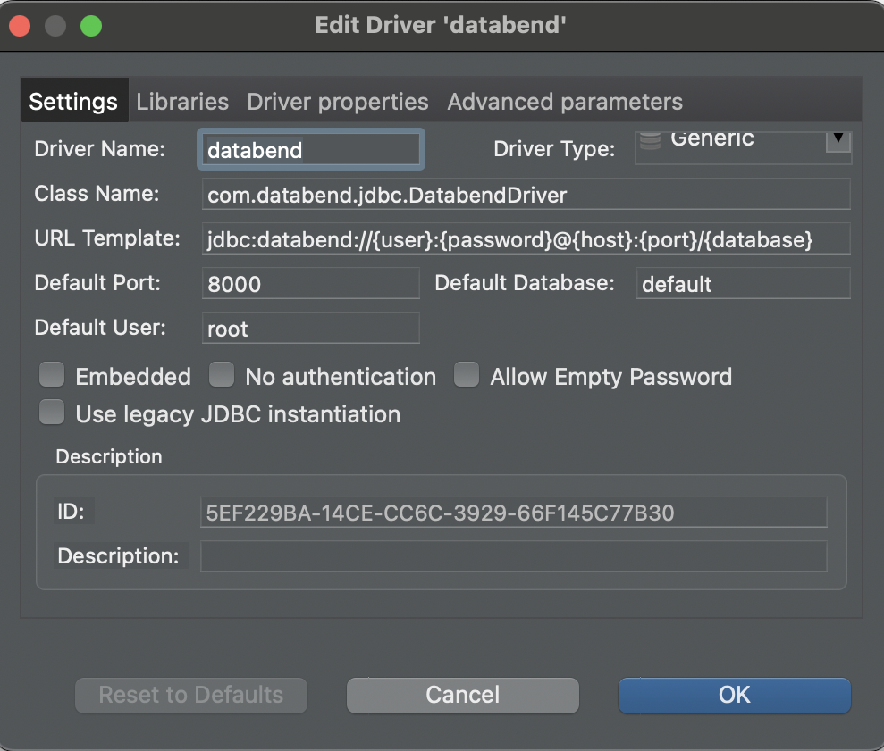
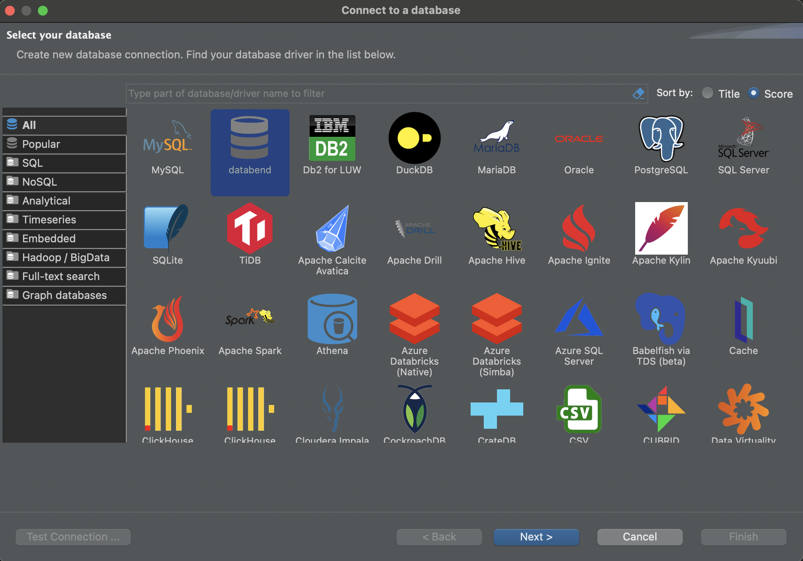
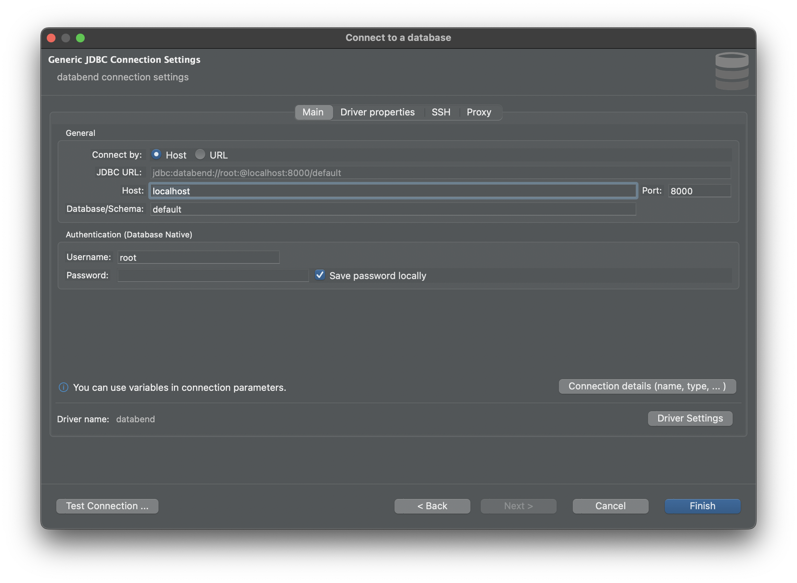

Databend provides a JDBC driver that enables connection to Databend from a client application, such as [DBeaver](https://dbeaver.com/). DBeaver comes with numerous pre-configured drivers for SQL, NoSQL, key-value databases, graph databases, search engines, and more. However, the Databend JDBC driver is not currently pre-configured in DBeaver, which means that you cannot locate and select Databend while creating a connection in the application. Nevertheless, you can manually add the driver to DBeaver, allowing you to establish a connection to Databend in the same way you would with a pre-configured database.

The following shows how to add the Databend JDBC driver to a client application and connect to Databend via the driver, using DBeaver as an example. For more information about the driver, refer to https://github.com/databendcloud/databend-jdbc

## Example: Connect from DBeaver with JDBC

To connect to Databend from DBeaver with the Databend JDBC driver, you need to add the driver to DBeaver's Driver Manager first, and then select the driver when you create a connection.

### Step 1. Add Databend JDBC Driver to DBeaver

1. In DBeaver, select **Database** > **Driver Manager** to open the Driver Manager, then click **New** to create a new driver.

2. On the **Settings** tab, enter the required information for the new driver as follows:

    - **Driver**: databend
    - **Driver Type**: Generic
    - **Class Name**: com.databend.jdbc.DatabendDriver
    - **URL Template**: jdbc:databend://{user}:{password}@{host}:{port}/{database}
    - **Default Port**: 8000
    - **Default User**: root



3. On the **Libraries** tab, click **Add Artifact**, then copy and paste the following to the **Dependency Declaration** textbox:

```java
<dependency>
    <groupId>com.databend</groupId>
    <artifactId>databend-jdbc</artifactId>
    <version>0.0.6</version>
</dependency>
```

4. Click **OK** to close the windows.

### Step 2. Create a Connection with Databend JDBC Driver

1. In DBeaver, search for and select `databend` on **Database** > **New Database Connection** first, and then click **Next**.



2. Set your connection settings. The default settings can connect to a local instance of Databend.



3. Click **Test Connection** to check if the connection is successful.