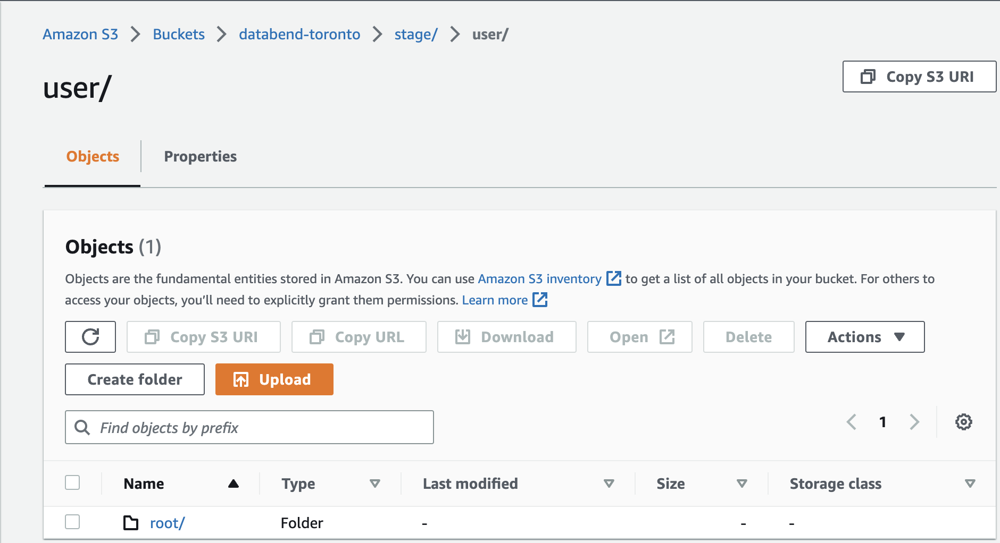
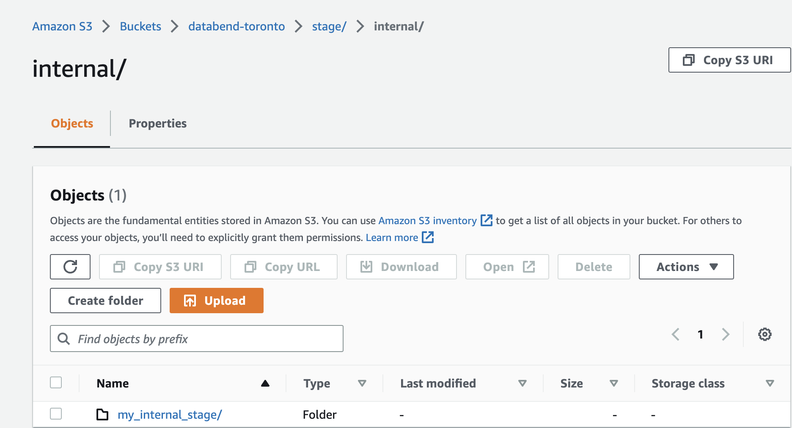

In Databend, a stage is a storage location where data files are stored before they are loaded into a table or exported to an external system. One of the benefits of using stages in Databend is that it simplifies data file management and access. By using stages, you can easily load data from staged files or unload data into a stage using provided tools and commands, without having to worry about their specific storage location. Moreover, Databend provides APIs and SQL commands that make it easy to manage files in a stage. 

Databend offers three different types of stages: User stage, Internal stage, and External stage.

### User Stage

In Databend, each user comes with a default stage called User Stage. When you store data files in the user stage, they are actually saved in your bucket on the object storage. For example, if your bucket on Amazon S3 is "databend-toronto" as configured below: 

```toml title='databend-query.toml'
...
# To use S3-compatible object storage, uncomment this block and set your values.
[storage.s3]
bucket = "databend-toronto"
...
```
The files saved in the user stage for each user can be found in the path as shown in the snapshot below. The *root* folder stores the files for the root user.



Please note the following when working with the user stage:

- The user stage is available out of the box. There is no need to create it before use, and you cannot change or drop it.
- Data files stored in your user stage are not accessible to other users.
- You cannot set format options for the user stage. Instead, you can set them in the COPY INTO command when you load data.

To reference the user stage, use `@~`. See the examples below:

```sql
-- List staged files in user stage
LIST @~;

-- Delete all files from user stage
REMOVE @~;
```

### Internal Stage

In Databend, an internal stage stores data files within the storage backend specified in databend-query.toml. For example, if your bucket on Amazon S3 is "databend-toronto" as configured below: 

```toml title='databend-query.toml'
...
# To use S3-compatible object storage, uncomment this block and set your values.
[storage.s3]
bucket = "databend-toronto"
...
```

The files saved in an internal stage can be found in the path as shown in the snapshot below. The *my_internal_stage/* folder stores the files for an internal stage named "my_internal_stage".



Unlike a user stage, which is automatically created for each user and cannot be modified, an internal stage can be created by the user and provides more control over data loading and access. Other users with appropriate privileges can access the staged data files in an internal stage and load them into tables.

### External Stage

An external stage in Databend stores data files outside of the storage backend specified in databend-query.toml. When you create an external stage using the [CREATE STAGE](../../14-sql-commands/00-ddl/40-stage/01-ddl-create-stage.md) command, you'll need to specify the stage location where the data files are stored. The data can be stored on cloud storage services such as AWS S3, and Google Cloud Storage.

One of the benefits of using external stages is that it enables sharing data files among multiple users who have access to the same external storage system. Additionally, you can use external stages to directly load data from files stored in an external storage system into Databend tables, or export Databend data into files that are stored in an external storage system.