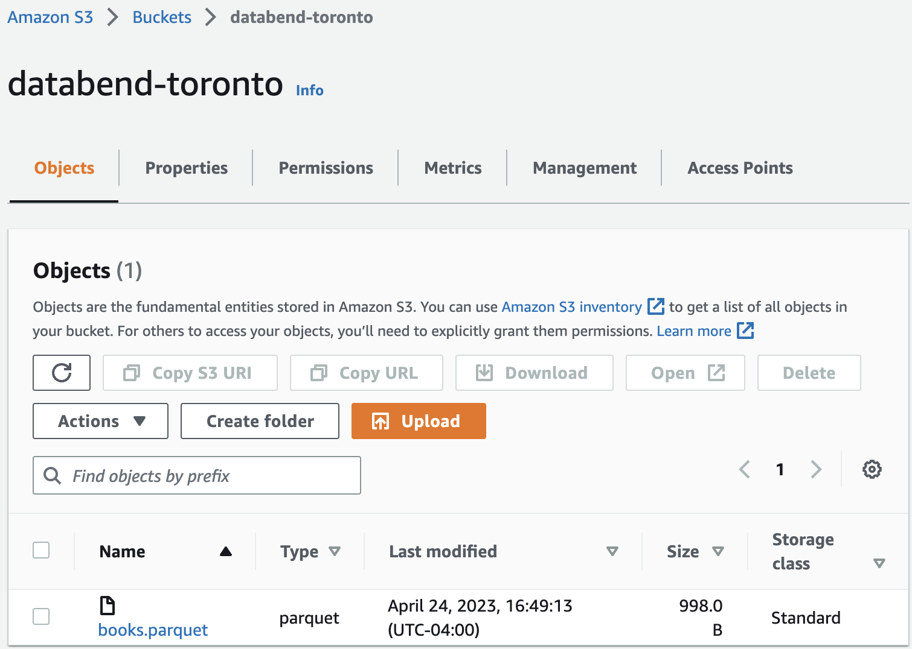

When data files are stored in an object storage bucket, such as Amazon S3, it is possible to load them directly into Databend using the [COPY INTO](../../14-sql-commands/10-dml/dml-copy-into-table.md) command. Please note that the files must be in a format supported by Databend, otherwise the data cannot be imported. For more information on the file formats supported by Databend, see [Input & Output File Formats](../../13-sql-reference/50-file-format-options.md).


This tutorial uses Amazon S3 bucket as an example and offers a detailed, step-by-step guide to help you effectively navigate the process of loading data from files stored in a bucket.

## Tutorial: Loading from Amazon S3 Bucket

### Before You Begin

Before you start, make sure you have completed the following tasks:

1. Download and save the sample file [books.parquet](https://datafuse-1253727613.cos.ap-hongkong.myqcloud.com/data/books.parquet) to a local folder. The file contains two records:

```text
Transaction Processing,Jim Gray,1992
Readings in Database Systems,Michael Stonebraker,2004
```

2. Create a bucket in Amazon S3 and upload the sample file to the bucket. For how to do that, refer to these links:
  - Creating a bucket: https://docs.aws.amazon.com/AmazonS3/latest/userguide/create-bucket-overview.html
  - Uploading objects: https://docs.aws.amazon.com/AmazonS3/latest/userguide/upload-objects.html

  For this tutorial, a bucket named **databend-toronto** was created in the region **US East (Ohio)** (ID: us-east-2).

  

### Step 1. Create Target Table

Create a table with the following SQL statements in Databend:

```sql
USE default;
CREATE TABLE books
(
    title VARCHAR,
    author VARCHAR,
    date VARCHAR
);
```

### Step 2. Copy Data into Table

1. Load data into the target table with the [COPY INTO](../../14-sql-commands/10-dml/dml-copy-into-table.md) command:

```sql
COPY INTO books
  FROM 's3://databend-toronto/'
  CONNECTION=(aws_key_id='<my-access-key-id>' aws_secret_key='<your-secret-access-key>' REGION = 'us-east-2')
  PATTERN ='.*[.]parquet'
  FILE_FORMAT = (TYPE = PARQUET);
```

2. Check the loaded data:

```sql
SELECT * FROM books;

---
title                       |author             |date|
----------------------------+-------------------+----+
Transaction Processing      |Jim Gray           |1992|
Readings in Database Systems|Michael Stonebraker|2004|
```