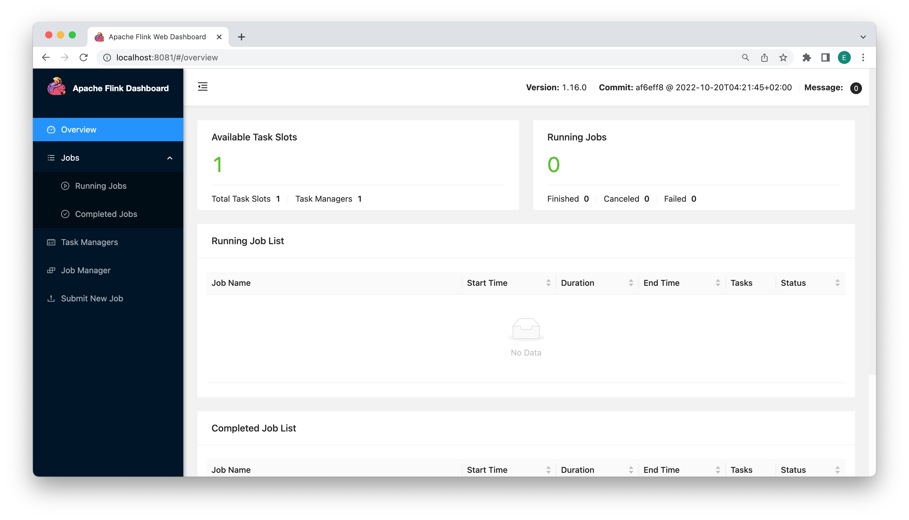
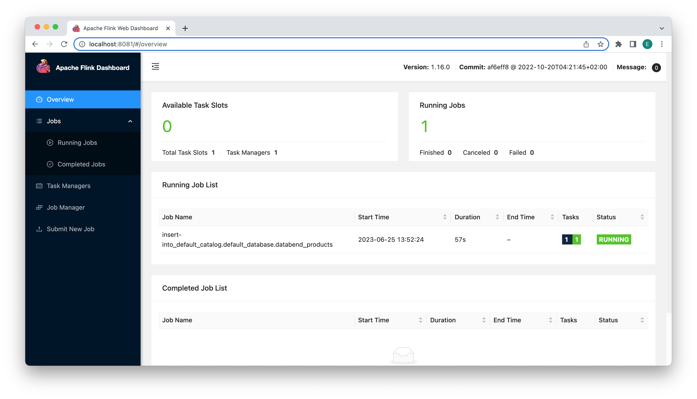

import FunctionDescription from '@site/src/components/FunctionDescription';

<FunctionDescription description="Introduced: v1.1.70"/>

[Apache Flink](https://github.com/apache/flink) CDC (Change Data Capture) refers to the capability of Apache Flink to capture and process real-time data changes from various sources using SQL-based queries. CDC allows you to monitor and capture data modifications (inserts, updates, and deletes) happening in a database or streaming system and react to those changes in real time. You can utilize the [Flink SQL connector for Databend](https://github.com/databendcloud/flink-connector-databend) to load data from other databases in real-time into Databend. The Flink SQL connector for Databend offers a connector that integrates Flink's stream processing capabilities with Databend. By configuring this connector, you can capture data changes from various databases as streams and load them into Databend for processing and analysis in real-time.

## Downloading & Installing Connector

To download and install the Flink SQL connector for Databend, follow these steps:

1. Download and set up Flink: Before installing the Flink SQL connector for Databend, ensure that you have downloaded and set up Flink on your system. You can download Flink from the official website: https://flink.apache.org/downloads/

2. Download the connector: Visit the releases page of the Flink SQL connector for Databend on GitHub: https://github.com/databendcloud/flink-connector-databend/releases. Download the latest version of the connector (e.g., flink-connector-databend-0.0.2.jar).

    Please note that you can also compile the Flink SQL connector for Databend from source:

    ```shell
    git clone https://github.com/databendcloud/flink-connector-databend
    cd flink-connector-databend
    mvn clean install -DskipTests
    ```

3. Move the JAR file: Once you have downloaded the connector, move the JAR file to the lib folder in your Flink installation directory. For example, if you have Flink version 1.16.0 installed, move the JAR file to the flink-1.16.0/lib/ directory.

## Tutorial: Real-time Data Loading from MySQL

In this tutorial, you will set up a real-time data loading from MySQL to Databend with the Flink SQL connector for Databend. Before you start, make sure you have successfully set up Databend and MySQL in your environment.

1. Create a table in MySQL and populate it with sample data. Then, create a corresponding target table in Databend.

```sql title='In MySQL:'
CREATE DATABASE mydb;
USE mydb;

CREATE TABLE products (id INTEGER NOT NULL AUTO_INCREMENT PRIMARY KEY,name VARCHAR(255) NOT NULL,description VARCHAR(512));
ALTER TABLE products AUTO_INCREMENT = 10;

INSERT INTO products VALUES (default,"scooter","Small 2-wheel scooter"),
(default,"car battery","12V car battery"),
(default,"12-pack drill bits","12-pack of drill bits with sizes ranging from #40 to #3"),
(default,"hammer","12oz carpenter's hammer"),
(default,"hammer","14oz carpenter's hammer"),
(default,"hammer","16oz carpenter's hammer"),
(default,"rocks","box of assorted rocks"),
(default,"jacket","black wind breaker"),
(default,"cloud","test for databend"),
(default,"spare tire","24 inch spare tire");
```

```sql title='In Databend:'
CREATE TABLE products (id INT NOT NULL, name VARCHAR(255) NOT NULL, description VARCHAR(512) );
```

2. Download [Flink](https://flink.apache.org/downloads/) and the following SQL connectors to your system:
    - Flink SQL connector for Databend: https://github.com/databendcloud/flink-connector-databend/releases
    - Flink SQL connector for MySQL: https://repo1.maven.org/maven2/com/ververica/flink-sql-connector-mysql-cdc/2.3.0/flink-sql-connector-mysql-cdc-2.3.0.jar
3. Move the both connector JAR files to the *lib* folder in your Flink installation directory.
4. Start Flink:

```shell
cd flink-16.0
./bin/start-cluster.sh
```

You can now open the Apache Flink Dashboard if you go to http://localhost:8081 in your browser:



5. Start the Flink SQL Client:

```shell
./bin/sql-client.sh

                                   ▒▓██▓██▒
                               ▓████▒▒█▓▒▓███▓▒
                            ▓███▓░░        ▒▒▒▓██▒  ▒
                          ░██▒   ▒▒▓▓█▓▓▒░      ▒████
                          ██▒         ░▒▓███▒    ▒█▒█▒
                            ░▓█            ███   ▓░▒██
                              ▓█       ▒▒▒▒▒▓██▓░▒░▓▓█
                            █░ █   ▒▒░       ███▓▓█ ▒█▒▒▒
                            ████░   ▒▓█▓      ██▒▒▒ ▓███▒
                         ░▒█▓▓██       ▓█▒    ▓█▒▓██▓ ░█░
                   ▓░▒▓████▒ ██         ▒█    █▓░▒█▒░▒█▒
                  ███▓░██▓  ▓█           █   █▓ ▒▓█▓▓█▒
                ░██▓  ░█░            █  █▒ ▒█████▓▒ ██▓░▒
               ███░ ░ █░          ▓ ░█ █████▒░░    ░█░▓  ▓░
              ██▓█ ▒▒▓▒          ▓███████▓░       ▒█▒ ▒▓ ▓██▓
           ▒██▓ ▓█ █▓█       ░▒█████▓▓▒░         ██▒▒  █ ▒  ▓█▒
           ▓█▓  ▓█ ██▓ ░▓▓▓▓▓▓▓▒              ▒██▓           ░█▒
           ▓█    █ ▓███▓▒░              ░▓▓▓███▓          ░▒░ ▓█
           ██▓    ██▒    ░▒▓▓███▓▓▓▓▓██████▓▒            ▓███  █
          ▓███▒ ███   ░▓▓▒░░   ░▓████▓░                  ░▒▓▒  █▓
          █▓▒▒▓▓██  ░▒▒░░░▒▒▒▒▓██▓░                            █▓
          ██ ▓░▒█   ▓▓▓▓▒░░  ▒█▓       ▒▓▓██▓    ▓▒          ▒▒▓
          ▓█▓ ▓▒█  █▓░  ░▒▓▓██▒            ░▓█▒   ▒▒▒░▒▒▓█████▒
           ██░ ▓█▒█▒  ▒▓▓▒  ▓█                █░      ░░░░   ░█▒
           ▓█   ▒█▓   ░     █░                ▒█              █▓
            █▓   ██         █░                 ▓▓        ▒█▓▓▓▒█░
             █▓ ░▓██░       ▓▒                  ▓█▓▒░░░▒▓█░    ▒█
              ██   ▓█▓░      ▒                    ░▒█▒██▒      ▓▓
               ▓█▒   ▒█▓▒░                         ▒▒ █▒█▓▒▒░░▒██
                ░██▒    ▒▓▓▒                     ▓██▓▒█▒ ░▓▓▓▓▒█▓
                  ░▓██▒                          ▓░  ▒█▓█  ░░▒▒▒
                      ▒▓▓▓▓▓▒▒▒▒▒▒▒▒▒▒▒▒▒▒▒▒▒▒▒▒▒▒▒░░▓▓  ▓░▒█░
          
    ______ _ _       _       _____  ____  _         _____ _ _            _  BETA   
   |  ____| (_)     | |     / ____|/ __ \| |       / ____| (_)          | |  
   | |__  | |_ _ __ | | __ | (___ | |  | | |      | |    | |_  ___ _ __ | |_ 
   |  __| | | | '_ \| |/ /  \___ \| |  | | |      | |    | | |/ _ \ '_ \| __|
   | |    | | | | | |   <   ____) | |__| | |____  | |____| | |  __/ | | | |_ 
   |_|    |_|_|_| |_|_|\_\ |_____/ \___\_\______|  \_____|_|_|\___|_| |_|\__|
          
        Welcome! Enter 'HELP;' to list all available commands. 'QUIT;' to exit.
```

6. Set the checkpointing interval to 3 seconds, and create corresponding tables with MySQL and Databend connectors in the Flink SQL Client. For the available connection parameters, see https://github.com/databendcloud/flink-connector-databend#connector-options: 

```sql       
Flink SQL> SET execution.checkpointing.interval = 3s;
[INFO] Session property has been set.

Flink SQL> CREATE TABLE mysql_products (id INT,name STRING,description STRING,PRIMARY KEY (id) NOT ENFORCED) 
WITH ('connector' = 'mysql-cdc',
'hostname' = 'localhost',
'port' = '3306',
'username' = 'root',
'password' = '123456',
'database-name' = 'mydb',
'table-name' = 'products',
'server-time-zone' = 'UTC'
);
[INFO] Execute statement succeed.

Flink SQL> CREATE TABLE databend_products (id INT,name String,description String, PRIMARY KEY (`id`) NOT ENFORCED) 
WITH ('connector' = 'databend',
'url'='databend://localhost:8000',
'username'='databend',
'password'='databend',
'database-name'='default',
'table-name'='products',
'sink.batch-size' = '5',
'sink.flush-interval' = '1000',
'sink.ignore-delete' = 'false',
'sink.max-retries' = '3');
[INFO] Execute statement succeed.
```

7. In the Flink SQL Client, synchronize the data from the *mysql_products* table to the *databend_products* table:

```sql
Flink SQL> INSERT INTO databend_products SELECT * FROM mysql_products;
[INFO] Submitting SQL update statement to the cluster...
[INFO] SQL update statement has been successfully submitted to the cluster:
Job ID: b14645f34937c7cf3672ffba35733734
```
You can now see a running job in the Apache Flink Dashboard:



You're all set!  If you query the *products* table in Databend, you will see that the data from MySQL has been successfully synchronized. Feel free to perform insertions, updates, or deletions in MySQL, and you will observe the corresponding changes reflected in Databend as well.