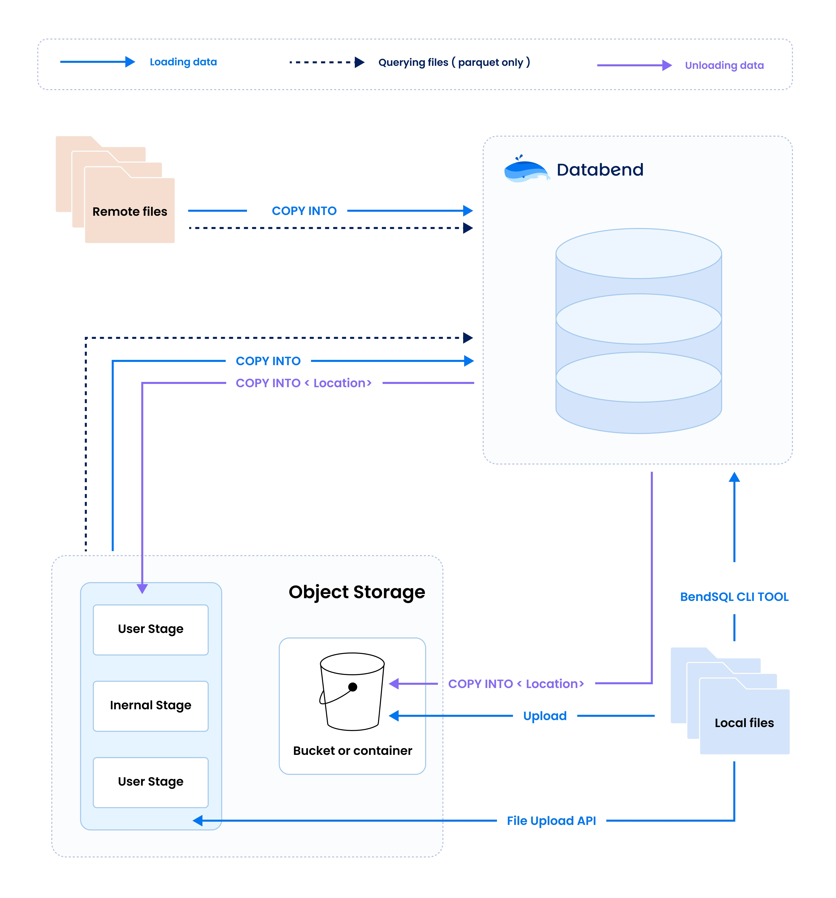

Databend simplifies the process of importing data by providing various methods to bring in datasets from multiple sources. This includes the local system, remote server, and object storage. When it comes to exporting data, Databend allows for direct export to object storage. 

The following is an overview of the data loading and unloading flows and their respective methods. Please refer to the topics in this chapter for detailed instructions.

