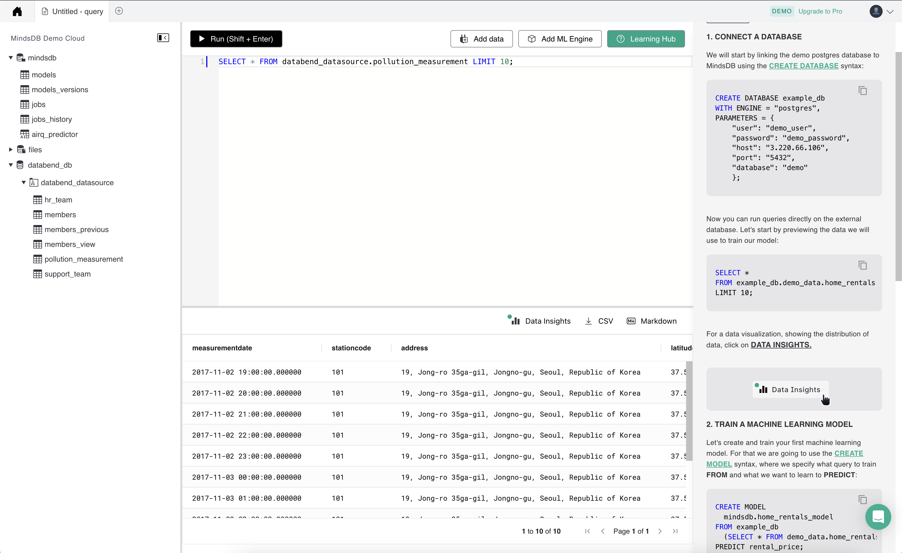
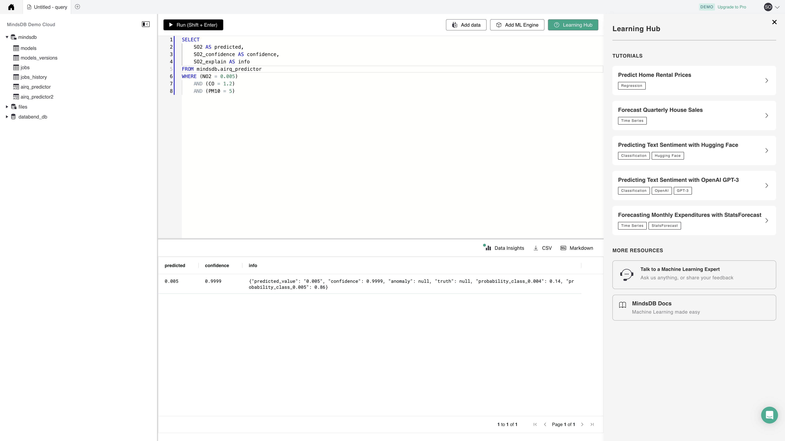

Data that lives in your database is a valuable asset. [MindsDB](https://mindsdb.com/) enables you to use your data and make forecasts. It speeds up the ML development process by bringing machine learning into the database. With MindsDB, you can build, train, optimize, and deploy your ML models without the need for other platforms.

Databend offers integration with MindsDB as a data source, which brings Machine Learning capabilities into Databend. The following tutorial shows you how to integrate with MindsDB and make data forecasts, using the [Air Pollution in Seoul](https://www.kaggle.com/datasets/bappekim/air-pollution-in-seoul) dataset as an example.

## Tutorial: Integrate with MindsDB

Before you start, install a local MindsDB or sign up an account for MindsDB Cloud. This tutorial uses MindsDB Cloud. For more information about how to install a local MindsDB, refer to https://docs.mindsdb.com/quickstart#1-create-a-mindsdb-cloud-account-or-install-mindsdb-locally

## Step 1. Load Dataset into Databend

Run the following SQL statements to create a table in the database `default` and load the [Air Pollution in Seoul](https://www.kaggle.com/datasets/bappekim/air-pollution-in-seoul) dataset using the COPY INTO command:

```sql
CREATE TABLE pollution_measurement(
  MeasurementDate Timestamp,
  StationCode String,
  Address String,
  Latitude double,
  Longitude double,
  SO2 double,
  NO2 double,
  O3 double,
  CO double,
  PM10 double,
  PM25 double
);
COPY INTO pollution_measurement FROM 'https://datasets.databend.org/AirPolutionSeoul/Measurement_summary.csv' file_format=(type='CSV' skip_header=1);
```

## Step 2. Connect MindsDB to Databend

1. Copy and paste the following SQL statements to the MindsDB Cloud Editor, and click **Run**:

```sql
CREATE DATABASE databend_datasource
WITH engine='databend',
parameters={
    "protocol": "https",
    "user": "<YOUR-USERNAME>",
    "port": 8000,
    "password": "<YOUR-PASSWORD>",
    "host": "<YOUR-HOST>",
    "database": "default"
};
```
:::tip
The SQL statements above connect the database `default` in Databend to your MindsDB Cloud account. For explanations about the parameters, refer to https://docs.mindsdb.com/data-integrations/all-data-integrations#databend
:::

2. In the MindsDB Cloud Editor, run the following SQL statements to verify the integration:

```sql
SELECT * FROM databend_datasource.pollution_measurement LIMIT 10;
```



## Step 3. Create a Predictor

In the MindsDB Cloud Editor, run the following SQL statements to create a predictor:

```sql
CREATE PREDICTOR airq_predictor
FROM databend_datasource (SELECT * FROM pollution_measurement LIMIT 50)
PREDICT so2;
```

Now the predictor will begin training. You can check the status with the following query:

```sql
SELECT *
FROM mindsdb.models
WHERE name='airq_predictor';
```

:::note
The status of the model must be `complete` before you can start making predictions.
:::

## Step 4. Make Predictions

In the MindsDB Cloud Editor, run the following SQL statements to predict the concentration of SO2:

```sql
SELECT
    SO2 AS predicted,
    SO2_confidence AS confidence,
    SO2_explain AS info
FROM mindsdb.airq_predictor
WHERE (NO2 = 0.005)
    AND (CO = 1.2)
    AND (PM10 = 5)
```

Output:


