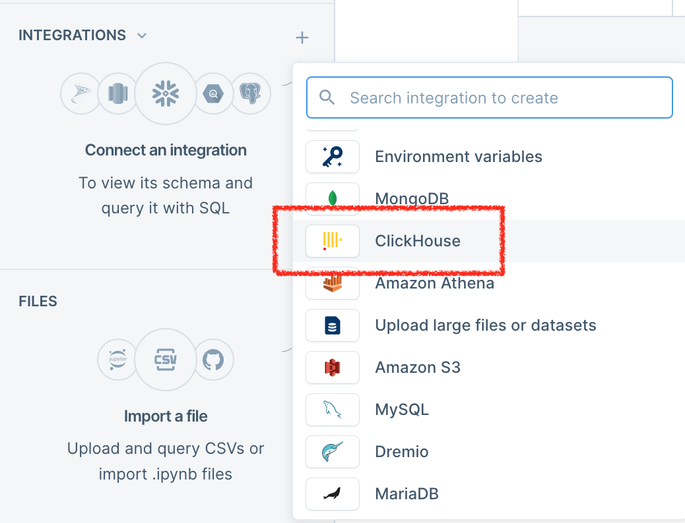
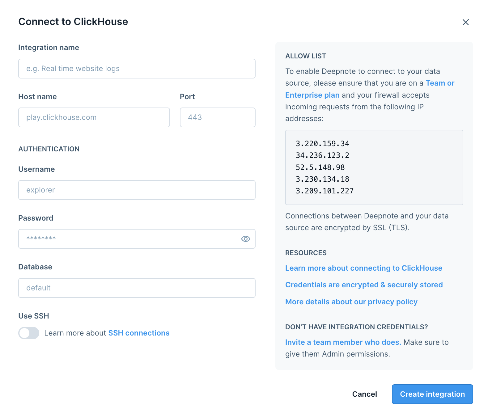
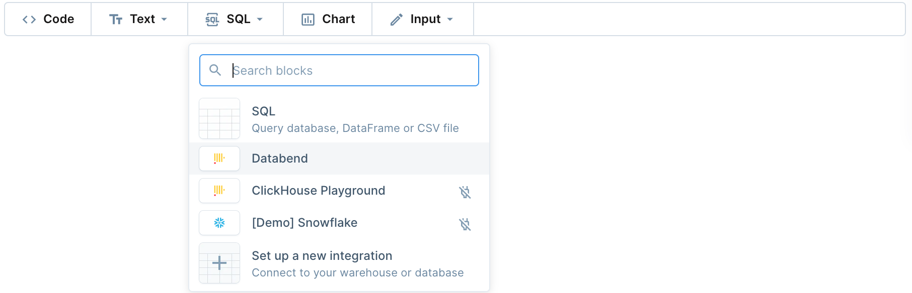
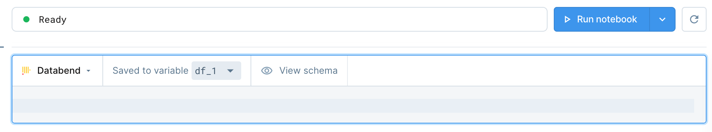

[Deepnote](https://deepnote.com) allows you to easily work on your data science projects, together in real-time and in one place with your friends and colleagues; helping you turn your ideas and analyses into products faster.

Deepnote is built for the browser so you can use it across any platform (Windows, Mac, Linux or Chromebook). No downloads required, with updates shipped to you daily. All changes are instantly saved.

***To integrate with Deepnote***:

1. Sign in to Deepnote with your account.

2. Click **+** to the right of **INTEGRATIONS** in the left sidebar, then select **ClickHouse**.

3. Complete the fields with your connection information. Please note that a secure connection is mandatory, and the default port is *8124*.

4. Create a notebook.

5. In the notebook you created, select SQL, then select the connection you created in step 3.

You're all set! Refer to the Deepnote documentation for how to work with the tool.

