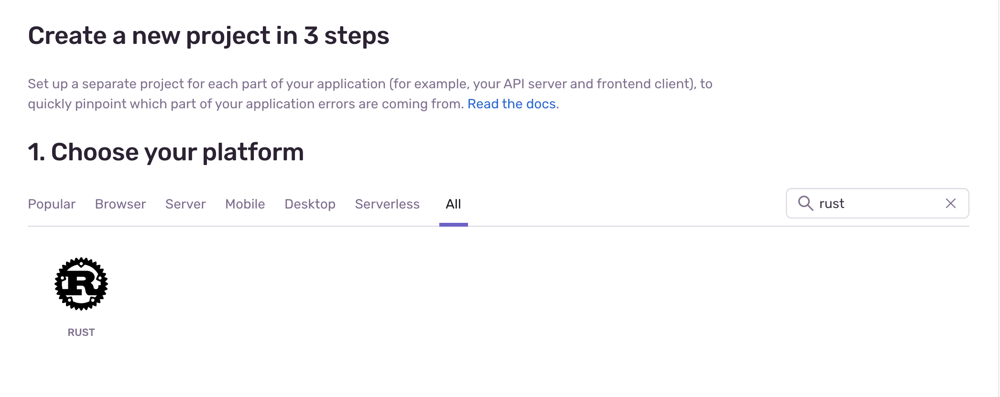
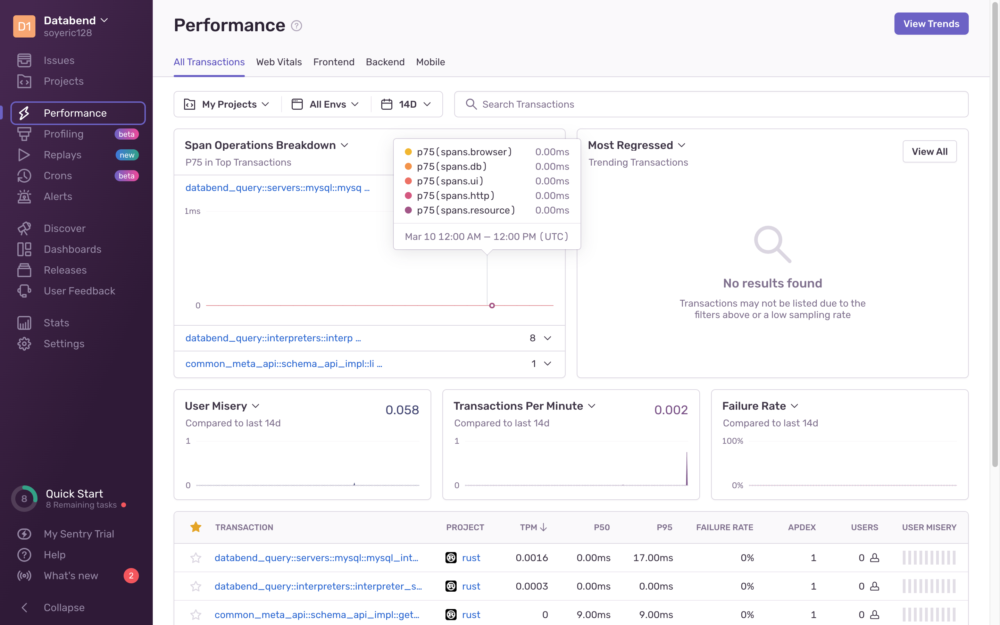

[Sentry](https://sentry.io/welcome/) is a developer-first error tracking and performance monitoring platform that helps developers see what actually matters, solve quicker, and learn continuously about their applications.

Databend provides integration with both Cloud and self-hosted Sentry solutions. The following tutorial walks you through the integration process.

## Tutorial: Monitor Databend with Sentry

### Step 1. Deploy Sentry

To deploy an on-premises Sentry, follow the instructions: https://develop.sentry.dev/self-hosted/

This tutorial uses the Sentry service on the cloud. To sign up an account for Cloud Sentry, go to https://sentry.io

### Step 2. Create a Sentry Project

Once you're logged into Sentry, create a Sentry project for the `Rust` platform to start. For how to create a project on Sentry, see https://docs.sentry.io/product/sentry-basics/integrate-frontend/create-new-project/



### Step 3. Set Environment Variables

1. Get the DSN (Data Source Name) of your project. For what DSN is and where to find it, see https://docs.sentry.io/product/sentry-basics/dsn-explainer/

2. Set environment variables.

  - To enable the error-tracking feature, run the following commands:

```bash
export DATABEND_SENTRY_DSN="<your-DSN>"
```

  - To enable the performance monitoring feature, run the following commands:

```bash
export DATABEND_SENTRY_DSN="<your-DSN>"
export SENTRY_TRACES_SAMPLE_RATE=1.0 LOG_LEVEL=DEBUG
```
:::tip
Set `SENTRY_TRACES_SAMPLE_RATE` to a small value in production.
:::

### Step 4. Deploy Databend

Follow the [Deployment Guide](https://databend.rs/doc/deploy) to deploy Databend.

You're all set now. Check the pages on Sentry for alerts and performce information.

