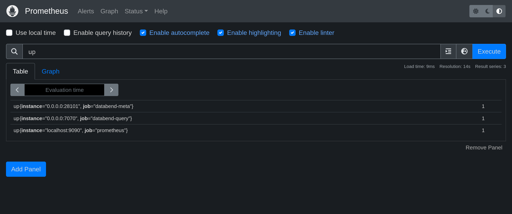
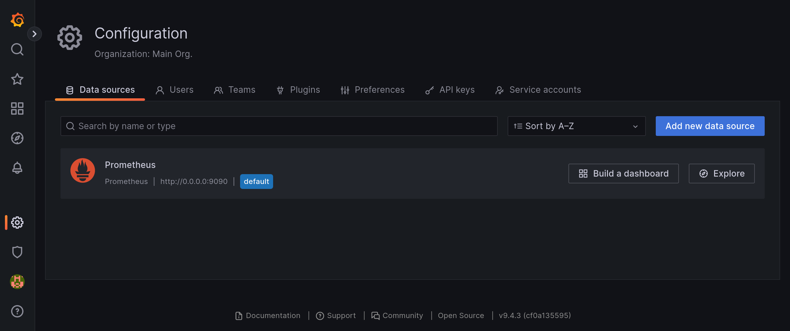
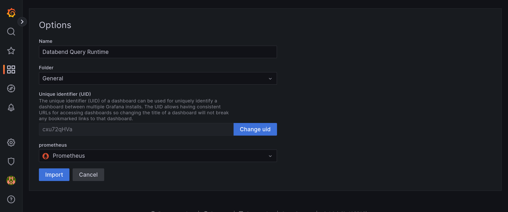
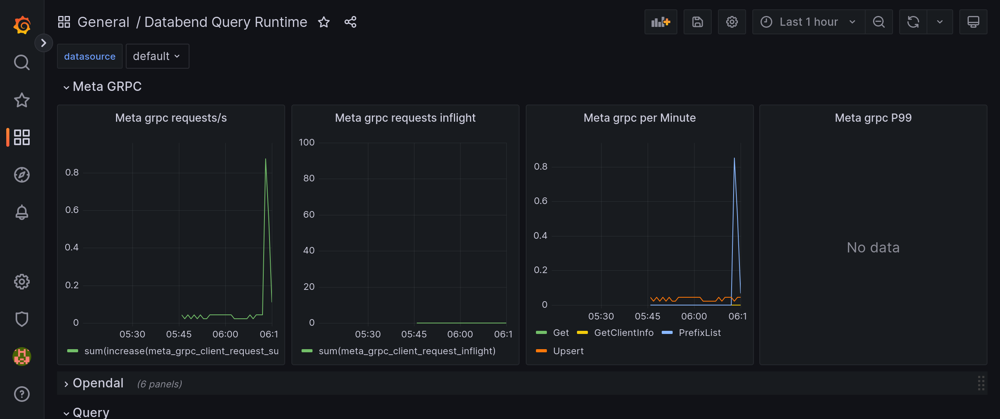

[Prometheus](https://prometheus.io/) is an open-source monitoring system with a dimensional data model, flexible query language, efficient time series database and modern alerting approach. [Grafana](https://grafana.com/grafana) is an open-source tool used for analyzing and visualizing metrics.

This following tutorial guides you through deploying and integrating Databend, Prometheus, and Grafana. In this tutorial, you'll deploy a local Databend and install Prometheus and Grafana with Docker. Before you start, ensure that you have Docker installed.

## Tutorial: Monitor Databend with Prometheus & Grafana

### Step 1. Deploy Databend

Follow the [Deployment Guide](https://databend.rs/doc/deploy) to deploy a local Databend.

:::tip
This tutorial uses the [default configuration files](https://github.com/datafuselabs/databend/tree/main/scripts/distribution/configs) in the `configs` folder of the install package. The metrics API for databend-meta is `0.0.0.0:28101/v1/metrics`, and the metrics API for databend-query is `0.0.0.0:7070/metrics`.
:::

### Step 2. Deploy Prometheus

The steps below describe how to install and deploy Prometheus using Docker.

1. Pull the latest Docker image of Prometheus from the Docker Hub registry.

   ```bash
   docker pull prom/prometheus
   ```

2. Edit the configuration file **prometheus.yml**.

   Add the following script to the end of the file prometheus.yml that can be found in the `/etc/prometheus/prometheus.yml` directory. Please note that, with Docker, there are multiple ways to modify a file for a container. In this tutorial, we demonstrate how to achieve this by saving the file to a local folder and mapping it when running the Prometheus image.

   :::tip
   Docker containers can connect to local services running on the host by using `host.docker.internal`. This feature is available by default only on Docker for Windows/Mac. However, it is also available on Linux starting from version **20.03**.
   :::

   ```yaml
   - job_name: "databend-query"

     # metrics_path defaults to '/metrics'
     # scheme defaults to 'http'.

     static_configs:
       - targets: ["host.docker.internal:7070"]

   - job_name: "databend-meta"

     metrics_path: "/v1/metrics"
     # scheme defaults to 'http'.

     static_configs:
       - targets: ["host.docker.internal:28101"]
   ```

3. Deploy Prometheus.

   If you saved and edited the file `prometheus.yml` in a local folder, you need to create a mapping using the `-v` option in the command. To do so, replace `/path/to/prometheus.yml` in the command below with the path to your local `prometheus.yml`.

   ```bash
   docker run \
   -p 9090:9090 \
   --add-host=host.docker.internal:host-gateway \
   -v /path/to/prometheus.yml:/etc/prometheus/prometheus.yml \
   prom/prometheus
   ```

4. Check Metrics Status

   Check the value on the right of each instance. `1` means the instance is healthy, and `0` means that the scrape failed.

   

### Step 3. Deploy Grafana

The steps below describe how to install and deploy Grafana using Docker.

1. Pull the latest Docker image of Grafana from the Docker Hub registry.

   ```bash
   docker pull grafana/grafana
   ```

2. Deploy Grafana.

   ```bash
   docker run \
   -p 3000:3000 \
   --add-host=host.docker.internal:host-gateway \
   grafana/grafana
   ```

3. Add a data source of Prometheus type.

   Open your web browser and go to `http://0.0.0.0:3000`. Log in with the user name `admin` and password `admin` first, and then add a data source of Prometheus type on **Configuration** > **Data Sources** > **Add data source**.

   Please note that set the URL to `http://host.docker.internal:9090` for the data source.

   

4. Create dashboards.

   Databend recommend import the files in [datafuselabs/helm-charts - dashboards](https://github.com/datafuselabs/helm-charts/tree/main/dashboards) to create your dashboards. To do so, download the files first, then go to `http://0.0.0.0:3000/dashboard/import` to import the downloaded files one by one and select the `Prometheus` data source for each dashboard.

   

   
