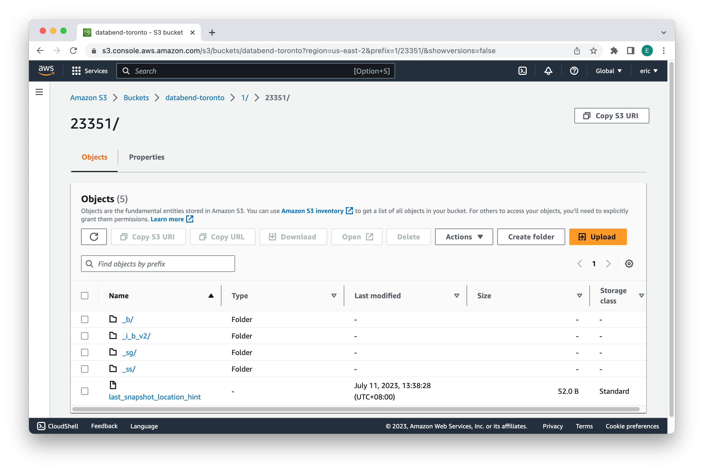
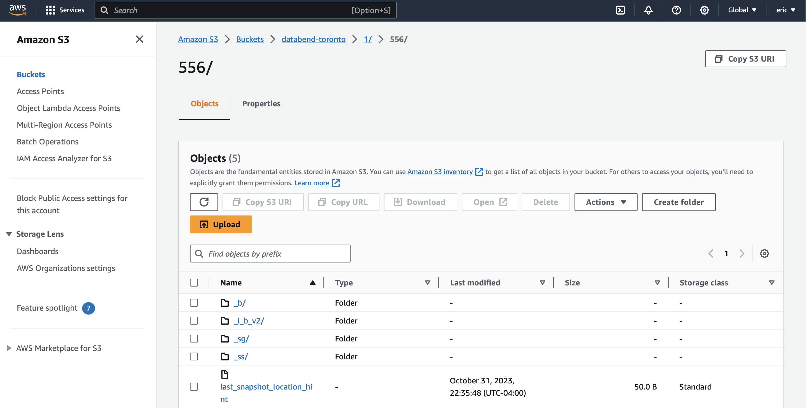
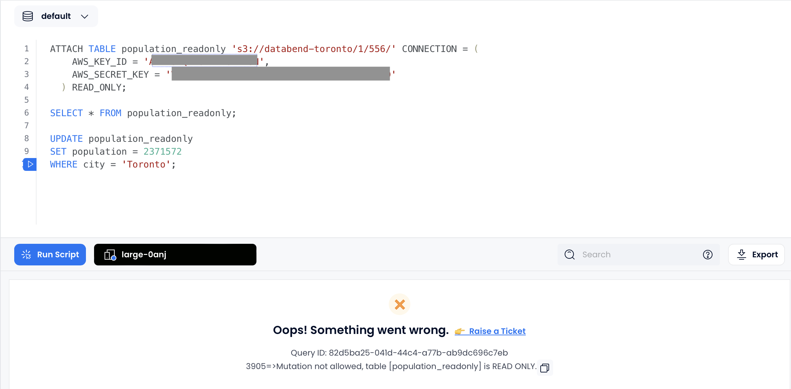

import FunctionDescription from '@site/src/components/FunctionDescription';

<FunctionDescription description="Introduced or updated: v1.2.180"/>

Attaches an existing table to another one. The command moves the data and schema of a table from one database to another, but without actually copying the data. Instead, it creates a link that points to the original table data for accessing the data.

Attach Table enables you to seamlessly connect a table in the cloud service platform to an existing table deployed in a private deployment environment without the need to physically move the data. This is particularly useful when you want to migrate data from a private deployment of Databend to [Databend Cloud](https://www.databend.com) while minimizing the data transfer overhead.

Attach Table provides a seamless connection between source tables and attached tables, with the data synchronization mechanism operating differently depending on the mode:

- In non-read-only mode, changes in the source table are instantly reflected in the attached table, and you can update the attached table as needed. However, it's essential to note that these updates won't sync back to the source table. See [Example 1: Attaching Table in Databend Cloud](#example-1-attaching-table-in-databend-cloud) for an example.

- In read-only mode, changes in the source table are also instantly reflected in the attached table. However, the attached table exclusively serves for querying purposes, with no update capabilities. See [Example 2: Attaching Table in READ_ONLY Mode](#example-2-attaching-table-in-read_only-mode) for an example.

## Syntax

```sql
ATTACH TABLE <target_table_name> '<source_table_data_URI>' 
CONNECTION=(<connection_parameters>) [READ_ONLY]
```

- `<source_table_data_URI>` represents the path to the source table's data. For S3-like object storage, the format is `s3://<bucket-name>/<database_ID>/<table_ID>`, for example, *s3://databend-toronto/1/23351/*, which represents the exact path to the table folder within the bucket.

  

  To obtain the database ID and table ID of a table, use the [FUSE_SNAPSHOT](../../../15-sql-functions/111-system-functions/fuse_snapshot.md) function. In the example below, the part **1/23351/** in the value of *snapshot_location* indicates that the database ID is **1**, and the table ID is **23351**.

  ```sql
  SELECT * FROM FUSE_SNAPSHOT('default', 'employees');

  Name                |Value                                              |
  --------------------+---------------------------------------------------+
  snapshot_id         |d6cd1f3afc3f4ad4af298ad94711ead1                   |
  snapshot_location   |1/23351/_ss/d6cd1f3afc3f4ad4af298ad94711ead1_v4.mpk|
  format_version      |4                                                  |
  previous_snapshot_id|                                                   |
  segment_count       |1                                                  |
  block_count         |1                                                  |
  row_count           |3                                                  |
  bytes_uncompressed  |122                                                |
  bytes_compressed    |523                                                |
  index_size          |470                                                |
  timestamp           |2023-07-11 05:38:27.0                              |
  ```

- `CONNECTION` specifies the connection parameters required for establishing a link to the object storage where the source table's data is stored. The connection parameters vary for different storage services based on their specific requirements and authentication mechanisms. For more information, see [Connection Parameters](../../../13-sql-reference/51-connect-parameters.md).

- `READ_ONLY` is an optional parameter that, when included, restricts data modification operations (e.g., INSERT, UPDATE, DELETE) on the attached table (<target_table_name>), allowing only SELECT queries.

  :::note
  In read-only mode, if there are schema changes in the source table, tables already attached must be dropped and then reattached. 
  :::

## Examples

### Example 1: Attaching Table in Databend Cloud

This example illustrates how to link a new table in Databend Cloud with an existing table in Databend, which stores data within an Amazon S3 bucket named "databend-toronto".

#### Step 1. Creating Table in Databend

Create a table named "employees" and insert some sample data:

```sql title='Databend:'
CREATE TABLE employees (
  id INT,
  name VARCHAR(50),
  salary DECIMAL(10, 2)
) ;

INSERT INTO employees (id, name, salary) VALUES
  (1, 'John Doe', 5000.00),
  (2, 'Jane Smith', 6000.00),
  (3, 'Mike Johnson', 7000.00);
```

#### Step 2. Obtaining Database ID and Table ID

Use the [FUSE_SNAPSHOT](../../../15-sql-functions/111-system-functions/fuse_snapshot.md) function to obtain the database ID and table ID. The result below indicates that the database ID is **1**, and the table ID is **216**:

```sql title='Databend:'
SELECT * FROM FUSE_SNAPSHOT('default', 'employees');

┌──────────────────────────────────────────────────────────────────────────────────────────────────────────────────────────────────────────────────────────────────────────────────────────────────────────────────────────────────────────────────────────┐
│            snapshot_id           │                 snapshot_location                 │ format_version │ previous_snapshot_id │ segment_count │ block_count │ row_count │ bytes_uncompressed │ bytes_compressed │ index_size │          timestamp         │
├──────────────────────────────────┼───────────────────────────────────────────────────┼────────────────┼──────────────────────┼───────────────┼─────────────┼───────────┼────────────────────┼──────────────────┼────────────┼────────────────────────────┤
│ cede9d925e7c41f5b29326c2c189a212 │ 1/216/_ss/cede9d925e7c41f5b29326c2c189a212_v4.mpk │              4 │ NULL                 │             1 │           1 │         3 │                125 │              590 │        531 │ 2023-10-31 19:51:05.832761 │
└──────────────────────────────────────────────────────────────────────────────────────────────────────────────────────────────────────────────────────────────────────────────────────────────────────────────────────────────────────────────────────────┘
```

When you access the bucket page on Amazon S3, you'll observe that the data is organized within the path `databend-toronto` > `1` > `216`, like this:


#### Step 3. Linking Table in Databend Cloud

Sign in to Databend Cloud and run the following command in a worksheet to link a table named "employees_backup":

```sql title='Databend Cloud:'
ATTACH TABLE employees_backup 's3://databend-toronto/1/216/' CONNECTION = (
  AWS_KEY_ID = '<your_aws_key_id>',
  AWS_SECRET_KEY = '<your_aws_secret_key>'
);
```

To verify the success of the link, run the following query in Databend Cloud:

```sql title='Databend Cloud:'
SELECT * FROM employees_backup;

-- Expected result:
┌───────────────────────────────────────────────────────────────┐
│        id       │       name       │          salary          │
├─────────────────┼──────────────────┼──────────────────────────┤
│               1 │ John Doe         │ 5000.00                  │
│               2 │ Jane Smith       │ 6000.00                  │
│               3 │ Mike Johnson     │ 7000.00                  │
└───────────────────────────────────────────────────────────────┘
```

You're all set! If you update the source table in Databend, you can observe the same changes reflected in the target table on Databend Cloud. For example, if you update the name "Mike Johnson" to "Eric Johnson" in the source table "employees":

```sql title='Databend:'
UPDATE employees
SET name = 'Eric Johnson'
WHERE name = 'Mike Johnson';
```

You can see that the updates are synced to the attached table in Databend Cloud:

```sql title='Databend Cloud:'
SELECT * FROM employees_backup;

-- Expected result:
┌───────────────────────────────────────────────────────────────┐
│        id       │       name       │          salary          │
├─────────────────┼──────────────────┼──────────────────────────┤
│               1 │ John Doe         │ 5000.00                  │
│               2 │ Jane Smith       │ 6000.00                  │
│               3 │ Eric Johnson     │ 7000.00                  │
└───────────────────────────────────────────────────────────────┘
```

You can also update the target table in Databend Cloud, but the changes will not be synced to the source table in Databend. For example, if you update the salary of  "John Doe" to 5,500 in the target table "employees_backup":

```sql title='Databend Cloud:'
UPDATE employees_backup
SET salary = 5500
WHERE name = 'John Doe';
```

The salary of  "John Doe" will remain unchanged in the source table "employees":

```sql title='Databend:'
SELECT salary FROM employees WHERE name = 'John Doe';

-- Expected result:
5000.00
```

### Example 2: Attaching Table in READ_ONLY Mode

This example illustrates how to link a new table in Databend Cloud in READ_ONLY mode with an existing table in Databend, which stores data within an Amazon S3 bucket named "databend-toronto".

#### Step 1. Creating Table in Databend

Create a table named "population" and insert some sample data:

```sql title='Databend:'
CREATE TABLE population (
  city VARCHAR(50),
  population INT
);

INSERT INTO population (city, population) VALUES
  ('Toronto', 2731571),
  ('Montreal', 1704694),
  ('Vancouver', 631486);
```

#### Step 2. Obtaining Database ID and Table ID

Use the [FUSE_SNAPSHOT](../../../15-sql-functions/111-system-functions/fuse_snapshot.md) function to obtain the database ID and table ID. The result below indicates that the database ID is **1**, and the table ID is **556**:

```sql title='Databend:'
SELECT * FROM FUSE_SNAPSHOT('default', 'population');

┌──────────────────────────────────────────────────────────────────────────────────────────────────────────────────────────────────────────────────────────────────────────────────────────────────────────────────────────────────────────────────────────┐
│            snapshot_id           │                 snapshot_location                 │ format_version │ previous_snapshot_id │ segment_count │ block_count │ row_count │ bytes_uncompressed │ bytes_compressed │ index_size │          timestamp         │
├──────────────────────────────────┼───────────────────────────────────────────────────┼────────────────┼──────────────────────┼───────────────┼─────────────┼───────────┼────────────────────┼──────────────────┼────────────┼────────────────────────────┤
│ f252dd43d1aa44898a04827808342daf │ 1/556/_ss/f252dd43d1aa44898a04827808342daf_v4.mpk │              4 │ NULL                 │             1 │           1 │         3 │                 70 │              448 │        531 │ 2023-11-01 02:35:47.325319 │
└──────────────────────────────────────────────────────────────────────────────────────────────────────────────────────────────────────────────────────────────────────────────────────────────────────────────────────────────────────────────────────────┘
```

When you access the bucket page on Amazon S3, you'll observe that the data is organized within the path `databend-toronto` > `1` > `556`, like this:



#### Step 3. Linking Table in Databend Cloud

Sign in to Databend Cloud and run the following command in a worksheet to link a table named "population_readonly" in read-only mode:

```sql title='Databend Cloud:'
ATTACH TABLE population_readonly 's3://databend-toronto/1/556/' CONNECTION = (
  AWS_KEY_ID = '<your_aws_key_id>',
  AWS_SECRET_KEY = '<your_aws_secret_key>'
) READ_ONLY;
```

To verify the success of the link, run the following query in Databend Cloud:

```sql title='Databend Cloud:'
SELECT * FROM population_readonly;

-- Expected result:
┌────────────────────────────────────┐
│       city       │    population   │
├──────────────────┼─────────────────┤
│ Toronto          │         2731571 │
│ Montreal         │         1704694 │
│ Vancouver        │          631486 │
└────────────────────────────────────┘
```

You're all set! If you update the source table in Databend, you can observe the same changes reflected in the target table on Databend Cloud. For example, if you change the population of Toronto to 2,371,571 in the source table:

```sql title='Databend:'
UPDATE population
SET population = 2371571
WHERE city = 'Toronto';
```

You can see that the updates are synced to the attached table in Databend Cloud:

```sql title='Databend Cloud:'
SELECT * FROM population_readonly;

-- Expected result:
┌────────────────────────────────────┐
│       city       │    population   │
├──────────────────┼─────────────────┤
│ Toronto          │         2371571 │
│ Montreal         │         1704694 │
│ Vancouver        │          631486 │
└────────────────────────────────────┘
```

If you attempt to update the attached table "population_readonly" in Databend Cloud, you will encounter the following error because the table is attached in read-only mode:

