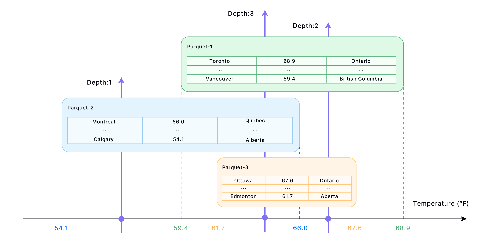
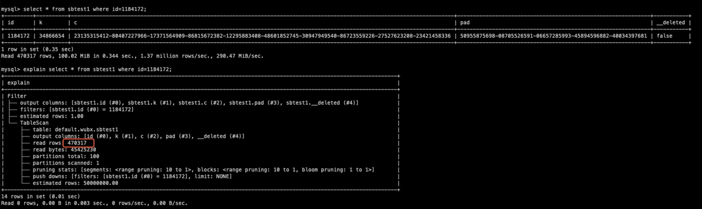
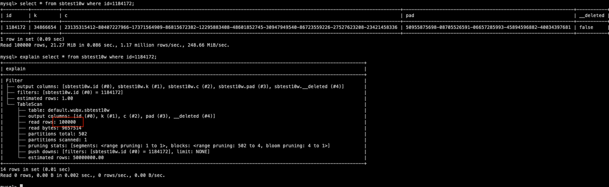
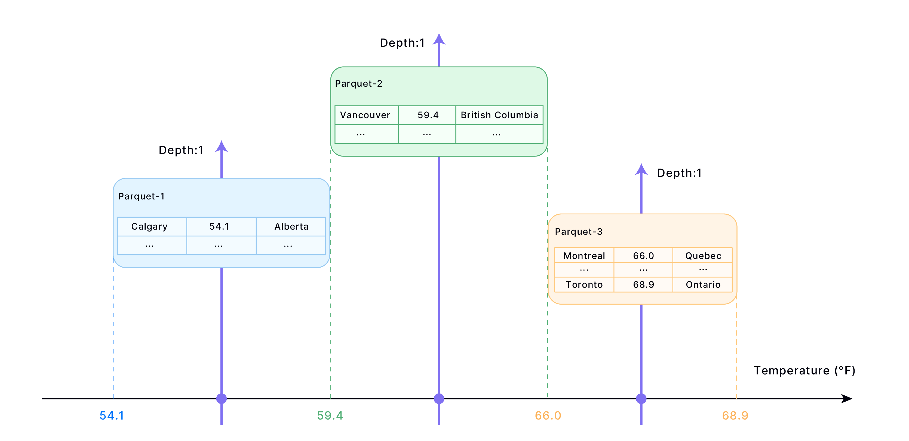

import IndexOverviewList from '@site/src/components/IndexOverviewList';

## Why Cluster Key?

In Databend, you have the option to enhance query performance by clustering tables. This involves providing explicit instructions to Databend on how to organize and group rows within storage, rather than relying solely on the order in which data is ingested. You can cluster a table by defining a cluster key, typically composed of one or more columns or expressions. Consequently, Databend arranges the data based on this cluster key, grouping similar rows into adjacent blocks. These blocks correspond to the Parquet files that Databend uses for data storage. For more detailed information, see [Databend Data Storage: Snapshot, Segment, and Block](../20-table/60-optimize-table.md#databend-data-storage-snapshot-segment-and-block).

:::tip
In most cases, setting a cluster key is not necessary. Clustering or re-clustering a table takes time and consumes your credits, especially in the Databend Cloud environment. Databend suggests defining cluster keys primarily for sizable tables that experience slow query performance.
:::

The cluster key serves as a connection between the metadata in Databend's Meta Service Layer and the storage blocks (Parquet files). Once a cluster key is defined for a table, the table's metadata establishes a key-value list, indicating the connections between column or expression values and their respective storage blocks. When a query is executed, Databend can rapidly locate the right blocks using the metadata and read fewer rows compared to when no cluster key is set.

## How Cluster Key Works

To make this work, the cluster key you set must align with how you filter the data in queries. For instance, let's consider a table that includes temperatures for all cities in Canada, with three columns: City, Temperature, and Province.

```sql
CREATE TABLE T (
    City VARCHAR(255),
    Temperature DECIMAL(10, 2),
    Province VARCHAR(255)
);
```

If your primary queries involve retrieving cities based on their temperature, set the cluster key to the Temperature column. The following illustrates how data could be stored in blocks for the given table:



Rows are sorted based on the Age column in each block (file). However, there can be overlapping age ranges between blocks. If a query falls precisely within the overlapping range of blocks, it requires reading multiple blocks. The number of blocks involved in this situation is referred to as the "Depth." Therefore, the smaller the depth, the better. This implies that having fewer relevant blocks to read during queries enhances query performance.

To see how well a table is clustered, use the function [CLUSTERING_INFORMATION](../../../15-sql-functions/111-system-functions/clustering_information.md). For example,

```sql
 SELECT * FROM clustering_information('default','T');
*************************** 1. row ***************************
            cluster_key: (id)   
      total_block_count: 451    
   constant_block_count: 0      
unclustered_block_count: 0     
       average_overlaps: 2.1774   
          average_depth: 2.4612   
  block_depth_histogram: {"00001":32,"00002":217,"00003":164,"00004":38}
1 row in set (0.02 sec)
Read 1 rows, 448.00 B in 0.015 sec., 67.92 rows/sec., 29.71 KiB/sec.
```

| Parameter               	| Description                                                                                                            	|
|-------------------------	|------------------------------------------------------------------------------------------------------------------------	|
| cluster_key         	| The defined cluster key.                                                                                               	|
| total_block_count       	| The current count of blocks.                                                                                           	|
| constant_block_count    	| The count of blocks where min/max values are equal, meaning each block contains only one (group of) cluster_key value. 	|
| unclustered_block_count 	| The count of blocks that have not yet been clustered.                                                                  	|
| average_overlaps        	| The average ratio of overlapping blocks within a given range.                                                          	|
| average_depth           	| The average depth of overlapping partitions for the cluster key.                                                       	|
| block_depth_histogram   	| The number of partitions at each depth level. A higher concentration of partitions at lower depths indicates more effective table clustering.                                                                          	|

### Tuning Performance with Custom Block Size

The block size in Databend is determined by the ROW_PER_BLOCK and BLOCK_SIZE_THRESHOLD parameters of the [Fuse Engine](../../../13-sql-reference/30-table-engines/00-fuse.md). Databend creates a new block when either of the thresholds is reached. You can further enhance the performance of single-point and range queries by customizing the block size for a table that includes a cluster key.

Customizing the block size to increase the number of storage blocks leads to a reduction in the number of rows read during query processing. This is because, as the number of blocks increases for the same dataset, the number of rows in each Parquet file decreases.

**Example**:

The following statement required scanning nearly 500,000 rows to process the single-point query:



The optimization reduces the block size, resulting in fewer rows per Parquet file.

```sql
ALTER TABLE sbtest10w SET OPTIONS(ROW_PER_BLOCK=100000,BLOCK_SIZE_THRESHOLD=52428800);
```

After the optimization, only 100,000 rows need to be scanned for the same query:



:::tip
While reducing block size might reduce the number of rows involved in individual queries, it's important to note that smaller block size is not always better. Before adjusting the block size, it's crucial to conduct proper performance tuning and testing to identify the optimal configuration. Different data and query types might require varying block sizes for achieving the best performance.
:::

## Re-clustering Table

A well-clustered table may become disordered within certain storage blocks, which can have a negative impact on query performance. For instance, if the table continues to undergo DML operations (INSERT / UPDATE / DELETE), it might be a good idea to consider re-clustering the table. For how to re-cluster a table, see [RECLUSTER TABLE](dml-recluster-table.md).

:::note
When using the COPY INTO or REPLACE INTO command to write data into a table that includes a cluster key, Databend will automatically initiate a re-clustering process, as well as a segment and block compact process.
:::

If you re-cluster the example table in the [How Cluster Key Works](#how-cluster-key-works) section, you might get data stored like this:



This is the most ideal scenario. In most cases, achieving this situation might require running a re-cluster operation more than once. Re-clustering a table consumes time (even longer if you include the **FINAL** option) and credits (when you are in Databend Cloud). Databend recommends using the function [CLUSTERING_INFORMATION](../../../15-sql-functions/111-system-functions/clustering_information.md) to determine when to re-cluster a table:

```sql
SELECT If(average_depth > total_block_count * 0.001
          AND average_depth > 1, 'The table needs re-cluster now',
              'The table does not need re-cluster now')
FROM CLUSTERING_INFORMATION('<your_database>', '<your_table>'); 
```

## Managing Cluster Key

In Databend, you can set a cluster key when you create a table, and you can alter the cluster key if necessary. A fully-clustered table might become chaotic if it continues to have ingestion or Data Manipulation Language operations (such as INSERT, UPDATE, DELETE), you will need to recluster the table to fix the chaos. For more information, see the topics below:

<IndexOverviewList />