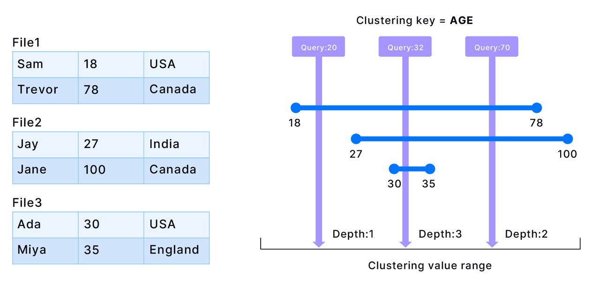

import IndexOverviewList from '@site/src/components/IndexOverviewList';

## Why Cluster Key?

In Databend, you have the option to enhance query performance by clustering tables. This involves providing explicit instructions to Databend on how to organize and group rows within storage, rather than relying solely on the order in which data is ingested. You can cluster a table by defining a cluster key, typically composed of one or more columns or expressions. Consequently, Databend arranges the data based on this cluster key, grouping similar rows into adjacent blocks. These blocks correspond to the Parquet files that Databend uses for data storage. For more detailed information, see [Databend Data Storage: Snapshot, Segment, and Block](../20-table/60-optimize-table.md#databend-data-storage-snapshot-segment-and-block).

:::important
In most cases, setting a cluster key is not necessary. Clustering or re-clustering a table takes time and consumes your credits, especially in the Databend Cloud environment. Databend suggests defining cluster keys primarily for sizable tables that experience slow query performance.
:::

The cluster key serves as a connection between the metadata in Databend's Meta Service Layer and the storage blocks (Parquet files). Once a cluster key is defined for a table, the table's metadata establishes a key-value list, indicating the connections between column or expression values and their respective storage blocks. When a query is executed, Databend can rapidly locate the right blocks using the metadata and read fewer rows compared to when no cluster key is set.

## How Cluster Key Works

To make this work, the cluster key you set must align with how you filter the data in queries. For instance, consider a table containing three columns: Name, Age, and Birth Place. 

```sql
CREATE TABLE T (
    Name VARCHAR(255),
    Age INT,
    BirthPlace VARCHAR(255)
);
```

If your queries primarily involve retrieving people's profile information based on their ages, set the cluster key to the Age column. The following illustrates how data could be stored in blocks for the given table:



Rows are sorted based on the Age column in each block (file). However, there can be overlapping age ranges between blocks. If a query falls precisely within the overlapping range of blocks, it requires reading multiple blocks. The number of blocks involved in this situation is referred to as the "depth." Therefore, the smaller the depth, the better. This implies that having fewer relevant blocks to read during queries enhances query performance.

To see how well a table is clustered, use the function [CLUSTERING_INFORMATION](../../../15-sql-functions/111-system-functions/clustering_information.md). For example,

```sql
 SELECT * FROM clustering_information('default','T');
*************************** 1. row ***************************
        cluster_by_keys: (id)   
      total_block_count: 451    
   constant_block_count: 0      
unclustered_block_count: 0     
       average_overlaps: 2.1774   
          average_depth: 2.4612   
  block_depth_histogram: {"00001":32,"00002":217,"00003":164,"00004":38}
1 row in set (0.02 sec)
Read 1 rows, 448.00 B in 0.015 sec., 67.92 rows/sec., 29.71 KiB/sec.
```

| Parameter               	| Description                                                                                                            	|
|-------------------------	|------------------------------------------------------------------------------------------------------------------------	|
| cluster_by_keys         	| The defined cluster key.                                                                                               	|
| total_block_count       	| The current count of blocks.                                                                                           	|
| constant_block_count    	| The count of blocks where min/max values are equal, meaning each block contains only one (group of) cluster_key value. 	|
| unclustered_block_count 	| The count of blocks that have not yet been clustered.                                                                  	|
| average_overlaps        	| The average ratio of overlapping blocks within a given range.                                                          	|
| average_depth           	| The average depth of overlapping partitions for the cluster key.                                                       	|
| block_depth_histogram   	| The number of partitions at each depth level. A higher concentration of partitions at lower depths indicates more effective table clustering.                                                                          	|

## Managing Cluster Key

In Databend, you can set a cluster key when you create a table, and you can alter the cluster key if necessary. A fully-clustered table might become chaotic if it continues to have ingestion or Data Manipulation Language operations (such as INSERT, UPDATE, DELETE), you will need to recluster the table to fix the chaos. For more information, see the topics below:

<IndexOverviewList />