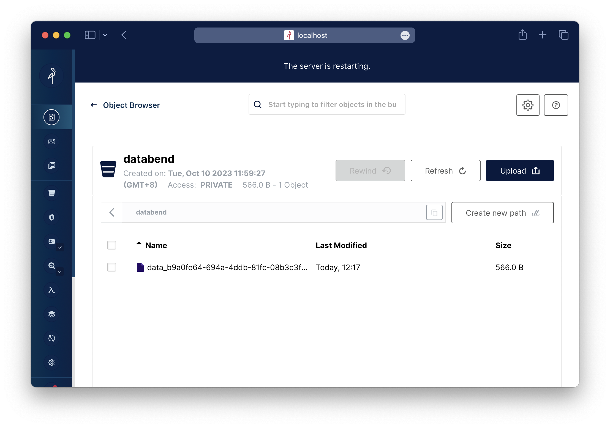

import FunctionDescription from '@site/src/components/FunctionDescription';

<FunctionDescription description="Introduced or updated: v1.2.134"/>

COPY INTO allows you to unload data from a table or query into one or more files in one of the following locations:

* User / Internal / External stages: See [Understanding Stages](../../12-load-data/00-stage/00-whystage.md) to learn about stages in Databend.
* Buckets or containers created in a storage service.

See also: [`COPY INTO <table>`](dml-copy-into-table.md)

## Syntax

```sql
COPY INTO { internalStage | externalStage | externalLocation }
FROM { [<database_name>.]<table_name> | ( <query> ) }
[ FILE_FORMAT = (
         FORMAT_NAME = '<your-custom-format>'
         | TYPE = { CSV | TSV | NDJSON | PARQUET | XML } [ formatTypeOptions ]
       ) ]
[ copyOptions ]
[ VALIDATION_MODE = RETURN_ROWS ]
```

### internalStage

```sql
internalStage ::= @<internal_stage_name>[/<path>]
```

### externalStage

```sql
externalStage ::= @<external_stage_name>[/<path>]
```

### externalLocation

import Tabs from '@theme/Tabs';
import TabItem from '@theme/TabItem';

<Tabs groupId="externallocation">

<TabItem value="Amazon S3-like Storage Services" label="Amazon S3-like Storage Services">

```sql
externalLocation ::=
  's3://<bucket>[<path>]'
  CONNECTION = (
        <connection_parameters>
  )
```
For the connection parameters available for accessing Amazon S3-like storage services, see [Connection Parameters](/13-sql-reference/51-connect-parameters.md).
</TabItem>

<TabItem value="Azure Blob Storage" label="Azure Blob Storage">

```sql
externalLocation ::=
  'azblob://<container>[<path>]'
  CONNECTION = (
        <connection_parameters>
  )
```

For the connection parameters available for accessing Azure Blob Storage, see [Connection Parameters](/13-sql-reference/51-connect-parameters.md).
</TabItem>

<TabItem value="Google Cloud Storage" label="Google Cloud Storage">

```sql
externalLocation ::=
  'gcs://<bucket>[<path>]'
  CONNECTION = (
        <connection_parameters>
  )
```

For the connection parameters available for accessing Google Cloud Storage, see [Connection Parameters](/13-sql-reference/51-connect-parameters.md).
</TabItem>

<TabItem value="Alibaba Cloud OSS" label="Alibaba Cloud OSS">

```sql
externalLocation ::=
  'oss://<bucket>[<path>]'
  CONNECTION = (
        <connection_parameters>
  )
```

For the connection parameters available for accessing Alibaba Cloud OSS, see [Connection Parameters](/13-sql-reference/51-connect-parameters.md).
</TabItem>

<TabItem value="Tencent Cloud Object Storage" label="Tencent Cloud Object Storage">

```sql
externalLocation ::=
  'cos://<bucket>[<path>]'
  CONNECTION = (
        <connection_parameters>
  )
```

For the connection parameters available for accessing Tencent Cloud Object Storage, see [Connection Parameters](/13-sql-reference/51-connect-parameters.md).
</TabItem>

<TabItem value="Hadoop Distributed File System (HDFS)" label="HDFS">

```sql
externalLocation ::=
  'hdfs://<endpoint_url>[<path>]'
  CONNECTION = (
        <connection_parameters>
  )
```

For the connection parameters available for accessing HDFS, see [Connection Parameters](/13-sql-reference/51-connect-parameters.md).
</TabItem>

<TabItem value="WebHDFS" label="WebHDFS">

```sql
externalLocation ::=
  'webhdfs://<endpoint_url>[<path>]'
  CONNECTION = (
        <connection_parameters>
  )
```

For the connection parameters available for accessing WebHDFS, see [Connection Parameters](/13-sql-reference/51-connect-parameters.md).
</TabItem>
</Tabs>

### FILE_FORMAT

See [Input & Output File Formats](../../13-sql-reference/50-file-format-options.md) for details.

### copyOptions

```sql
copyOptions ::=
  [ SINGLE = TRUE | FALSE ]
  [ MAX_FILE_SIZE = <num> ]
```

| Parameter       | Description                                                                                                               |
|-----------------|---------------------------------------------------------------------------------------------------------------------------|
| SINGLE        | When TRUE, the command unloads data into one single file. Default: FALSE.                                                 |
| MAX_FILE_SIZE | The maximum size (in bytes) of each file to be created.<br />Effective when `SINGLE` is FALSE. Default: 67108864 bytes (64 MB). |

## Examples

In this section, the provided examples make use of the following table and data:

```sql
-- Create sample table
CREATE TABLE canadian_city_population (
     city_name VARCHAR(50),
     population INT
);

-- Insert sample data
INSERT INTO canadian_city_population (city_name, population)
VALUES
('Toronto', 2731571),
('Montreal', 1704694),
('Vancouver', 631486),
('Calgary', 1237656),
('Ottawa', 934243),
('Edmonton', 972223),
('Quebec City', 542298),
('Winnipeg', 705244),
('Hamilton', 536917),
('Halifax', 403390);
```

### Example 1: Unloading to Internal Stage

This example unloads data to an internal stage:

```sql
-- Create an internal stage
CREATE STAGE my_internal_stage;

-- Unload data from the table to the stage using the PARQUET file format
COPY INTO @my_internal_stage
    FROM canadian_city_population
    FILE_FORMAT = (TYPE = PARQUET);


LIST @my_internal_stage;

name                                                           |size|md5|last_modified                |creator|
---------------------------------------------------------------+----+---+-----------------------------+-------+
data_cb30822a-4166-4df6-9030-21a47c565bea_0000_00000000.parquet| 566|   |2023-10-10 02:26:48.219 +0000|       |
```

### Example 2: Unloading to Compressed File

This example unloads data into a compressed file:

```sql
-- Unload data from the table to the stage using the CSV file format with gzip compression
COPY INTO @my_internal_stage
    FROM canadian_city_population
    FILE_FORMAT = (TYPE = CSV COMPRESSION = gzip);

COPY INTO @my_internal_stage
    FROM canadian_city_population
    FILE_FORMAT = (TYPE = CSV COMPRESSION = gzip);


LIST @my_internal_stage;

name                                                           |size|md5|last_modified                |creator|
---------------------------------------------------------------+----+---+-----------------------------+-------+
data_95825fe7-de33-4f9c-9a66-3e9525996252_0000_00000000.csv.gz | 168|   |2023-10-10 02:38:37.349 +0000|       |
data_cb30822a-4166-4df6-9030-21a47c565bea_0000_00000000.parquet| 566|   |2023-10-10 02:26:48.219 +0000|       |

-- COPY INTO also works with custom file formats. See below:
-- Create a custom file format named my_cs_gzip with CSV format and gzip compression
CREATE FILE FORMAT my_csv_gzip TYPE = CSV COMPRESSION = gzip;
       
-- Unload data from the table to the stage using the custom file format my_cs_gzip
COPY INTO @my_internal_stage
    FROM canadian_city_population
    FILE_FORMAT = (FORMAT_NAME = 'my_csv_gzip');

LIST @my_internal_stage;

name                                                           |size|md5|last_modified                |creator|
---------------------------------------------------------------+----+---+-----------------------------+-------+
data_95825fe7-de33-4f9c-9a66-3e9525996252_0000_00000000.csv.gz | 168|   |2023-10-10 02:38:37.349 +0000|       |
data_dfb0935f-8ccc-4c4e-970b-5189f1436e89_0000_00000000.csv.gz | 168|   |2023-10-10 02:59:53.580 +0000|       |
data_cb30822a-4166-4df6-9030-21a47c565bea_0000_00000000.parquet| 566|   |2023-10-10 02:26:48.219 +0000|       |
```

### Example 3: Unloading to Bucket

This example unloads data into a bucket on MinIO:

```sql
-- Unload data from the table to a bucket named 'databend' on MinIO using the PARQUET file format
COPY INTO 's3://databend'
    CONNECTION = (
    ENDPOINT_URL = 'http://localhost:9000/',
    ACCESS_KEY_ID = 'ROOTUSER',
    SECRET_ACCESS_KEY = 'CHANGEME123',
    region = 'us-west-2'
    )
    FROM canadian_city_population
    FILE_FORMAT = (TYPE = PARQUET);
```

