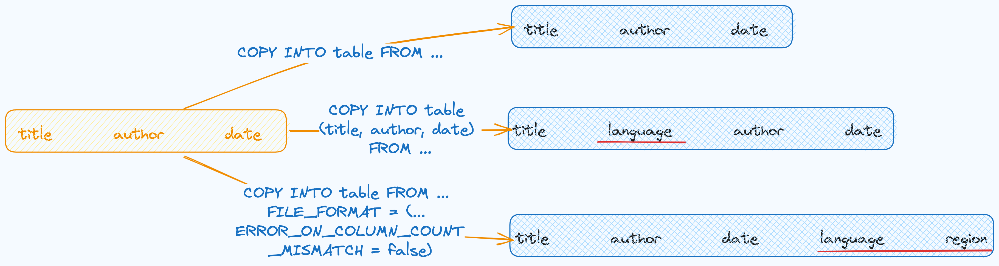

import FunctionDescription from '@site/src/components/FunctionDescription';

<FunctionDescription description="Introduced or updated: v1.2.148"/>

COPY INTO allows you to load data from files located in one of the following locations:

- User / Internal / External stages: See [Understanding Stages](../../12-load-data/00-stage/00-whystage.md) to learn about stages in Databend.
- Buckets or containers created in a storage service.
- Remote servers from where you can access the files by their URL (starting with "https://...").
- [IPFS](https://ipfs.tech).

See also: [`COPY INTO <location>`](dml-copy-into-location.md)

## Syntax

```sql
COPY INTO [<database>.]<table_name>
     FROM { userStage | internalStage | externalStage | externalLocation }
[ FILES = ( '<file_name>' [ , '<file_name>' ] [ , ... ] ) ]
[ PATTERN = '<regex_pattern>' ]
[ FILE_FORMAT = (
         FORMAT_NAME = '<your-custom-format>'
         | TYPE = { CSV | TSV | NDJSON | PARQUET | XML } [ formatTypeOptions ]
       ) ]
[ copyOptions ]
```

### FROM ...

The FROM clause specifies the source location (user stage, internal stage, external stage, or external location) from which data will be loaded into the specified table using the COPY INTO command.

:::note
When you load data from a staged file and the stage path contains special characters such as spaces or parentheses, you can enclose the entire path in single quotes, as demonstrated in the following SQL statements:

COPY INTO mytable FROM 's3://mybucket/dataset(databend)/' ...
COPY INTO mytable FROM 's3://mybucket/dataset databend/' ...
:::

#### userStage

```sql
userStage ::= @~[/<path>]
```

#### internalStage

```sql
internalStage ::= @<internal_stage_name>[/<path>]
```

#### externalStage

```sql
externalStage ::= @<external_stage_name>[/<path>]
```

#### externalLocation

import Tabs from '@theme/Tabs';
import TabItem from '@theme/TabItem';

<Tabs groupId="externallocation">

<TabItem value="Amazon S3-like Storage" label="Amazon S3-like Storage">

```sql
externalLocation ::=
  's3://<bucket>[<path>]'
  CONNECTION = (
        <connection_parameters>
  )
```
For the connection parameters available for accessing Amazon S3-like storage services, see [Connection Parameters](/13-sql-reference/51-connect-parameters.md).
</TabItem>

<TabItem value="Azure Blob Storage" label="Azure Blob Storage">

```sql
externalLocation ::=
  'azblob://<container>[<path>]'
  CONNECTION = (
        <connection_parameters>
  )
```

For the connection parameters available for accessing Azure Blob Storage, see [Connection Parameters](/13-sql-reference/51-connect-parameters.md).
</TabItem>

<TabItem value="Google Cloud Storage" label="Google Cloud Storage">

```sql
externalLocation ::=
  'gcs://<bucket>[<path>]'
  CONNECTION = (
        <connection_parameters>
  )
```

For the connection parameters available for accessing Google Cloud Storage, see [Connection Parameters](/13-sql-reference/51-connect-parameters.md).
</TabItem>

<TabItem value="Alibaba Cloud OSS" label="Alibaba Cloud OSS">

```sql
externalLocation ::=
  'oss://<bucket>[<path>]'
  CONNECTION = (
        <connection_parameters>
  )
```

For the connection parameters available for accessing Alibaba Cloud OSS, see [Connection Parameters](/13-sql-reference/51-connect-parameters.md).
</TabItem>

<TabItem value="Tencent Cloud Object Storage" label="Tencent Cloud Object Storage">

```sql
externalLocation ::=
  'cos://<bucket>[<path>]'
  CONNECTION = (
        <connection_parameters>
  )
```

For the connection parameters available for accessing Tencent Cloud Object Storage, see [Connection Parameters](/13-sql-reference/51-connect-parameters.md).
</TabItem>

<TabItem value="Hadoop Distributed File System (HDFS)" label="HDFS">

```sql
externalLocation ::=
  'hdfs://<endpoint_url>[<path>]'
  CONNECTION = (
        <connection_parameters>
  )
```

For the connection parameters available for accessing HDFS, see [Connection Parameters](/13-sql-reference/51-connect-parameters.md).
</TabItem>

<TabItem value="WebHDFS" label="WebHDFS">

```sql
externalLocation ::=
  'webhdfs://<endpoint_url>[<path>]'
  CONNECTION = (
        <connection_parameters>
  )
```

For the connection parameters available for accessing WebHDFS, see [Connection Parameters](/13-sql-reference/51-connect-parameters.md).
</TabItem>

<TabItem value="Remote Files" label="Remote Files">

```sql
externalLocation ::=
  'https://<url>'
```

You can use glob patterns to specify more than one file. For example, use

- `ontime_200{6,7,8}.csv` to represents `ontime_2006.csv`,`ontime_2007.csv`,`ontime_2008.csv`.
- `ontime_200[6-8].csv` to represents `ontime_2006.csv`,`ontime_2007.csv`,`ontime_2008.csv`.

</TabItem>

<TabItem value="IPFS" label="IPFS">

```sql
externalLocation ::=
  'ipfs://<your-ipfs-hash>'
  CONNECTION = (ENDPOINT_URL = 'https://<your-ipfs-gateway>')
```

</TabItem>
</Tabs>

### FILES

FILES specifies one or more file names (separated by commas) to be loaded.

### PATTERN

A [PCRE2](https://www.pcre.org/current/doc/html/)-based regular expression pattern string, enclosed in single quotes, specifying the file names to match. For PCRE2 syntax, see http://www.pcre.org/current/doc/html/pcre2syntax.html. See [Example 4: Filtering Files with Pattern](#example-4-filtering-files-with-pattern) for examples and useful tips about filtering files with the PATTERN parameter.

### FILE_FORMAT

See [Input & Output File Formats](../../13-sql-reference/50-file-format-options.md) for details.

### copyOptions

```sql
copyOptions ::=
  [ SIZE_LIMIT = <num> ]
  [ PURGE = <bool> ]
  [ FORCE = <bool> ]
  [ DISABLE_VARIANT_CHECK = <bool> ]
  [ ON_ERROR = { continue | abort | abort_N } ]
  [ MAX_FILES = <num> ]
```

| Parameter             | Description                                                                                                                                                                                                                                                                                                                                                                                                      | Required |
|-----------------------|------------------------------------------------------------------------------------------------------------------------------------------------------------------------------------------------------------------------------------------------------------------------------------------------------------------------------------------------------------------------------------------------------------------|----------|
| SIZE_LIMIT            | Specifies the maximum rows of data to be loaded for a given COPY statement. Defaults to `0` meaning no limits.                                                                                                                                                                                                                                                                                                   | Optional |
| PURGE                 | If `True`, the command will purge the files in the stage after they are loaded successfully into the table. Default: `False`.                                                                                                                                                                                                                                                                                    | Optional |
| FORCE                 | COPY INTO ensures idempotence by automatically tracking and preventing the reloading of files for a default period of 7 days. This can be customized using the `load_file_metadata_expire_hours` setting to control the expiration time for file metadata.<br/>This parameter defaults to `False` meaning COPY INTO will skip duplicate files when copying data. If `True`, duplicate files will not be skipped. | Optional |
| DISABLE_VARIANT_CHECK | If `True`, this will allow the variant field to insert invalid JSON strings. Default: `False`.                                                                                                                                                                                                                                                                                                                   | Optional |
| ON_ERROR              | Decides how to handle a file that contains errors: 'continue' to skip and proceed, 'abort' to terminate on error, 'abort_N' to terminate when errors ≥ N. Default is 'abort'. Note: 'abort_N' not available for Parquet files.                                                                                                                                                                                   | Optional |
| MAX_FILES             | Sets the maximum number of files to load that have not been loaded already. The value can be set up to 500; any value greater than 500 will be treated as 500.                                                                                                                                                                                                                                                   | Optional |
| RETURN_FAILED_ONLY    | When set to 'True', only files that failed to load will be returned in the output. Default: `False`.                                                                                                                                                                                                                                                                                          | Optional |

:::tip
When importing large volumes of data, such as logs, it is recommended to set both `PURGE` and `FORCE` to True. This ensures efficient data import without the need for interaction with the Meta server (updating the copied-files set). However, it is important to be aware that this may lead to duplicate data imports.
:::

## Output

COPY INTO provides a summary of the data loading results with these columns:

| Column           | Type    | Nullable | Description                                     |
|------------------|---------|----------|-------------------------------------------------|
| FILE             | VARCHAR | NO       | The relative path to the source file.           |
| ROWS_LOADED      | INT     | NO       | The number of rows loaded from the source file. |
| ERRORS_SEEN      | INT     | NO       | Number of error rows in the source file         |
| FIRST_ERROR      | VARCHAR | YES      | The first error found in the source file.       |
| FIRST_ERROR_LINE | INT     | YES      | Line number of the first error.                 |

If RETURN_FAILED_ONLY is set to True, the output will only contain the files that failed to load.

## Distributed COPY INTO

COPY INTO supports distributed execution in cluster environments. You can enable distributed COPY INTO by setting ENABLE_DISTRIBUTED_COPY_INTO to 1. This helps enhance data loading performance and scalability in cluster environments.

```sql
SET enable_distributed_copy_into = 1;
```

## Examples

### Example 1: Loading from Stages

These examples showcase data loading into Databend from various types of stages:

<Tabs>
  <TabItem value="user" label="User Stage" default>

```sql
COPY INTO mytable
    FROM @~
    PATTERN = '.*[.]parquet'
    FILE_FORMAT = (TYPE = PARQUET);
```
  </TabItem>
  <TabItem value="internal" label="Internal Stage">

```sql
COPY INTO mytable
    FROM @my_internal_stage
    PATTERN = '.*[.]parquet'
    FILE_FORMAT = (TYPE = PARQUET);
```
  </TabItem>
  <TabItem value="external" label="External Stage">

```sql
COPY INTO mytable
    FROM @my_external_stage
    PATTERN = '.*[.]parquet'
    FILE_FORMAT = (TYPE = PARQUET);
```
  </TabItem>
</Tabs>

### Example 2: Loading from External Locations

These examples showcase data loading into Databend from various types of external sources:

<Tabs groupId="external-example">
<TabItem value="Amazon S3" label="Amazon S3">

This example establishes a connection to Amazon S3 using AWS access keys and secrets, and it loads 10 rows from a CSV file:

```sql
-- Authenticated by AWS access keys and secrets.
COPY INTO mytable
    FROM 's3://mybucket/data.csv'
    CONNECTION = (
        ACCESS_KEY_ID = '<your-access-key-ID>',
        SECRET_ACCESS_KEY = '<your-secret-access-key>'
    )
    FILE_FORMAT = (
        TYPE = CSV,
        FIELD_DELIMITER = ',',
        RECORD_DELIMITER = '\n',
        SKIP_HEADER = 1
    )
    SIZE_LIMIT = 10;
```

This example connects to Amazon S3 using AWS IAM role authentication with an external ID and loads CSV files matching the specified pattern from 'mybucket':

```sql
-- Authenticated by AWS IAM role and external ID.
COPY INTO mytable
    FROM 's3://mybucket/'
    CONNECTION = (
        ENDPOINT_URL = 'https://<endpoint-URL>',
        ROLE_ARN = 'arn:aws:iam::123456789012:role/my_iam_role',
        EXTERNAL_ID = '123456'
    )
    PATTERN = '.*[.]csv'
        FILE_FORMAT = (
        TYPE = CSV,
        FIELD_DELIMITER = ',',
        RECORD_DELIMITER = '\n',
        SKIP_HEADER = 1
    );
```

</TabItem>

<TabItem value="Azure Blob Storage" label="Azure Blob Storage">

This example connects to Azure Blob Storage and loads data from 'data.csv' into Databend:

```sql
COPY INTO mytable
    FROM 'azblob://mybucket/data.csv'
    CONNECTION = (
        ENDPOINT_URL = 'https://<account_name>.blob.core.windows.net',
        ACCOUNT_NAME = '<account_name>',
        ACCOUNT_KEY = '<account_key>'
    )
    FILE_FORMAT = (type = CSV);
```
</TabItem>

<TabItem value="Remote Files" label="Remote Files">

This example loads data from three remote CSV files and skips a file in case of errors.

```sql
COPY INTO mytable
    FROM 'https://ci.databend.org/dataset/stateful/ontime_200{6,7,8}_200.csv'
    FILE_FORMAT = (type = CSV)
    ON_ERROR = continue;
```
</TabItem>

<TabItem value="IPFS" label="IPFS">

This example loads data from a CSV file on IPFS:

```sql
COPY INTO mytable
    FROM 'ipfs://<your-ipfs-hash>'
    CONNECTION = (
        ENDPOINT_URL = 'https://<your-ipfs-gateway>'
    )
    FILE_FORMAT = (
        TYPE = CSV,
        FIELD_DELIMITER = ',',
        RECORD_DELIMITER = '\n',
        SKIP_HEADER = 1
    );
```
</TabItem>
</Tabs>

### Example 3: Loading Compressed Data

This example loads a GZIP-compressed CSV file on Amazon S3 into Databend:

```sql
COPY INTO mytable
    FROM 's3://mybucket/data.csv.gz'
    CONNECTION = (
        ENDPOINT_URL = 'https://<endpoint-URL>',
        ACCESS_KEY_ID = '<your-access-key-ID>',
        SECRET_ACCESS_KEY = '<your-secret-access-key>'
    )
    FILE_FORMAT = (
        TYPE = CSV,
        FIELD_DELIMITER = ',',
        RECORD_DELIMITER = '\n',
        SKIP_HEADER = 1,
        COMPRESSION = AUTO
    );
```

### Example 4: Filtering Files with Pattern

This example demonstrates how to load CSV files from Amazon S3 using pattern matching with the PATTERN parameter. It filters files with 'sales' in their names and '.csv' extensions:

```sql
COPY INTO mytable
    FROM 's3://mybucket/'
    PATTERN = '.*sales.*[.]csv'
    FILE_FORMAT = (
        TYPE = CSV,
        FIELD_DELIMITER = ',',
        RECORD_DELIMITER = '\n',
        SKIP_HEADER = 1
    );
```
Where `.*` is interpreted as zero or more occurrences of any character. The square brackets escape the period character `.` that precedes a file extension.

To load from all the CSV files:

```sql
COPY INTO mytable
    FROM 's3://mybucket/'
    PATTERN = '.*[.]csv'
    FILE_FORMAT = (
        TYPE = CSV,
        FIELD_DELIMITER = ',',
        RECORD_DELIMITER = '\n',
        SKIP_HEADER = 1
    );

```

When specifying the pattern for a file path including multiple folders, consider your matching criteria:

- If you want to match a specific subpath following a prefix, include the prefix in the pattern (e.g., 'multi_page/') and then specify the pattern you want to match within that subpath (e.g., '_page_1').

```sql
-- File path: parquet/multi_page/multi_page_1.parquet
COPY INTO ... FROM @data/parquet/ PATTERN = 'multi_page/.*_page_1.*') ...
```

- If you want to match any part of the file path that contains the desired pattern, use '.*' before and after the pattern (e.g., '.*multi_page_1.*') to match any occurrences of 'multi_page_1' within the path.

```sql
-- File path: parquet/multi_page/multi_page_1.parquet
COPY INTO ... FROM @data/parquet/ PATTERN ='.*multi_page_1.*') ...
```

### Example 5: Loading to Table with Extra Columns

This section demonstrates data loading into a table with extra columns, using the sample file [books.csv](https://datafuse-1253727613.cos.ap-hongkong.myqcloud.com/data/books.csv):

```text title='books.csv'
Transaction Processing,Jim Gray,1992
Readings in Database Systems,Michael Stonebraker,2004
```



By default, COPY INTO loads data into a table by matching the order of fields in the file to the corresponding columns in the table. It's essential to ensure that the data aligns correctly between the file and the table. For example,

```sql
CREATE TABLE books
(
    title VARCHAR,
    author VARCHAR,
    date VARCHAR
);

COPY INTO books
    FROM 'https://datafuse-1253727613.cos.ap-hongkong.myqcloud.com/data/books.csv'
    FILE_FORMAT = (TYPE = CSV);
```

If your table has more columns than the file, you can specify the columns into which you want to load data. For example,

```sql
CREATE TABLE books_with_language
(
    title VARCHAR,
    language VARCHAR,
    author VARCHAR,
    date VARCHAR
);

COPY INTO books_with_language (title, author, date)
    FROM 'https://datafuse-1253727613.cos.ap-hongkong.myqcloud.com/data/books.csv'
    FILE_FORMAT = (TYPE = CSV);
```

If your table has more columns than the file, and the additional columns are at the end of the table, you can load data using the [FILE_FORMAT](#file_format) option `ERROR_ON_COLUMN_COUNT_MISMATCH`. This allows you to load data without specifying each column individually. Please note that ERROR_ON_COLUMN_COUNT_MISMATCH currently works for the CSV file format.

```sql
CREATE TABLE books_with_extra_columns
(
    title VARCHAR,
    author VARCHAR,
    date VARCHAR,
    language VARCHAR,
    region VARCHAR
);

COPY INTO books_with_extra_columns
    FROM 'https://datafuse-1253727613.cos.ap-hongkong.myqcloud.com/data/books.csv'
    FILE_FORMAT = (TYPE = CSV, ERROR_ON_COLUMN_COUNT_MISMATCH = false);
```

:::note
Extra columns in a table can have default values specified by [CREATE TABLE](../00-ddl/20-table/10-ddl-create-table.md) or [ALTER TABLE COLUMN](../00-ddl/20-table/90-alter-table-column.md). If a default value is not explicitly set for an extra column, the default value associated with its data type will be applied. For instance, an integer-type column will default to 0 if no other value is specified. 
:::

### Example 6: Loading JSON with Custom Format

This example loads data from a CSV file "data.csv" with the following content:

```json
1,"U00010","{\"carPriceList\":[{\"carTypeId":10,\"distance":5860},{\"carTypeId":11,\"distance\":5861}]}"
2,"U00011","{\"carPriceList\":[{\"carTypeId":12,\"distance":5862},{\"carTypeId":13,\"distance\":5863}]}"
```

Each line contains three columns of data, with the third column being a string containing JSON data. To load CSV data correctly with JSON fields, we need to set the correct escape character. This example uses the backslash \ as the escape character, as the JSON data contains double quotes ".

#### Step 1: Create custom file format.

```sql
-- Define a custom CSV file format with the escape character set to backslash \
CREATE FILE FORMAT my_csv_format
    TYPE = CSV
    ESCAPE = '\\';
```

#### Step 2: Create target table.

```sql
CREATE TABLE t
  (
     id       INT,
     seq      VARCHAR,
     p_detail VARCHAR
  ); 
```

#### Step 3: Load with custom file format.

```sql
COPY INTO t FROM @t_stage FILES=('data.csv') 
FILE_FORMAT=(FORMAT_NAME='my_csv_format');
```