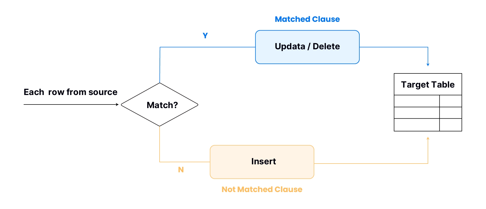
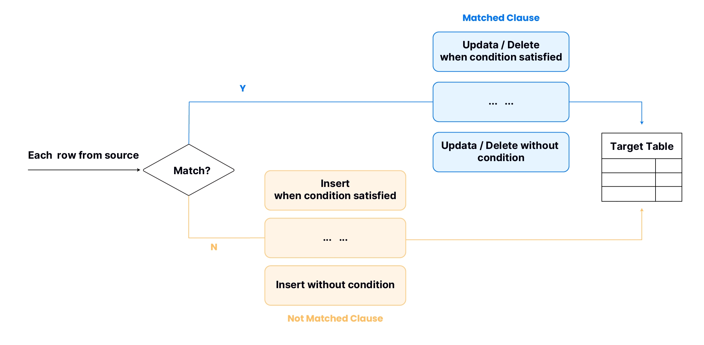

import FunctionDescription from '@site/src/components/FunctionDescription';

<FunctionDescription description="Introduced: v1.2.122"/>

Performs INSERT, UPDATE, or DELETE operations on rows within a target table, all in accordance with conditions and matching criteria specified within the statement, using data from a specified source.

The data source, which can be a subquery, is linked to the target data via a JOIN expression. This expression assesses whether each row in the source can find a match in the target table and then determines which type of clause (MATCHED or NOT MATCHED) it should move to in the next execution step.



A MERGE statement usually contains a MATCHED and / or a NOT MATCHED clause, instructing Databend on how to handle matched and unmatched scenarios. For a MATCHED clause, you have the option to choose between performing an UPDATE or DELETE operation on the target table. Conversely, in the case of a NOT MATCHED clause, the available choice is INSERT.

## Multiple MATCHED & NOT MATCHED Clauses

A MERGE statement can include multiple MATCHED and / or NOT MATCHED clauses, giving you the flexibility to specify different actions to be taken based on the conditions met during the MERGE operation.



If a MERGE statement includes multiple MATCHED clauses, a condition needs to be specified for each clause EXCEPT the last one. These conditions determine the criteria under which the associated operations are executed. Databend evaluates the conditions in the specified order. Once a condition is met, it triggers the specified operation, skips any remaining MATCHED clauses, then moves on to the next row in the source. If the MERGE statement also includes multiple NOT MATCHED clauses, Databend handles them in a similar way.

:::note
MERGE is currently in an experimental state. Before using the MERGE command, you need to run "SET enable_experimental_merge_into = 1;" to enable the feature.
:::

## Syntax

```sql
MERGE INTO <target_table> 
    USING (SELECT ... ) ON <join_expr> { matchedClause | notMatchedClause } [ ... ]

matchedClause ::=
  WHEN MATCHED [ AND <condition> ] THEN 
  { UPDATE SET <col_name> = <expr> [ , <col_name2> = <expr2> ... ] | UPDATE * | DELETE } 

notMatchedClause ::=
  WHEN NOT MATCHED [ AND <condition> ] THEN 
  { INSERT ( <col_name> [ , <col_name2> ... ] ) VALUES ( <expr> [ , ... ] ) | INSERT * }
```

- **UPDATE ***: Updates all columns of the matched row in the target table with values from the corresponding row in the source. This requires the column names between the source and target are consistent (though their order can be different) because during the update process, matching is done based on column names.

- **INSERT ***: Inserts a new row into the target table with values from the source row. This requires the source row has the same columns in the same order as those in the target table.

## Examples

### Example 1: Merge with Multiple Matched Clauses

This example uses MERGE to synchronize employee data from 'employees' into 'salaries', allowing for inserting and updating salary information based on specified criteria.

```sql
-- Create the 'employees' table as the source for merging
CREATE TABLE employees (
    employee_id INT,
    employee_name VARCHAR(255),
    department VARCHAR(255)
);

-- Create the 'salaries' table as the target for merging
CREATE TABLE salaries (
    employee_id INT,
    salary DECIMAL(10, 2)
);

-- Insert initial employee data
INSERT INTO employees VALUES
    (1, 'Alice', 'HR'),
    (2, 'Bob', 'IT'),
    (3, 'Charlie', 'Finance'),
    (4, 'David', 'HR');

-- Insert initial salary data
INSERT INTO salaries VALUES
    (1, 50000.00),
    (2, 60000.00);

-- Enable MERGE INTO
SET enable_experimental_merge_into = 1;

-- Merge data into 'salaries' based on employee details from 'employees'
MERGE INTO salaries
    USING (SELECT * FROM employees)
    ON salaries.employee_id = employees.employee_id
    WHEN MATCHED AND employees.department = 'HR' THEN
        UPDATE SET
            salaries.salary = salaries.salary + 1000.00
    WHEN MATCHED THEN
        UPDATE SET
            salaries.salary = salaries.salary + 500.00
    WHEN NOT MATCHED THEN
        INSERT (employee_id, salary)
            VALUES (employees.employee_id, 55000.00);

-- Retrieve all records from the 'salaries' table after merging
SELECT * FROM salaries;

employee_id | salary
--------------------
1           | 51000.00
2           | 60500.00
3           | 55000.00
4           | 55000.00
```

### Example 2: Merge with UPDATE \* & INSERT \*

This example uses MERGE to synchronize data between the target_table and source_table, updating matching rows with values from the source and inserting non-matching rows.

```sql
-- Create the target table target_table
CREATE TABLE target_table (
    ID INT,
    Name VARCHAR(50),
    Age INT,
    City VARCHAR(50)
);

-- Insert initial data into target_table
INSERT INTO target_table (ID, Name, Age, City)
VALUES
    (1, 'Alice', 25, 'Toronto'),
    (2, 'Bob', 30, 'Vancouver'),
    (3, 'Carol', 28, 'Montreal');

-- Create the source table source_table
CREATE TABLE source_table (
    ID INT,
    Name VARCHAR(50),
    Age INT,
    City VARCHAR(50)
);

-- Insert initial data into source_table
INSERT INTO source_table (ID, Name, Age, City)
VALUES
    (1, 'David', 27, 'Calgary'),
    (2, 'Emma', 29, 'Ottawa'),
    (4, 'Frank', 32, 'Edmonton');

-- Enable MERGE INTO
SET enable_experimental_merge_into = 1;

-- Merge data from source_table into target_table
MERGE INTO target_table AS T
    USING (SELECT * FROM source_table) AS S
    ON T.ID = S.ID
    WHEN MATCHED THEN
        UPDATE *
    WHEN NOT MATCHED THEN
    INSERT *;

-- Retrieve all records from the 'target_table' after merging
SELECT * FROM target_table order by ID;

id|name |age|city    |
--+-----+---+--------+
 1|David| 27|Calgary |
 2|Emma | 29|Ottawa  |
 3|Carol| 28|Montreal|
 4|Frank| 32|Edmonton|
```