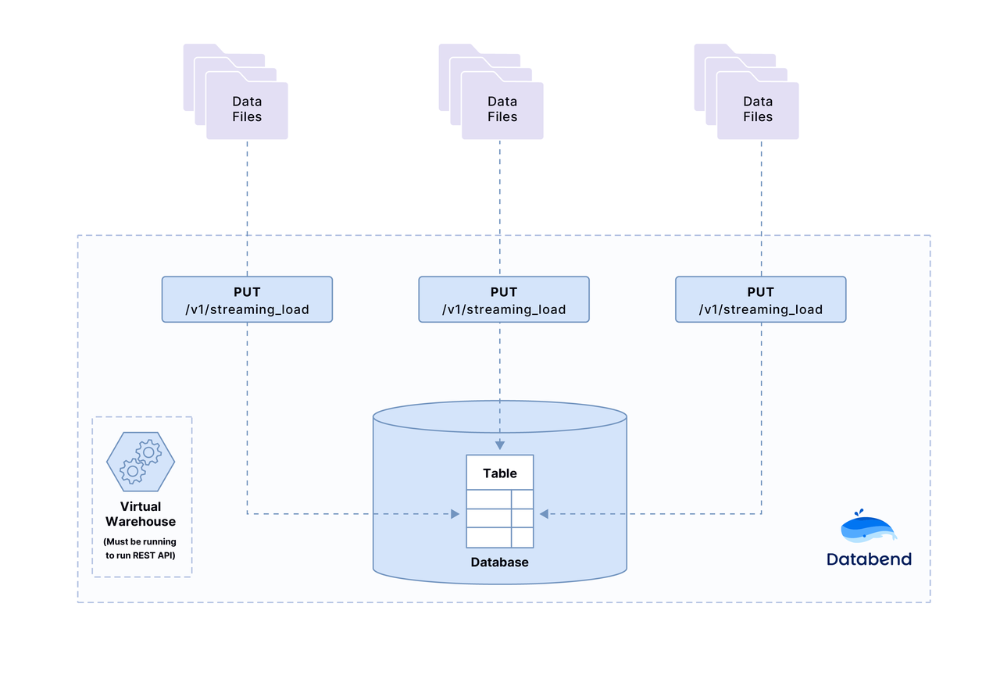

This tutorial explains how to use the HTTP API `v1/streaming_load` to load data from a local file (in the CSV, JSON, NDJSON, or Parquet format) into Databend.

> Note: CSV file should be UTF-8 character encoded if you have extra character set.

### Before You Begin

* **Databend :** Make sure Databend is running and accessible, see [How to deploy Databend](../10-deploy/02-deploying-databend.md).

### Step 1. Data Files for Loading

Download the sample data file(Choose CSV or Parquet), the file contains two records:
```text
Transaction Processing,Jim Gray,1992
Readings in Database Systems,Michael Stonebraker,2004
```

import Tabs from '@theme/Tabs';
import TabItem from '@theme/TabItem';

<Tabs groupId="sample-data">

<TabItem value="csv" label="CSV">

Download [books.csv](https://datafuse-1253727613.cos.ap-hongkong.myqcloud.com/data/books.csv)

</TabItem>

<TabItem value="parquet" label="Parquet">

Download [books.parquet](https://datafuse-1253727613.cos.ap-hongkong.myqcloud.com/data/books.parquet)

</TabItem>

</Tabs>

### Step 2. Create Database and Table

```shell
mysql -h127.0.0.1 -uroot -P3307
```

```sql
CREATE DATABASE book_db;
```

```sql
USE book_db;
```

```sql
CREATE TABLE books
(
    title VARCHAR,
    author VARCHAR,
    date VARCHAR
);
```

### Step 3. Load Data into the Target Tables

<Tabs groupId="load-data">

<TabItem value="csv" label="CSV">

```shell title='Request'
curl -XPUT 'http://root:@127.0.0.1:8081/v1/streaming_load' -H 'insert_sql: insert into book_db.books format CSV' -H 'skip_header: 0' -H 'field_delimiter: ,' -H 'record_delimiter: \n' -F 'upload=@"./books.csv"'
```

```json title='Response'
{
  "id": "f4c557d3-f798-4cea-960a-0ba021dd4646",
  "state": "SUCCESS",
  "stats": {
    "rows": 2,
    "bytes": 157
  },
  "error": null
}
```

:::tip
* http://127.0.0.1:8081/v1/streaming_load
  * `127.0.0.1` is `http_handler_host` value in your *databend-query.toml*
  * `8081` is `http_handler_port` value in your *databend-query.toml*

* skip_header: Number of lines at the start of the file to skip
* field_delimiter: One character that separate fields
* record_delimiter: One character that separate records
* -F  \"upload=@./books.csv\"
  * Your books.csv file location
:::

</TabItem>

<TabItem value="parquet" label="Parquet">

```shell title='Request'
curl -XPUT 'http://root:@127.0.0.1:8081/v1/streaming_load' -H 'insert_sql: insert into book_db.books format Parquet' -F 'upload=@"./books.parquet"'
```

```json title='Response'
{
  "id": "f4c557d3-f798-4cea-960a-0ba021dd4646",
  "state": "SUCCESS",
  "stats": {
    "rows": 2,
    "bytes": 157
  },
  "error": null
}
```

:::tip
* http://127.0.0.1:8081/v1/streaming_load
  * `127.0.0.1` is `http_handler_host` value in your *databend-query.toml*
  * `8081` is `http_handler_port` value in your *databend-query.toml*

* -F  \"upload=@./books.parquet\"
  * Your books.parquet file location
:::

</TabItem>

</Tabs>


### Step 4. Verify the Loaded Data

```sql
SELECT * FROM books;
+------------------------------+----------------------+-------+
| title                        | author               | date  |
+------------------------------+----------------------+-------+
| Transaction Processing       |  Jim Gray            |  1992 |
| Readings in Database Systems |  Michael Stonebraker |  2004 |
+------------------------------+----------------------+-------+
```

### Step 5. Congratulations!

You have successfully completed the tutorial.