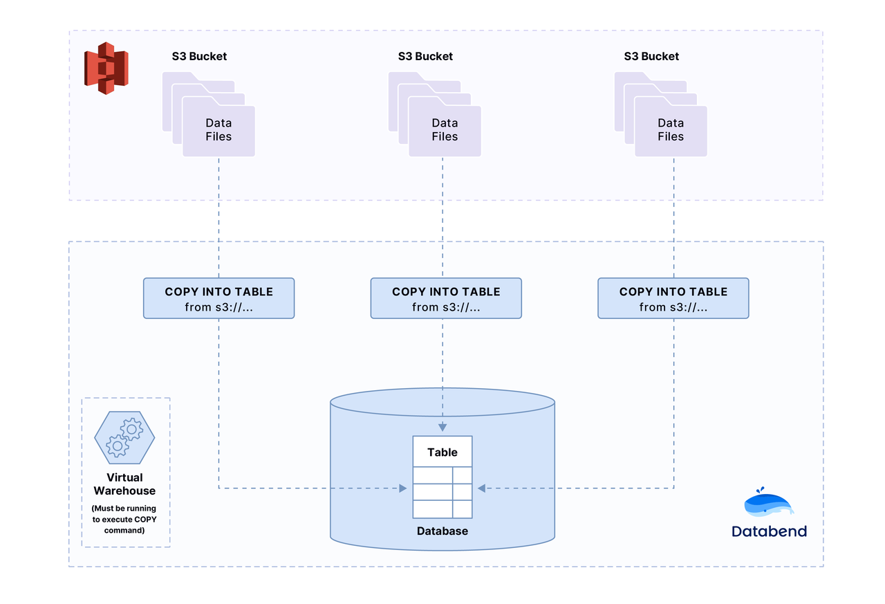

Databend [COPY](../30-reference/30-sql/10-dml/dml-copy-into-table.md) command can read object files(CSV, JSON, NDJSON or Parquet file format) from Amazon S3 buckets.

### Before You Begin

* **AWS Account:**  This Quickstart uses Amazon S3 and requires an AWS account’s *`access key id`* and *`secret access key`*.
* **Databend :** Make sure Databend is running and accessible, please see [Deploy Databend With S3](../10-deploy/02-deploying-databend.md).

### Step 1. Data Files for Loading

Download the sample data file(Choose CSV or Parquet), the file contains two records:
```text
Transaction Processing,Jim Gray,1992
Readings in Database Systems,Michael Stonebraker,2004
```

import Tabs from '@theme/Tabs';
import TabItem from '@theme/TabItem';

<Tabs groupId="sample-data">

<TabItem value="csv" label="CSV">

Download [books.csv](https://datafuse-1253727613.cos.ap-hongkong.myqcloud.com/data/books.csv)

</TabItem>

<TabItem value="parquet" label="Parquet">

Download [books.parquet](https://datafuse-1253727613.cos.ap-hongkong.myqcloud.com/data/books.parquet)

</TabItem>

</Tabs>


### Step 2. Creating an Amazon S3 Bucket

If you don't know how to create Amazon S3 bucket, please see [Create Amazon S3 Bucket](https://docs.aws.amazon.com/AmazonS3/latest/userguide/create-bucket-overview.html).

### Step 3. Add sample data files to Amazon S3 bucket

Upload `books.csv` or `books.parquet` to the bucket.

If you don't know how to upload file to Amazon S3 bucket, please see [Upload Files to Amazon S3 Bucket](https://docs.aws.amazon.com/AmazonS3/latest/userguide/upload-objects.html).

### Step 4. Create Database and Table

```shell
mysql -h127.0.0.1 -uroot -P3307 
```

```sql
CREATE DATABASE book_db;
```

```sql
USE book_db;
```

```sql
CREATE TABLE books
(
    title VARCHAR,
    author VARCHAR,
    date VARCHAR
);
```

Now that the database and table have been created.
In Step 3 of this Quickstart, you uploaded the `books.csv` or `books.parquet` file to your bucket.
To use the COPY data loading, you will need the following information:
* The name of the S3 URI(*s3://bucket/to/path/*), such as: *s3://databend-bohu/data/*
* Your AWS account’s access keys, such as:
  * Access Key ID: *your-access-key-id*
  * Secret Access Key: *your-secret-access-key*


### Step 5: Copy Data into the Target Tables

Using this URI and keys, execute the following statement, replacing the placeholder values with your own:

<Tabs groupId="sample-data">

<TabItem value="csv" label="CSV">

```sql
COPY INTO books
  FROM 's3://databend-bohu/data/'
  credentials=(aws_key_id='<your-access-key-id>' aws_secret_key='<your-secret-access-key>')
  pattern ='.*[.]csv'
  file_format = (type = 'CSV' field_delimiter = ','  record_delimiter = '\n' skip_header = 0);
```


</TabItem>

<TabItem value="parquet" label="Parquet">

```sql
COPY INTO books
  FROM 's3://databend-bohu/data/'
  credentials=(aws_key_id='<your-access-key-id>' aws_secret_key='<your-secret-access-key>')
  pattern ='.*[.]parquet'
  file_format = (type = 'Parquet');
```

</TabItem>

</Tabs>


:::tip

If the file(s) is large and we want to check the file format is ok to parse, we can use the `SIZE_LIMIT`:

```sql
COPY INTO books
  FROM 's3://databend-bohu/data/'
  credentials=(aws_key_id='<your-access-key-id>' aws_secret_key='<your-secret-access-key>')
  pattern ='.*[.]csv'
  file_format = (type = 'CSV' field_delimiter = ','  record_delimiter = '\n' skip_header = 0)
  size_limit = 1; -- only load 1 rows
```
:::

### Step 6. Verify the Loaded Data

Now, let's check the data to make sure data has actually loaded:

```sql
SELECT * FROM books;
+------------------------------+----------------------+-------+
| title                        | author               | date  |
+------------------------------+----------------------+-------+
| Transaction Processing       |  Jim Gray            |  1992 |
| Readings in Database Systems |  Michael Stonebraker |  2004 |
+------------------------------+----------------------+-------+
```

### Step 7. Congratulations!

You have successfully completed the tutorial.
