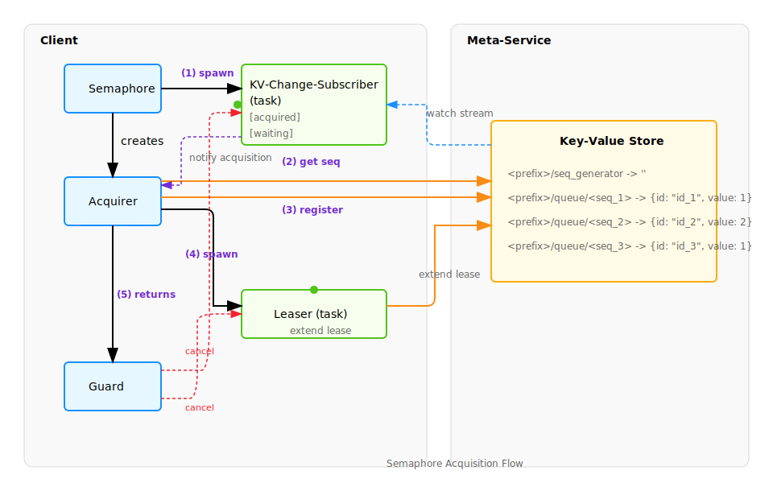

# Databend Common Meta Semaphore

A distributed semaphore implementation based on meta-service, providing reliable resource management across distributed systems.

## Overview

This crate implements a distributed semaphore using a meta-service as the underlying storage and coordination mechanism. It provides a robust way to manage and coordinate access to limited resources across distributed systems.

## Features

- **Distributed Coordination**: Uses meta-service for reliable distributed coordination
- **Fair Queueing**: Implements a fair queueing mechanism based on sequence numbers
- **Automatic Lease Management**: Handles TTL and lease extension automatically
- **Atomic Operations**: Ensures consistency through atomic operations on meta-service
- **Event-based Updates**: Real-time updates through meta-service watch API

## Key Components

### Semaphore Structure

```text
<prefix>/meta          -> {capacity: 10}  // Planned for future versions
<prefix>/queue/<seq_1> -> {id: "<id_1>", value: 1}
<prefix>/queue/<seq_2> -> {id: "<id_2>", value: 2}
<prefix>/queue/<seq_3> -> {id: "<id_3>", value: 1}
<prefix>/seq_generator -> {}
```

- `<prefix>`: User-defined string to identify a semaphore instance
- `queue/*`: Contains semaphore entries with sequence numbers
- `seq_generator`: Generates globally unique sequence numbers
- Each entry contains:
  - `id`: User-defined identifier
  - `value`: Resource amount consumed

### Main Types

- `Semaphore`: The main entry point for semaphore operations
- `Acquirer`: Handles the semaphore acquisition process
- `AcquiredGuard`: Manages the lifecycle of an acquired semaphore
- `SemaphoreEntry`: Represents a semaphore entry in the queue
- `SemaphoreKey`: Defines the key structure for semaphore entries

## Usage

```rust
let client = MetaGrpcClient::try_create(/*..*/);
let acquired_guard = Semaphore::new_acquired(
        client,
        "your/semaphore/name/in/meta/service",
        2,                          // capacity: 2 acquired at most
        "id11",                     // ID of this acquirer
        Duration::from_secs(3)      // lease time
).await?;

acquired_guard.await;
// Released
```

## Implementation Details

### Acquisition Process

1. Client obtains a new sequence number from `seq_generator`
2. Creates a `SemaphoreEntry` and inserts it at `queue/<seq>`
3. Submits a watch request to monitor changes
4. Maintains local collections of `acquired` and `waiting` entries
5. Manages entries based on capacity and sequence order



### Consistency Guarantees

- Atomic verification of sequence numbers during insertion
- Fair ordering based on sequence numbers
- Automatic lease management to prevent stale entries
- Real-time updates through meta-service watch API

## Current Limitations

- Capacity is set per client rather than globally (planned for future versions)
- Different capacity values across clients may lead to starvation
- Future versions will store capacity in the `meta` key for consistency

## License

This project is licensed under the Apache License 2.0 - see the LICENSE file for details.
