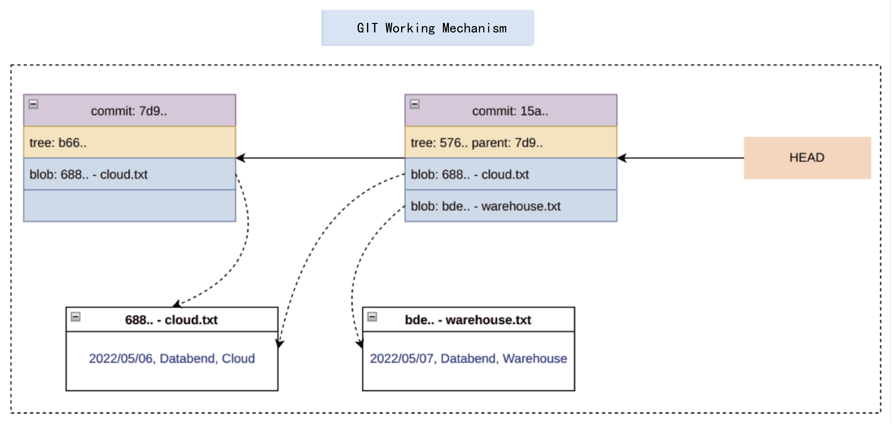
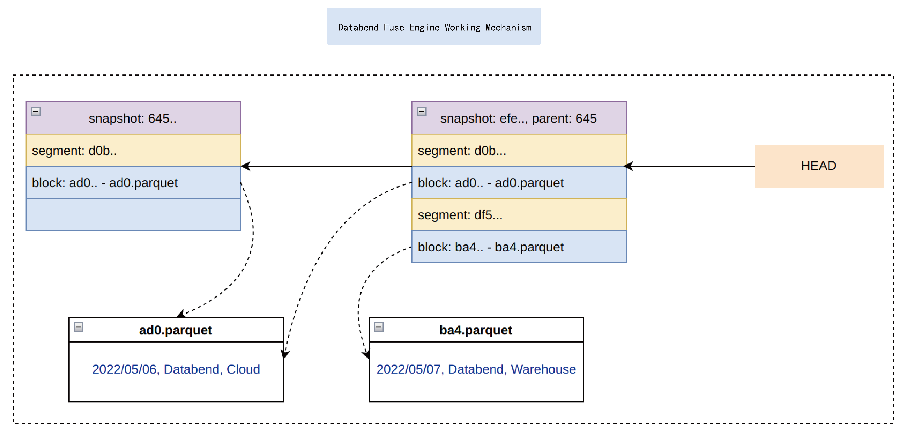

> Databend, developed with Rust, is a new open-source data warehouse architected toward the cloud. It is committed to providing fast elastic expansion capabilities and a pay-as-you-go user experience.
> GitHub：https://github.com/datafuselabs/databend

## Introduction

This post explains the Databend base: Fuse Engine, a powerful columnar storage engine. The engine was designed by the Databend community with the following principles: Powerful performance, simple architecture, and high reliability.

Before we start, check out a challenging task that Databend completed: With the Fuse Engine deployed on AWS S3, a transaction wrote 22.89 TB of raw data in around one and a half hour.

```sql
mysql> INSERT INTO ontime_new SELECT * FROM ontime_new;
Query OK, 0 rows affected (1 hour 34 min 36.82 sec)
Read 31619274180 rows, 22.89 TB in 5675.207 sec., 5.57 million rows/sec., 4.03 GB/sec.
```

Meanwhile, the following conditions were met as well:

* Distributed transactions: Multiple computing nodes can read and write the same data simultaneously (This is the first problem that an architecture that separates storage from compute must solve).
* Snapshot isolation: Different versions of data do not affect each other so you can do Zero-Copy Cloning for tables.
* Retrospective ability: You are allowed to switch to any version of the data, so you can recover with the Time Travel feature.
* Data merging: A new version of data can be generated after merging.
* Simple and robust: Data relationships are described using files, and you can recover entire data system based on these files.

From above, you will find that Fuse Engine is "Git-inspired". Before introducing the design of Fuse Engine, let's take a look at how the bottom layer of Git works.

## How Git Works 

Git implements data version control (including branch, commit, checkout, and merge) in a distributed environment. Based on Git semantics, it is possible to create a distributed storage engine. There are also some products built on Git-like on the market, such as [Nessie - Transactional Catalog for Data Lakes](https://projectnessie.org/) and [lakeFS](https://lakefs.io/).

To better explore the underlying working mechanism of Git, we use Git semantics to complete a series of "data" operations from the perspective of the database.

1. Prepare a file named `cloud.txt` with the content:

```shell
2022/05/06, Databend, Cloud
```

2. Commit the file `cloud.txt` to Git.

```shell
git commit -m "Add cloud.txt"
```

3. Git generates a snapshot (Commit ID:  `7d972c7ba9213c2a2b15422d4f31a8cbc9815f71`).

```shell
git log 
commit 7d972c7ba9213c2a2b15422d4f31a8cbc9815f71 (HEAD)
Author: BohuTANG <overred.shuttler@gmail.com>
Date:   Fri May 6 16:44:21 2022 +0800

    Add cloud.txt
```

4. Prepare another file named `warehouse.txt`.

```shell
2022/05/07, Databend, Warehouse
```

5. Commit the file `warehouse.txt` to Git.

```shell
git commit -m "Add warehouse.txt"
```

6. Git generates another snapshot (Commit ID:  `15af34e4d16082034e1faeaddd0332b3836f1424`).

```shell
commit 15af34e4d16082034e1faeaddd0332b3836f1424 (HEAD)
Author: BohuTANG <overred.shuttler@gmail.com>
Date:   Fri May 6 17:41:43 2022 +0800

    Add warehouse.txt

commit 7d972c7ba9213c2a2b15422d4f31a8cbc9815f71
Author: BohuTANG <overred.shuttler@gmail.com>
Date:   Fri May 6 16:44:21 2022 +0800

    Add cloud.txt
```

Git now keeps two versions of the data:

```shell
ID 15af34e4d16082034e1faeaddd0332b3836f1424，Version2
ID 7d972c7ba9213c2a2b15422d4f31a8cbc9815f71，Version1
```

We can switch between versions by the Commit ID, which implements the functions of Time Travel and Table Zero-Copy. How does Git make it possible in the bottom layer? It's not rocket science. Git introduces these types of object files to describe the relationship:

* Commit: Describes tree object information
* Tree: Describes blob object information
* Blob: Describes file information



### HEAD File

First, we need to know the HEAD pointer:

```shell
cat .git/HEAD
15af34e4d16082034e1faeaddd0332b3836f1424
```

### Commit File

The Commit file records metadata related to the commit, such as the current tree and parent, as well as the committer, etc. 

File path:

```shell
.git/objects/15/af34e4d16082034e1faeaddd0332b3836f1424
```

File content:

```shell
git cat-file -p 15af34e4d16082034e1faeaddd0332b3836f1424

tree 576c63e580846fa6df2337c1f074c8d840e0b70a
parent 7d972c7ba9213c2a2b15422d4f31a8cbc9815f71
author BohuTANG <overred.shuttler@gmail.com> 1651830103 +0800
committer BohuTANG <overred.shuttler@gmail.com> 1651830103 +0800

Add warehouse.txt
```

### Tree File

The Tree file records all the files of the current version.

File path:

```shell
.git/objects/57/6c63e580846fa6df2337c1f074c8d840e0b70a
```

File content:

```shell
git cat-file -p 576c63e580846fa6df2337c1f074c8d840e0b70a

100644 blob 688de5069f9e873c7e7bd15aa67c6c33e0594dde	cloud.txt
100644 blob bdea812b9602ed3c6662a2231b3f1e7b52dc1ccb	warehouse.txt
```

### Blob File

The Blob files are raw data files. You can veiw the file content using `git cat-file` (if you use Git to manage code, blobs are the code files).

```shell
git cat-file -p 688de5069f9e873c7e7bd15aa67c6c33e0594dde
2022/05/06, Databend, Cloud

git cat-file -p bdea812b9602ed3c6662a2231b3f1e7b52dc1ccb
2022/05/07, Databend, Warehouse
```

## Fuse Engine

Databend's Fuse Engine was designed in a way similar to Git. It introduces three description files：

* Snapshot: Describes segment object information.
* Segment: Describes block object information.
* Block: Describes parquet file information.



Let's repeat the operations we just did with Git in Fuse Engine.

1. [Create a table](https://databend.rs/doc/reference/sql/ddl/table/ddl-create-table).

```sql
CREATE TABLE git(file VARCHAR, content VARCHAR);
```

2. Write `cloud.txt` to Fuse Engine.

   ```sql
    INSERT INTO git VALUES('cloud.txt', '2022/05/06, Databend, Cloud');
   ```

3. Fuse Engine generates a snapshot (Snapshot ID: `6450690b09c449939a83268c49c12bb2`).

   ```shell
   CALL system$fuse_snapshot('default', 'git');
   *************************** 1. row ***************************
            snapshot_id: 6450690b09c449939a83268c49c12bb2
      snapshot_location: 53/133/_ss/6450690b09c449939a83268c49c12bb2_v1.json
         format_version: 1
   previous_snapshot_id: NULL
          segment_count: 1
            block_count: 1
              row_count: 1
     bytes_uncompressed: 68
       bytes_compressed: 351
   
   ```

4. Write `warehouse.txt` to Fuse Engine.

   ```sql
   INSERT INTO git VALUES('warehouse.txt', '2022/05/07, Databend, Warehouse');
   ```

5. Fuse Engine generates another snapshot (Snapshot ID `efe2687fd1fc48f8b414b5df2cec1e19`) that is linked to the previous one (Snapshot ID:  `6450690b09c449939a83268c49c12bb2`).

   ```shell
   CALL system$fuse_snapshot('default', 'git');
   *************************** 1. row ***************************
            snapshot_id: efe2687fd1fc48f8b414b5df2cec1e19
      snapshot_location: 53/133/_ss/efe2687fd1fc48f8b414b5df2cec1e19_v1.json
         format_version: 1
   previous_snapshot_id: 6450690b09c449939a83268c49c12bb2
          segment_count: 2
            block_count: 2
              row_count: 2
   *************************** 2. row ***************************
            snapshot_id: 6450690b09c449939a83268c49c12bb2
      snapshot_location: 53/133/_ss/6450690b09c449939a83268c49c12bb2_v1.json
         format_version: 1
   previous_snapshot_id: NULL
          segment_count: 1
            block_count: 1
              row_count: 1
   
   ```

   Fuse Engine now keeps two versions of the data:

   ```shell
   ID efe2687fd1fc48f8b414b5df2cec1e19，Version2
   ID 6450690b09c449939a83268c49c12bb2，Version1
   ```

   That's very similar to Git. Right?

### HEAD

Git needs a HEAD as an entry. So does Fuse Engine. Check the HEAD of Fuse Engine:

```shell
SHOW CREATE TABLE git\G;
*************************** 1. row ***************************
       Table: git
Create Table: CREATE TABLE `git` (
  `file` VARCHAR,
  `content` VARCHAR
) ENGINE=FUSE SNAPSHOT_LOCATION='53/133/_ss/efe2687fd1fc48f8b414b5df2cec1e19_v1.json'
```

`SNAPSHOT_LOCATION` is the HEAD, which by default points to the latest snapshot `efe2687fd1fc48f8b414b5df2cec1e19`, then how do we switch to the snapshot data whose ID is `6450690b09c449939a83268c49c12bb2`? 
First, check the snapshot information of the current table:

```shell
CALL system$fuse_snapshot('default', 'git')\G;
*************************** 1. row ***************************
         snapshot_id: efe2687fd1fc48f8b414b5df2cec1e19
   snapshot_location: 53/133/_ss/efe2687fd1fc48f8b414b5df2cec1e19_v1.json
      format_version: 1
previous_snapshot_id: 6450690b09c449939a83268c49c12bb2
       segment_count: 2
         block_count: 2
           row_count: 2
*************************** 2. row ***************************
         snapshot_id: 6450690b09c449939a83268c49c12bb2
   snapshot_location: 53/133/_ss/6450690b09c449939a83268c49c12bb2_v1.json
      format_version: 1
previous_snapshot_id: NULL
       segment_count: 1
         block_count: 1
           row_count: 1

```

Then create a new table (git_v1) and point `SNAPSHOT_LOCATION` to the snapshot file you need:

```sql
CREATE TABLE git_v1(`file` VARCHAR, `content` VARCHAR) SNAPSHOT_LOCATION='53/133/_ss/6450690b09c449939a83268c49c12bb2_v1.json';

SELECT * FROM git_v1;
+-----------+-----------------------------+
| file      | content                     |
+-----------+-----------------------------+
| cloud.txt | 2022/05/06, Databend, Cloud |
+-----------+-----------------------------+
```

### Snapshot File

Stores the segment information. 

File path:

```shell
53/133/_ss/efe2687fd1fc48f8b414b5df2cec1e19_v1.json
```

File content:

```json
{
   "format_version":1,
   "snapshot_id":"efe2687f-d1fc-48f8-b414-b5df2cec1e19",
   "prev_snapshot_id":[
      "6450690b-09c4-4993-9a83-268c49c12bb2",
      1
   ],
   
   "segments":[
      [
         "53/133/_sg/df56e911eb26446b9f8fac5acc65a580_v1.json"
      ],
      [
         "53/133/_sg/d0bff902b98846469480b23c2a8f93d7_v1.json"
      ]
   ]
   ... ...
}

```

### Segment File

Stores block information. 

File path:

```shell
 53/133/_sg/df56e911eb26446b9f8fac5acc65a580_v1.json
```

File content:

```json
{
   "format_version":1,
   "blocks":[
      {
         "row_count":1,
         "block_size":76,
         "file_size":360,
         "location":[
            "53/133/_b/ba4a60013e27479e856f739aefeadfaf_v0.parquet",
            0
         ],
         "compression":"Lz4Raw"
      }
   ]
   ... ...
}
```

### Block File

The underlying data of Fuse Engine uses Parquet format, and each file is composed of multiple blocks.
 
## Summary

In the early design period (October 2021) of Databend's Fuse Engine, the requirements were very clear, but the solution selection didn't go smoothly. At that time, the Databend community investigated a large number of Table Format solutions (such as Iceberg) on the market. The challenge was to choose between using an existing solution and building a new one. Finally, we decided to develop a simple and suitable Storage Engine that uses the Parquet standard as the storage format. Fuse Engine stores the Parquet Footer separately to reduce unnecessary Seek operations, and introduces a more flexible indexing mechanism, for example, operations such as Aggregation and Join can have their own indexes for acceleration.

Feel free to deploy Fuse Engine with your object storage to have a different experience on the big data analysis: https://databend.rs/doc/deploy

Databend on GitHub: https://github.com/datafuselabs/databend