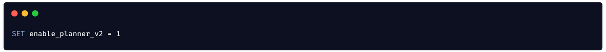
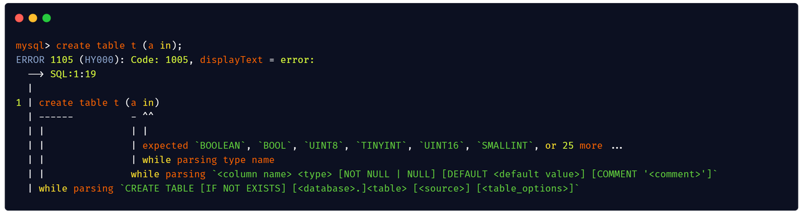
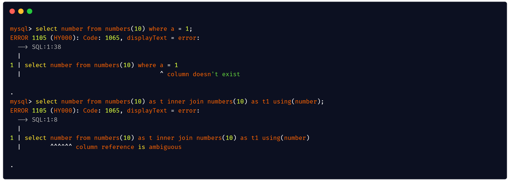
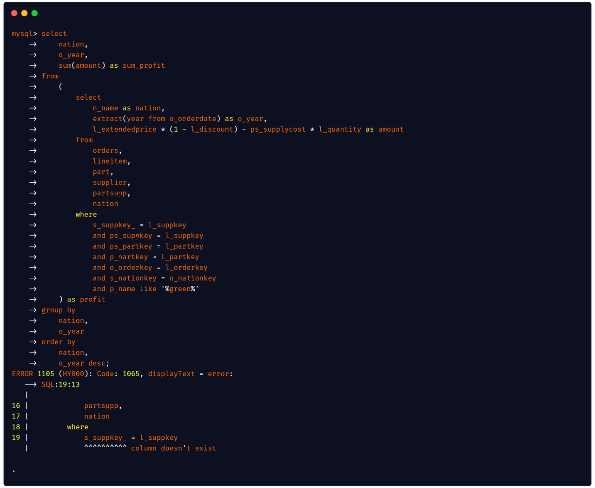
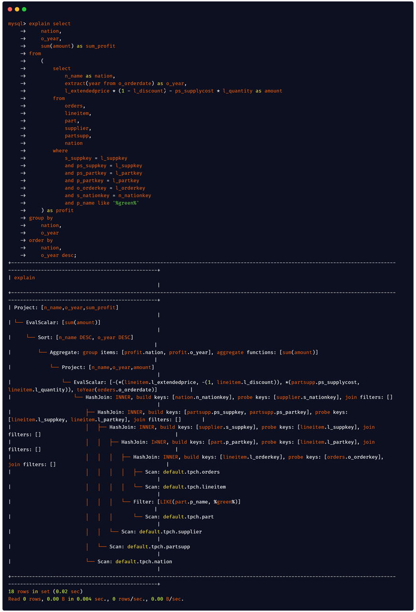
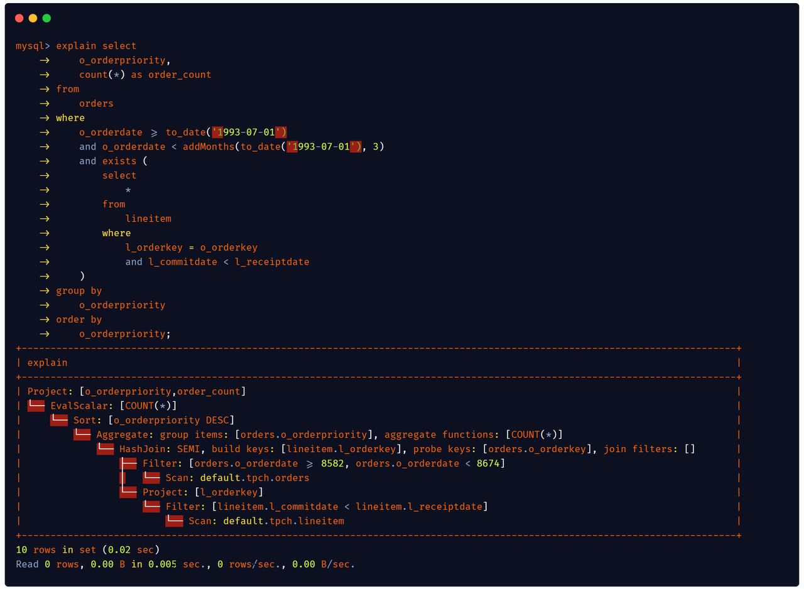
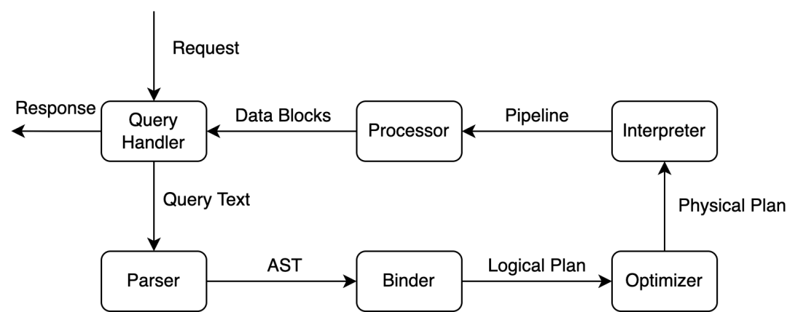
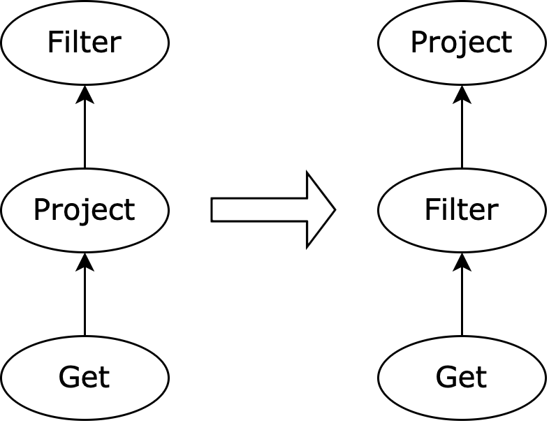
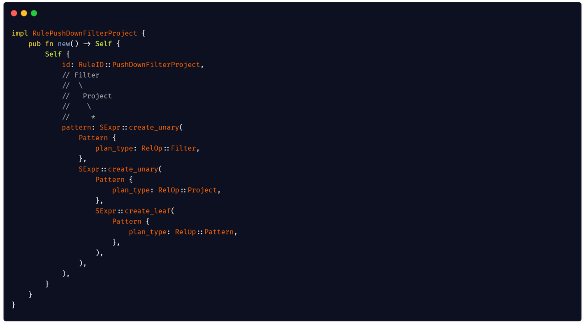
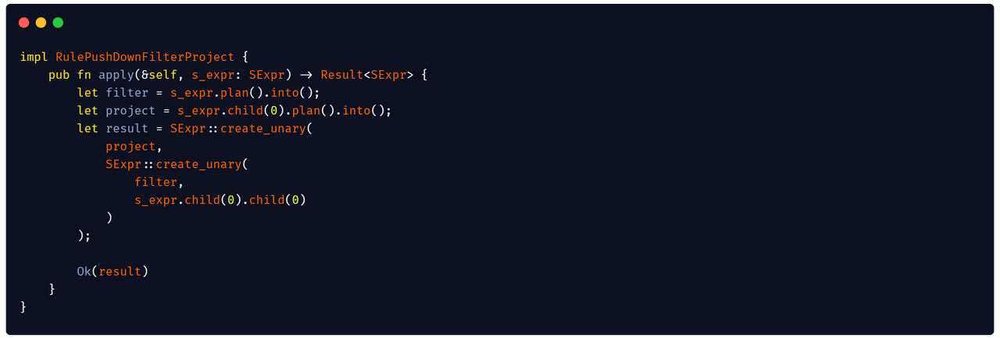

To support complex SQL queries and improve user experience, a large-scale refactoring work for Databend's SQL planner was started several months ago. At present, the refactoring is coming to an end. You can now modify the Session settings of Databend as follows to enable the new planner for early access:

## Feature Highlights

### A more friendly query experience

Data analysts and developers usually get various errors when coding SQL queries, and troubleshooting can be a nightmare when the queries are complex. I hate MySQL's error prompts because I have coded a query with dozens of JOIN clauses.

The new planner now includes some passes for strict semantic checking so that most errors can be intercepted during the compilation. A new error prompt algorithm was also introduced to help users locate the errors. When there is invalid syntax in your SQL query (for example, misspelled keywords or missing clauses), you will receive an error message that is more instructive.

If your SQL query has a semantic error (for example, you reference a column that is ambiguous, or a column does not exist at all), Databend can help you locate it.

You can also get a better experience when coding complex queries:

### Support for JOIN queries and correlated subqueries

The new SQL planner supports JOIN queries (INNER JOIN, OUTER JOIN, CROSS JOIN) and correlated subqueries, and provides a Hash Join algorithm to execute JOIN queries.

For more information about how to use JOIN in Databend, go to https://databend.rs/doc/reference/sql/query-syntax/dml-join

JOIN is a very important part of the OLAP query. In traditional star and snowflake schemas, we join dimensional tables with fact tables through the JOIN query to generate the resulting report.

TPC-H Benchmark is a set of OLAP query benchmarks developed by the TPC committee to evaluate the OLAP capabilities of database systems. It contains the following eight tables:

  - Lineitem: Holds product information.

  - Orders: Holds order information. 

  - Customer: Holds customer information. 

  - Part: Holds parts information.

  - Supplier: Holds supplier information.

  - Partsupp: Parts-Supplier Relationship Table

  - Nation: Holds nation information.

  - Region: Holds region information.

  TPC-H includes 22 complex queries, corresponding to different business needs. The new SQL planner now supports the Q9 query that calculates the profit amount for a specified year and region using a large number of JOIN calculations:

  

  Correlated subqueries are also an essential part of SQL for coding complex queries. The Q4 query of TPC-H shows the order delivery status of various priority levels over a period of time and uses a correlated subquery with the EXISTS clause to filter overdue orders:

  

 ## Brand New Architecture

 We redesigned the process of SQL parsing for the new SQL planner to support more complex semantic analysis and SQL optimization.

After the client sends a SQL statement to the databend-query server, the components in the new SQL planner process the SQL statement in the order shown in the flowchart below before returning the query result to the client:

The Parser starts to parse a SQL query after receiving it. If a syntax error is found during the parsing, the error information will be directly returned to the client; If the parsing is successful, an AST (Abstract Syntax Tree) for the query will be constructed.

### Parser

To provide more powerful syntax analysis functions and a better development experience, we have developed a DSL (Domain Specific Language) nom-rule based on the nom Parser combinator and rewritten SQL Parser based on this framework.

With this framework, we can easily define the syntax for a statement. Taking the CREATE TABLE statement as an example, we can use DSL to describe it as follows:

The elegant syntax brings more fun to the work of coding a parser. Try it out if you’re interested.

### Binder

After the AST is successfully parsed by the Parser, we will semantically analyze it through Binder and generate an initial logical plan. During this process, we perform different types of semantic analysis:

  - Name resolution: Check the validity of the variables referenced in the SQL query by querying the relevant table and column object information in the Databend Catalog and bind the valid variables to their corresponding objects for subsequent analysis.

  - Type check: Check the validity of the expression according to the information obtained in the name resolution, and find a proper return type for the expression.

  - Subquery unnesting: Extract the subquery from the expression and translate it into relational algebra.

  - Grouping check: For queries with aggregate calculations, check whether non-aggregate columns are referenced.

With semantic analysis, we can eliminate most semantic errors and return them to the user during the compilation to provide the best troubleshooting experience.

### Optimizer

After getting the initial logical plan, the optimizer will rewrite and optimize it and, finally, generate an executable physical plan.

The new planner introduced a set of Transformer Rule-based optimizer frameworks (Volcano/Cascades). An independent rule can be implemented by defining a relational algebra sub-tree structure pattern with related transform logic.

Take Predicate Push Down as a simple example:

We only need to define the pattern of the input plan:

And then implement a conversion function:

### Interpreter
After the physical plan is generated by the Optimizer, we will translate it into an executable pipeline and hand it over to Databend's processor execution framework for calculation.

## What's Next

Building a SQL planner from the ground up is a very challenging job, but the redesign and development let us find the most suitable architecture and functionalities for the system. In the future, we will continue to improve and consolidate the new SQL planner on these functions:

  - Cost-based Optimization (CBO)

  - Distributed query optimization

  - More optimization rules

Currently, we’re in the middle of migrating to the new SQL planner. We will release an announcement when the migration is complete (around July 2022). Stay tuned.