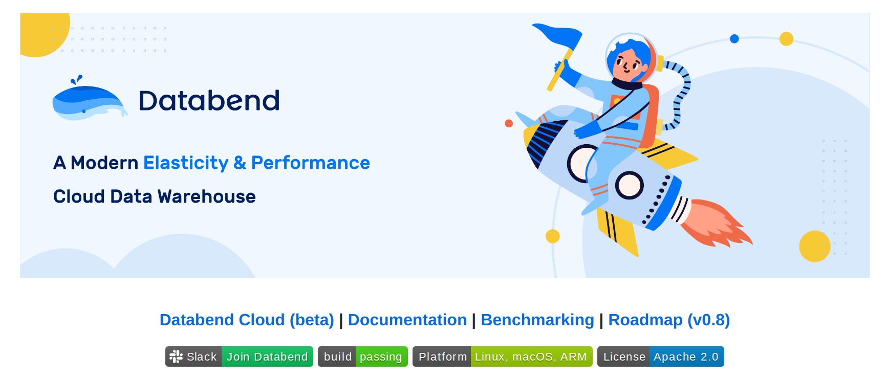
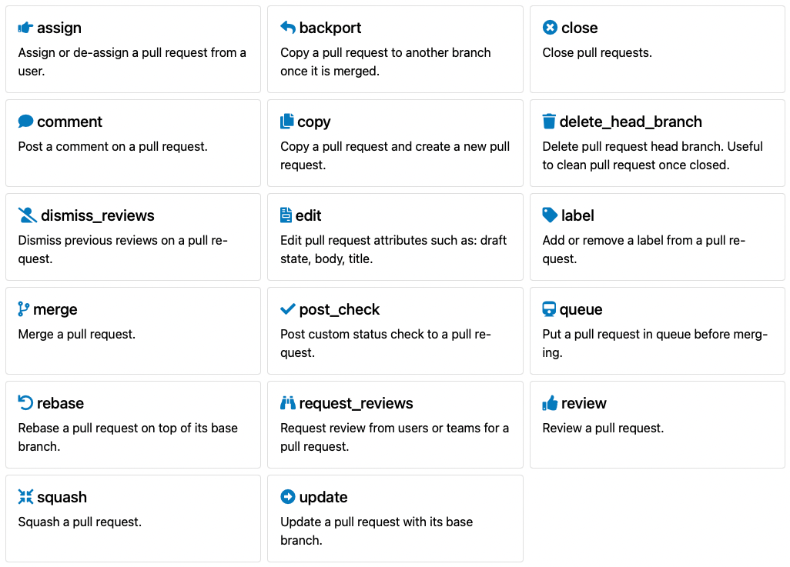

:::tip

This post was originally published by [Anne-Laure Civeyrac](https://blog.mergify.com/author/annelaure/) on https://mergify.com.

:::

Every day, major projects use Mergify to automate their GitHub workflow. Whether they have a core team of 3 or 50 people, the one thing they all have in common is that the project leads are willing to let their developers focus on what’s really important—code. So we decided to meet with some of them to get to know more about the challenges they face and discover how Mergify helps their teams be more efficient when it comes to pull requests. This time, we sat down (virtually) with [Xuanwo](https://twitter.com/OnlyXuanwo), an infrastructure engineer who oversees automation, distributed systems and storage for the [Databend](https://databend.rs/) project.

Xuanwo

**Please could you give us a brief outline of the Databend project.**

Of course! So [Databend](https://github.com/datafuselabs/databend) is a modern elasticity and performance cloud data warehouse. It uses the latest techniques in vectorized query processing to allow people to do blazing-fast data analytics on object storage platforms like [S3](https://aws.amazon.com/fr/s3/), [Azure Blob](https://azure.microsoft.com/en-us/services/storage/blobs/), or [MinIO](https://min.io/). It was mainly inspired by [ClickHouse](https://clickhouse.com/) and [Snowflake](https://www.snowflake.com/) and focuses on online analytical processing.

**How many people are currently working on the project?**

Right now, we have more than 100 contributors on Databend, with about 30 of them contributing continuously.

**What’s your GitHub workflow on this project?**

Databend is a very new project and it doesn’t have a stable release yet, so our pull request \[PR\] workflow is quite simple. All our contributions go through GitHub PRs. For every PR, we use [GitHub Actions as the CI](https://github.com/features/actions), where we run `cargo check`, `cargo fmt`, `cargo clippy`, and all our test cases. If all the checks pass, we merge the PR. And once on the main branch, the PR runs production CI, which goes through all test cases with the release build. We then release a nightly version daily, uploading our release builds to GitHub releases and the [Docker Hub Registry](https://hub.docker.com/_/registry).

**How many people need to approve PRs?**

We need two approvals for a PR to be merged.

**What are the main challenges with this workflow?**

Mainly the PR merge speed! Our developers are coding in [Rust](https://www.rust-lang.org/), which is known for not being very good with compilation speed. We typically need about 30 minutes to finish all our checks, and most of this time is consumed by [rustc](https://doc.rust-lang.org/rustc/what-is-rustc.html), the compiler for Rust. To make Rust compile faster, we set up our own self-hosted GitHub Actions runners, which have a very high performance. Thanks to this change, our PR merge time was reduced from 60 to 30 minutes.

**What made the project team start using Mergify in the first place?**

Before coming across Mergify, we enabled the option on GitHub that requires code to be updated before merging. But it added a lot of work for our maintainers, who had to merge the main branch repeatedly.

So to make their lives easier, we implemented Mergify to update the branch automatically and merge PRs after all tests have passed.

**Which Mergify features do you use the most?**

The automatic merge! And with the help of the Mergify team, we enabled the merge queue feature as well. So now, we can merge multiple PRs simultaneously with only one CI check. This helped us significantly reduce the waiting time for the CI.  

**What is your favorite Mergify feature and why?**

Oh, I love PR actions. Although I can implement the same features with GitHub Actions, I find Mergify’s PR actions more simple and exciting. For example, last week, we introduced a new requirement that every PR must be semantic—we want all PRs to contain a valid title starting with a type like “fix”, “feat”, or “refactor”.

[Actions](https://docs.mergify.com/actions/) 

With the help of Mergify, I only needed to create some rules, such as adding corresponding labels if the PR title starts with “fix”, comment in the PR with a help message if the PR title doesn’t fulfill the requirements, and add post checks so that we can mark the PR as not mergeable.

This feature is very cool, and I would love to have it on issues too!

**What has been the most significant impact of using Mergify on your team’s performance so far?**

Our teams don’t need to worry about merges anymore! We can start jobs without having to wait on the PRs.  

**What would be your n°1 tip for someone new to Mergify?**

Don’t try to migrate all your workloads to Mergify in one go. Migrating things one by one and progressively will make your lives easier.

**If you had time to contribute to the Mergify project, what would your contribution be about?**

I used to contribute to Mergify regarding a small documentation typo. But I am not comfortable contributing to more complex issues because Mergify uses Python, a programming language I’m unfamiliar with. But if I could contribute to one feature, it would be about commands. Mergify only supports a small set of commands. Maybe we could define new commands in PR rules and allow users to call them with Mergify bots. This feature would be exciting to me!