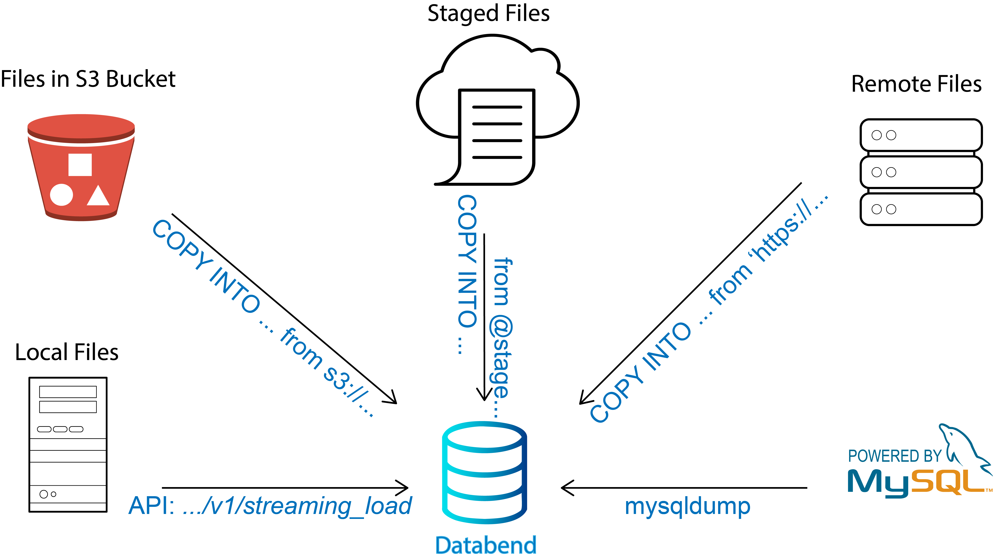

Data is important. If you're moving your business to the cloud to take advantage of the cloud-native features, the first thing you need to consider might be how to load your data to the cloud.

There are many ways to load data into Databend. You can use the command-line interface (CLI), API, or the mysqldump client utility, depending on where your data is stored.

The powerful COPY INTO commands allow you to load data from:

- Files in an S3 bucket or a blob storage container.
- Staged files (internal or external).
- Files in a remote server.

If you have local data files to load, use the HTTP API `v1/streaming_load` to upload them to Databend.

Please note that Databend supports loading data from files in these formats:

- CSV
- JSON
- Parquet

If you're coming from MySQL, Databend can also use a dump file (*.sql) created by the mysqldump client utility to load your data from MySQL.

Detailed explanations about loading data in different scenarios can be found at https://databend.rs/doc/load-data. 