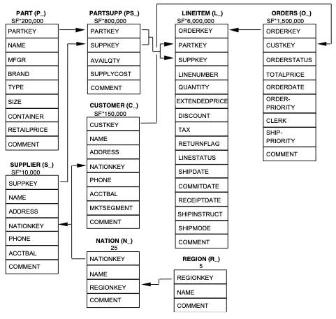

This post gives you a general idea about the TPC-H benchmark and explains how to run a TPC-H benchmark on Databend.

## What's TPC-H?

TPC-H is a decision support benchmark. It consists of a suite of business-oriented ad hoc queries and concurrent data modifications. The queries and the data populating the database have been chosen to have broad industry-wide relevance. This benchmark illustrates decision support systems that examine large volumes of data, execute queries with a high degree of complexity, and give answers to critical business questions.

The TPC-H benchmark simulates a system for online sales of parts and components and defines eight tables in total. The structure, data volume, and mutual relationship of each table are shown in the figure below:



The benchmark workload consists of twenty-two decision support queries that must be executed as part of the TPC-H benchmark. Each TPC-H query asks a business question and includes the corresponding query to answer the question. More information about TPC-H can be found at https://www.tpc.org/tpch/.

## Running TPC-H Benchmark on Databend

This section describes the steps to run the TPC-H benchmark on Databend and provides the related scripts.

### Step 1: Generate test data with TPC-H Docker

The following code pulls a docker image and allocates the data in the path where you are running the TPC-H benchmark.

```shell
docker pull ghcr.io/databloom-ai/tpch-docker:main
docker run -it -v "$(pwd)":/data ghcr.io/databloom-ai/tpch-docker:main dbgen -vf -s 1
```
TPC-H comes with various data set sizes to test different scale factors. You can use the `-s` option to set scale factor in the command (for example, the code above sets the scale factor to `1`). For more information about the command, see https://github.com/databloom-ai/TPCH-Docker.

| SF (Gigabytes) | Size                                                                    |
|----------------|-------------------------------------------------------------------------|
| 1              | Consists of the base row size (several million elements).               |
| 10             | Consists of the base row size x 10.                                     |
| 100            | Consists of the base row size x 100 (several hundred million elements). |
| 1000           | Consists of the base row size x 1000 (several billion elements).        |


### Step 2: Create database and tables

```sql
CREATE DATABASE IF NOT EXISTS tpch;

USE tpch;

CREATE TABLE IF NOT EXISTS nation
  (
     n_nationkey INTEGER NOT NULL,
     n_name      VARCHAR NOT NULL,
     n_regionkey INT NOT NULL,
     n_comment   VARCHAR
  );

CREATE TABLE IF NOT EXISTS region
  (
     r_regionkey INT NOT NULL,
     r_name      VARCHAR NOT NULL,
     r_comment   VARCHAR
  );

CREATE TABLE IF NOT EXISTS part
  (
     p_partkey     INT NOT NULL,
     p_name        VARCHAR NOT NULL,
     p_mfgr        VARCHAR NOT NULL,
     p_brand       VARCHAR NOT NULL,
     p_type        VARCHAR NOT NULL,
     p_size        INT NOT NULL,
     p_container   VARCHAR NOT NULL,
     p_retailprice FLOAT NOT NULL,
     p_comment     VARCHAR NOT NULL
  );

CREATE TABLE IF NOT EXISTS supplier
  (
     s_suppkey   INT NOT NULL,
     s_name      VARCHAR NOT NULL,
     s_address   VARCHAR NOT NULL,
     s_nationkey INT NOT NULL,
     s_phone     VARCHAR NOT NULL,
     s_acctbal   FLOAT NOT NULL,
     s_comment   VARCHAR NOT NULL
  );

CREATE TABLE IF NOT EXISTS partsupp
  (
     ps_partkey    INT NOT NULL,
     ps_suppkey    INT NOT NULL,
     ps_availqty   INT NOT NULL,
     ps_supplycost FLOAT NOT NULL,
     ps_comment    VARCHAR NOT NULL
  );

CREATE TABLE IF NOT EXISTS customer
  (
     c_custkey    INT NOT NULL,
     c_name       VARCHAR NOT NULL,
     c_address    VARCHAR NOT NULL,
     c_nationkey  INT NOT NULL,
     c_phone      VARCHAR NOT NULL,
     c_acctbal    FLOAT NOT NULL,
     c_mktsegment VARCHAR NOT NULL,
     c_comment    VARCHAR NOT NULL
  );

CREATE TABLE IF NOT EXISTS orders
  (
     o_orderkey      INT NOT NULL,
     o_custkey       INT NOT NULL,
     o_orderstatus   VARCHAR NOT NULL,
     o_totalprice    FLOAT NOT NULL,
     o_orderdate     DATE NOT NULL,
     o_orderpriority VARCHAR NOT NULL,
     o_clerk         VARCHAR NOT NULL,
     o_shippriority  INT NOT NULL,
     o_comment       VARCHAR NOT NULL
  );

CREATE TABLE IF NOT EXISTS lineitem
  (
     l_orderkey      INT NOT NULL,
     l_partkey       INT NOT NULL,
     l_suppkey       INT NOT NULL,
     l_linenumber    INT NOT NULL,
     l_quantity      FLOAT NOT NULL,
     l_extendedprice FLOAT NOT NULL,
     l_discount      FLOAT NOT NULL,
     l_tax           FLOAT NOT NULL,
     l_returnflag    VARCHAR NOT NULL,
     l_linestatus    VARCHAR NOT NULL,
     l_shipdate      DATE NOT NULL,
     l_commitdate    DATE NOT NULL,
     l_receiptdate   DATE NOT NULL,
     l_shipinstruct  VARCHAR NOT NULL,
     l_shipmode      VARCHAR NOT NULL,
     l_comment       VARCHAR NOT NULL
  ); 
```

### Step 3: Load test data to Databend

This step uses the HTTP API `v1/streaming_load` to load the test data to Databend. More information about this API can be found at https://databend.rs/doc/load-data/local. 

The code below connects to Databend using the Root user. Please note that the root user only works when you access Databend from localhost. You will need to create new users and grant proper privileges first to connect to Databend remotely.

```shell
#!/bin/bash

for t in customer lineitem nation orders partsupp part region supplier
do
    echo "$t"
    curl -XPUT 'http://root:@127.0.0.1:8000/v1/streaming_load' -H 'insert_sql: insert into tpch.'$t' format CSV' -H 'skip_header: 0' -H 'field_delimiter:|' -H 'record_delimiter: \n' -F 'upload=@"./'$t'.tbl"'
done
```

### Step 4: Run TPC-H queries

All the definitions of the TPC-H queries can be found at https://www.tpc.org/tpc_documents_current_versions/pdf/tpc-h_v3.0.1.pdf. You can simply run them by copying and pasting the scripts to Databend.

The Databend team ran the TPC-H benchmark around two months ago and uploaded their queries and results to GitHub. You can find them at https://github.com/datafuselabs/databend/tree/main/tests/suites/0_stateless/13_tpch. Please note that Databend now uses the new planner by default, so you DO NOT need to enable it any more before running the queries.