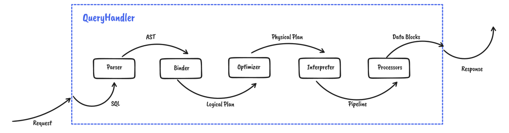

Hello, everyone! I'm Xuanwo. Today, on behalf of the Databend community, I would like to announce the official release of v0.8.

Development of Databend v0.8 started on March 28th, with 5000+ commits and 4600+ file changes. In the last 5 months, the community of 120+ contributors added 420K lines of code and removed 160K lines, equivalent to rewriting Databend once. In this release, the community made significant improvements to the SQL Planner framework and migrated all SQL statements to the new Planner, providing full JOIN and subquery support.

Let's see what has been done in v0.8.

## What's Databend?

Databend is a modern cloud data warehouse based on Rust that enables high-performance, elastic and scalable real-time data analysis and activates the data potential of users.


## Significant improvements

### New Planner: JOIN! JOIN! JOIN!

To better support complex SQL queries and improve user experience, Databend v0.8 is designed with a new Planner framework.



Databend has added JOIN and proper subquery support, driven by New Planner.

```sql
select vip_info.Client_ID, vip_info.Region 
    from vip_info right 
    join purchase_records 
    on vip_info.Client_ID = purchase_records.Client_ID;
```

### New Parser: The Best Parser！

While refactoring Planner, the databend community has implemented a new nom-based Parser that balances development efficiency with user experience.

New Parser makes it easy for developers to design/develop/test complex SQL syntax in an intuitive way

```sql
COPY
    ~ INTO ~ #copy_unit
    ~ FROM ~ #copy_unit
    ~ ( FILES ~ "=" ~ "(" ~ #comma_separated_list0(literal_string) ~ ")")?
    ~ ( PATTERN ~ "=" ~ #literal_string)?
    ~ ( FILE_FORMAT ~ "=" ~ #options)?
    ~ ( VALIDATION_MODE ~ "=" ~ #literal_string)?
    ~ ( SIZE_LIMIT ~ "=" ~ #literal_u64)?
```

It also gives the user specific and precise information about the error.

```sql
MySQL [(none)]> select number from numbers(10) as t inner join numbers(30) as t1 using(number);
ERROR 1105 (HY000): Code: 1065, displayText = error:
  --> SQL:1:8
  |
1 | select number from numbers(10) as t inner join numbers(30) as t1 using(number)
  |        ^^^^^^ column reference is ambiguous
```

No more worrying about not knowing what's wrong with SQL. Visit [The New Databend SQL Planner](2022-07-19-databend-new-planner.md) for more information.

## New Features

In addition to the newly designed Planner, the Databend community has implemented a number of new features.

### COPY Enhancement

COPY capabilities have been greatly enhanced, and Databend can now:

- Copy data from any supported storage service (even https!)

```sql
COPY 
    INTO ontime200 
    FROM 'https://repo.databend.rs/dataset/stateful/ontime_2006_[200-300].csv' 
    FILE_FORMAT = (TYPE = 'CSV')
```

- Support for copying compressed files

```sql
COPY 
    INTO ontime200 
    FROM 's3://bucket/dataset/stateful/ontime.csv.gz' 
    FILE_FORMAT = (TYPE = 'CSV' COMPRESSION=AUTO)
```

- UNLOAD data to any supported storage service

```sql
COPY 
    INTO 'azblob://bucket/'  
    FROM ontime200
    FILE_FORMAT = (TYPE = 'PARQUET‘)
```

### Hive Support

Databend v0.8 designed and developed the Multi Catalog and implemented Hive Metastore support on top of it!

Databend can now interface directly to Hive and read data from HDFS.

```sql
select * from hive.default.customer_p2 order by c_nation;
```

### Time Travel

A long time ago, the Databend community shared an implementation of the underlying FUSE Engine, [From Git to Fuse Engine](2022-07-05-databend-cloud-warehouse-fuse-engine.md), where one of the most important features was the support for time travel, allowing us to query data tables at any point in time.

Starting from v0.8, this feature is now officially installed and we can now

- Query the data table for a specified time

```sql
-- Travel to the time when the last row was inserted
select * from demo at (TIMESTAMP => '2022-06-22 08:58:54.509008'::TIMESTAMP); 
+----------+
| c        |
+----------+
| batch1.1 |
| batch1.2 |
| batch2.1 |
+----------+
```

- Recover mistakenly deleted data tables

```sql
DROP TABLE test;

SELECT * FROM test;
ERROR 1105 (HY000): Code: 1025, displayText = Unknown table 'test'.

-- un-drop table
UNDROP TABLE test;

-- check
SELECT * FROM test;
+------+------+
| a    | b    |
+------+------+
|    1 | a    |
+------+------+
```

Make business data have more security!

### CTE Support

CTE (Common Table Expression) is a frequently used feature in OLAP business to define a temporary result set within the execution of a single statement, which is valid only during the query period, enabling the reuse of code segments, improving readability and better implementation of complex queries.

Databend v0.8 re-implements the CTE based on New Planner and now users can happily use WITH to declare the CTE.

```sql
WITH customers_in_quebec 
     AS (SELECT customername, 
                city 
         FROM   customers 
         WHERE  province = 'Québec') 
SELECT customername 
FROM   customers_in_quebec
WHERE  city = 'Montréal' 
ORDER  BY customername; 
```

In addition to these features mentioned above, Databend v0.8 also supports UDFs, adds DELETE statements, further enhances support for semi-structured data types, not to mention the numerous SQL statement improvements and new methods added. Thanks to all the contributors to the Databend community, without you all the new features mentioned here would not have been possible!

## Quality Enhancement

Feature implementation is just the first part of product delivery. In Databend v0.8, the community introduced the concept of engineering quality, which evaluates the quality of Databend development in three dimensions: users, contributors, and community.

### Reassuring users

In order for users to use Databend with confidence, the community has added a lot of tests over the last three months, fetching stateless test sets from YDB and others, adding stateful tests for ontime, hits and other datasets, putting SQL Logic Test online to cover all interfaces, and enabling SQL Fuzz testing to cover boundary cases.

Furthermore, the community has also gone live with [Databend Perf](https://perf.databend.rs/) to do continuous performance testing of Databend in production environments to catch unexpected performance regressions in time.

### Make contributors comfortable

Databend is a large Rust project that has been criticized by the community for its build time.

To improve this issue and make contributors feel comfortable, the community went live with a highly configurable, specially tuned Self-hosted Runner to perform integration tests for PR and enabled several services or tools such as Mergify, mold, dev-tools, etc. to optimize the CI process.

We also initiated a new plan to restructure the Databend project, splitting the original huge query crate into multiple sub-crates to avoid, as much as possible, the situation of changing one line of code and check execution for five minutes.

### Keeping the community happy

Databend is a contributor and participant in the open source community. During the development of v0.8, the Databend community established the principle of Upstream First, actively following and adopting the latest upstream releases, giving feedback on known bugs, contributing their own patches, and starting [Tracking issues of upstream first violation](https://github.com/datafuselabs/databend/issues/6926) to keep up with the latest developments.

The Databend community is actively exploring integration with other open source projects and has already implemented integration and support for third-party drivers such as Vector, sqlalchemy, clickhouse-driver, etc.

## Next Steps

Databend v0.8 is a solid foundation release with a new Planner that makes it easier to implement features and make optimizations. In version 0.9, we expect improvements in the following areas.

- Query Result Cache
- JSON Optimization
- Table Share
- Processor Profiling
- Resource Quota
- Data Caching

Please check the [Release proposal: Nightly v0.9](https://github.com/datafuselabs/databend/issues/7052) for the latest news~

## Get going now!

Visit the release log (link) and download the latest version (link) to learn more, and feel free to submit feedback using [Github Issues](https://github.com/datafuselabs/databend/issues) if you encounter problems!