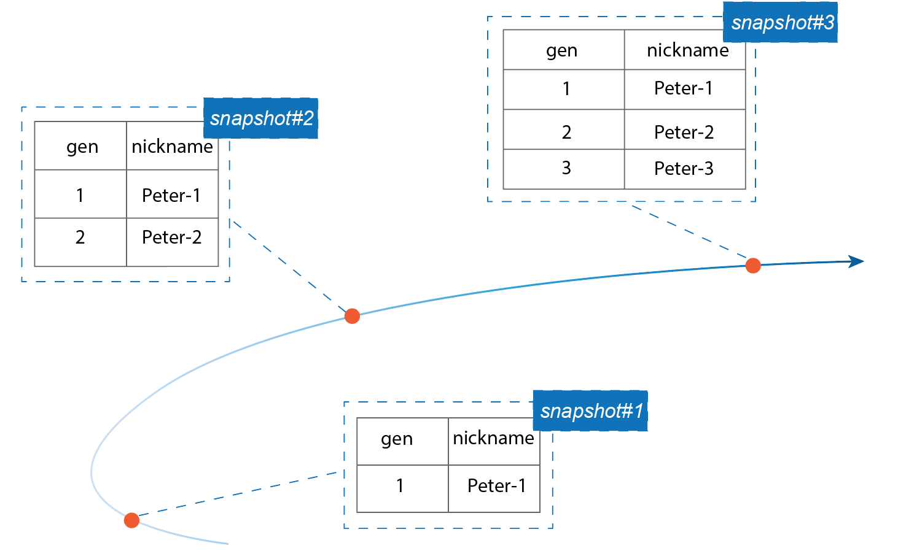

The most impressive part of the movie *Spider-Man: No Way Home* is "three generations coming together. In the story, when the spider-man's friend repeats the magic words "Find Peter Parker!", we surprisingly see two old friends on the screen, the previous generations of spider-man. They travel from other universes to join forces and develop cures for the villains.


Did you know that you have a similar magic power in Databend? That is, you can always get back the previous versions of your data in a few simple steps whenever you need them. The secret is Databend automatically creates and saves snapshots with timestamps of your tables when a data updating occurs, so you can track the history of a table and see how what it looked like at a time point in the past.

The following code creates a table first, and then inserts values with three separate SQL statements:

```sql
create table spiderman(gen int, nickname varchar);

insert into spiderman values(1,'Peter-1');
insert into spiderman values(2,'Peter-2');
insert into spiderman values(3,'Peter-3');
```

Databend creates and saves three snapshots for the code above. Each one holds a historical version of the data in the table. 



To find them, use the system function [FUSE_SNAPSHOT](https://databend.rs/doc/reference/functions/system-functions/fuse_snapshot). The function returns everything you may need to know about the saved snapshots of a table, such as the snapshot IDs, timestamps, and locations.

```sql
select snapshot_id,previous_snapshot_id, timestamp from fuse_snapshot('default','spiderman');

---
+----------------------------------+----------------------------------+----------------------------+
| snapshot_id                      | previous_snapshot_id             | timestamp                  |
+----------------------------------+----------------------------------+----------------------------+
| 34b8df220edc4d8cb9e3e76118788686 | 4bb479751b7144d8aa2b53e5b281453f | 2022-08-30 01:18:53.202724 |
| 4bb479751b7144d8aa2b53e5b281453f | a2801ed9656d42c9812f2921214f0795 | 2022-08-30 01:18:35.597615 |
| a2801ed9656d42c9812f2921214f0795 | NULL                             | 2022-08-30 01:18:21.750208 |
+----------------------------------+----------------------------------+----------------------------+
```

You can now query the history data with a snapshot or timestamp by including the [AT](https://databend.rs/doc/reference/sql/query-syntax/dml-at) clause in the SELECT statement:

```sql
select * from spiderman at(snapshot=>'a2801ed9656d42c9812f2921214f0795');

---
+------+----------+
| gen  | nickname |
+------+----------+
| 1    | Peter-1  |
+------+----------+
```

```sql
select * from spiderman at(timestamp=>'2022-08-30 01:18:21.750208'::timestamp);

---
+------+----------+
| gen  | nickname |
+------+----------+
| 1    | Peter-1  |
+------+----------+
```

The "magic" explained above is part of the powerful Time Travel feature of Databend that enables you to query, back up, or restore from a specified historical version of your data. That's not all about the feature. You can do more with the snapshots to make your work easier. Join the Databend community to find out more "magic tricks".