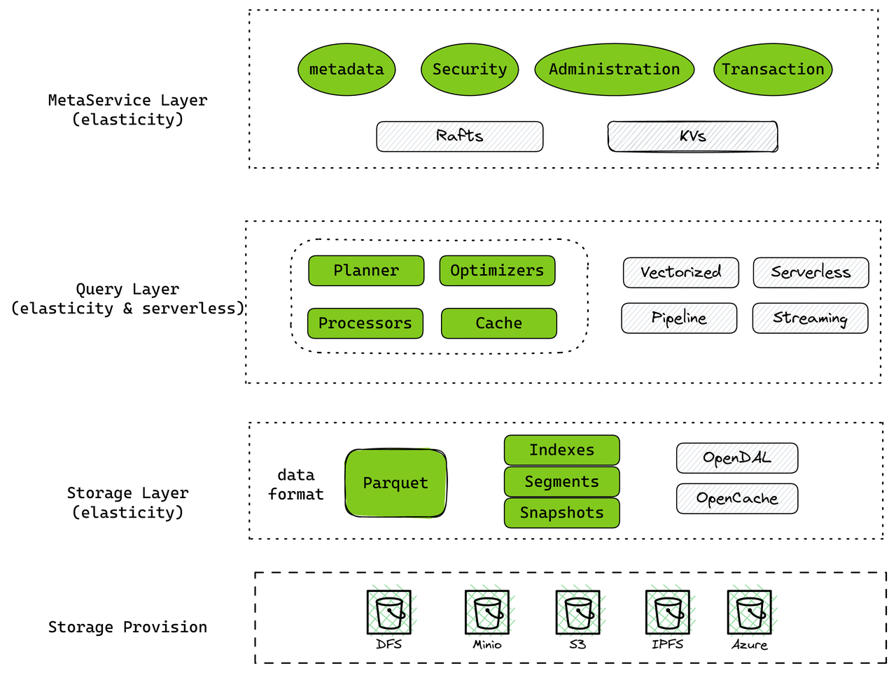
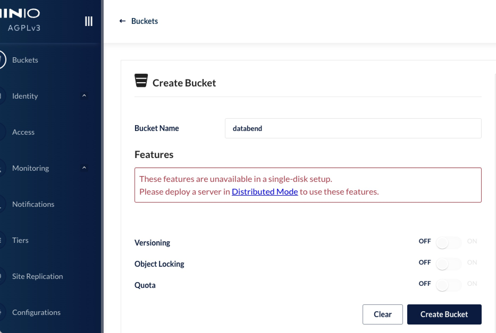
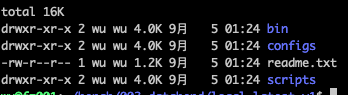
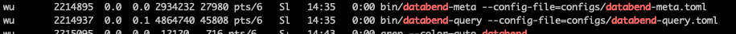

This blog walks you through the process of deploying a single instance of Databend on MinIO. MinIO is an object storage solution that is lightweight and easy to operate. Databend is a modern data warehouse designed for cloud architecture, built with Rust and open-source. It provides rapid elastic scaling and aims to create an on-demand, pay-as-you-go data cloud product experience.

Open-Source Repo: https://github.com/datafuselabs/databend/

Databend Docs: https://databend.rs/doc

## Databend Architecture



Databend is architecturally divided into three layers: Meta Service Layer, Query Layer, and Storage Layer.

- Meta Service Layer

This layer stores permission definitions, table structure definitions, transaction management, table and data association, and the overall logic of data sharing. Cluster deployment is recommended for a production environment.

- Query layer

This layer interacts directly with users and their storage. They interact with Databend through SQL, and the Query Layer reads from and and writes to the storage layer after receiving their requests. This layer is not always online and can be pulled up when needed. Scale up and down are allowed in this layer.

- Storage Layer

The Databend storage layer is the Databend Fuse Engine and supports for cloud and self-built object storage. Databend uses the Parquet format to store data block with min/max indexing, sparse indexing, bloom indexing, etc.


### Supported Deployment Platforms

| Platform    | Supported|
| ----------- | -------- |
| AWS S3      | Yes     |
| Google GCS  | Yes     |
| Azure Blob  | Yes     |
| Aliyun OSS  | Yes     |
| Tencent COS | Yes     |
| Huawei OBS  | Yes     |
| MinIO       | Yes     |
| Ceph        | Yes     |
| Wasabi      | Yes     |
| SeaweedFS   | Yes     |
| QingStor    | Yes     |

Detailed reference: https://databend.rs/doc/deploy/deploying-databend

## Deploying a Single Instance of Databend

> Compared to the Databend deployment, a MinIO environment is easier to set up. In a production environment, MinIO Cloud or AWS S3 environment is recommended for a hassle-free experience.

The following uses the MinIO + Databend standalone deployment in Linux of x64 as an example:

| Software | Path           | Port                                                |
| -------- | -------------- | --------------------------------------------------- |
| minio    | /data/minio    | 9900                                                |
| databend | /data/databend | mysql: 3307 <br/> http:  8000 <br/>ClickHouse http:  8124 |

### Deploy MinIO

Download [MinIO](https://min.io/) from the official website and start it by running the following commands:

```Bash
cd /data
mkdir minio
cd minio
wget https://dl.min.io/server/minio/release/linux-amd64/minio
export MINIO_ROOT_USER=minioadmin
export MINIO_ROOT_PASSWORD=minioadmin
./minio server ./data./minio server --address :9900 ./data
```
Use the MinIO Admin web interface to create a bucket named as "databend":



After creating the bucket, the MinIO deployment is complete.

### Download and Install Databend

| Type                                                         | OS            |
| ------------------------------------------------------------ | ------------- |
| - databend-version-nightly-x86_64-unknown-linux-musl.tar.gz  | Linux for x64 |
| - databend-version-nightly-aarch64-apple-darwin.tar.gz       | MacOS of M1   |
| - databend-version-nightly-aarch64-unknown-linux-musl.tar.gz | Linux of Arm  |
| - databend-version-nightly-x86_64-apple-darwin.tar.gz        | MacOS of X64  |
| - source code                                                | src           |

We can download the musl package for Linux from the Databend open-source project repo: https://github.com/datafuselabs/databend/tags

The latest version is always recommended as Databend develops and merges new features on a daily basis. For example, if you're running Linux on an x86_64 machine, you can download version v0.9.51-nightly like this:

```Bash
cd /data
mkdir databend
export ver=v0.9.51-nightly
wget https://repo.databend.rs/databend/$ver/databend-$ver-x86_64-unknown-linux-musl.tar.gz
cd databend
tar zxvf ../databend-$ver-x86_64-unknown-linux-musl.tar.gz

sudo mkdir /var/log/databend
sudo mkdir /var/lib/databend
sudo chown -R $USER /var/log/databend
sudo chown -R $USER /var/lib/databend
```



The Databend installation files are extracted to a directory named "databend".

### Configure Databend

You need to configure Databend after the installation. The default configuration file for databend-query is included with the download. You can modify this file as follows:

```Bash
vim configs/databend-query.toml
```

Updates:

```Bash
# Storage config.[storage]
# fs | s3 | azblob | obs
type = "s3"
# Set a local folder to store your data.
# Comment out this block if you're NOT using local file system as storage.
[storage.fs]
data_path = "/var/lib/databend/data"
# To use S3-compatible object storage, uncomment this block and set your values.
[storage.s3]
bucket = "databend"
endpoint_url = "https://127.0.0.1:9900"
access_key_id = "minioadmin"
secret_access_key = "minioadmin"
```

### Start and Stop Databend

To start Databend, run the following command:

```bash
./script/start.sh
```

To check that Databend is running, you can use the following command:
```bash
ps axu |grep databend
```



To stop Databend, run the following command:

```bash
./script/stop.sh
```

#### Connect to Databend

Databend has three external service ports by default:

- MySQL: 3307 supports MySQL cli and application connection.
- ClickHouse: 8124 ClickHouse http handler protocol
- [http prot: 8000](https://databend.rs/doc/integrations/api/rest) The Databend HTTP handler is a REST API

To connect to Databend using the MySQL client, run the following command:

```Bash
mysql -h 127.0.0.1 -P3307 -uroot
```

>Note that the root user can log in without a password from localhost. Databend permission management refers to the design of MySQL 8.0 and allows you to manage Databend users in the same way as MySQL 8.0 user management.

ClickHouse protocol using: https://databend.rs/doc/reference/api/clickhouse-handler

You're all set up now. Use Databend as you're with MySQL.

## Other Resources
- Loading data to Databend: https://databend.rs/doc/load-data/
- Databend k8s opterator: https://github.com/datafuselabs/helm-charts
- bendsql: https://github.com/databendcloud/bendsql
- Databend drivers:
  - Java Driver: https://github.com/databendcloud/databend-jdbc
  - Go Driver: https://github.com/databendcloud/databend-go
  - Python Driver: https://github.com/databendcloud/databend-py
