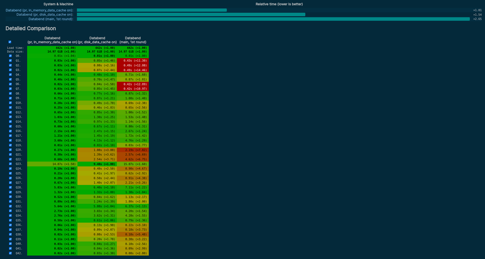

Dear Databenders,

We're excited to share with you that on the occasion of the second anniversary of the establishment of Databend Labs, we're officially releasing Databend 1.0! This is a significant milestone for our team, and we want to express our gratitude for your support and contributions along the way.

Driven by top-tier use cases and requirements, the Databend community has been committed to addressing the challenges of cost and complexity in big data analytics. Stats shows that around 700 TB of data is being written to cloud object storage and analyzed using Databend everyday by users from Europe, North America, Southeast Asia, Africa, China, and other regions. This has resulted in saving them millions of dollars in costs every month.

Databend 1.0 is a significant release, and we believe it will drive further advancements in cloud-based big data analytics. Now let's dive in to see what's new in Databend 1.0 compared to version 0.9, and explore our team's vision and future prospects in depth.

## What's New in Databend 1.0

Databend 1.0 has demonstrated a noteworthy enhancement in its performance, as evidenced by a twofold increase in query efficiency compared to version 0.9. Please check on the [ClickBench website](https://benchmark.clickhouse.com/) for further details. Moreover, Databend 1.0 has also introduced a variety of new features:

### UPDATE

Databend now allows users to modify data using the UPDATE statement with the syntax below. This UPDATE support marks the completion of Databend's full support for CRUD operations.

```sql
-- Update a book (Id: 103)
UPDATE bookstore SET book_name = 'The long answer (2nd)' WHERE book_id = 103;
```

### ALTER TABLE

The ALTER TABLE statement is now available to modify the structure of tables:

```sql
-- Add a column
ALTER TABLE t ADD COLUMN c Int DEFAULT 10;
```

### DECIMAL Data Type

Databend has successfully integrated support for the DECIMAL data type after an extensive refactoring of the type system, laying a robust foundation for this feature.

```sql
-- Create a table with decimal data type.
create table tb_decimal(c1 decimal(36, 18));

-- Insert two values.
insert into tb_decimal values(0.152587668674722117), (0.017820781941443176);

select * from tb_decimal;
+----------------------+
| c1                   |
+----------------------+
| 0.152587668674722117 |
| 0.017820781941443176 |
+----------------------+
```

### Native Format

Databend 1.0 introduces several significant enhancements to the Native Format strawboat. In addition to support for semi-structured data, the Databend community has implemented a range of performance optimizations, leading to substantial improvements in performance on the HITS dataset.

### Cost-Based Optimization (CBO)

The histogram framework has been introduced to enable more accurate cost estimation using statistics. The join reorder algorithm has been further improved and strengthened, resulting in a significant improvement in the performance of multi-table joins and helping Databend achieve remarkable performance improvements on the TPCH dataset.

### SELECT FROM STAGE

STAGE serves as the central hub for data flow in Databend. While we've already supported loading data from STAGE and exporting data to it, we've now taken things a step further by enabling data querying directly within STAGE.

Users can now create a STAGE that contains data files and easily perform data querying without having to write complex CREATE TABLE statements or go through tedious data import processes. 

```sql
select min(number), max(number) 
    from @lake (pattern => '.*parquet');

+-------------+-------------+
| min(number) | max(number) |
+-------------+-------------+
|           0 |           9 |
+-------------+-------------+
```

For one-time queries, users can use a short URI in the statement for even greater convenience:

```sql
select count(*), author 
    from 'https://datafuse-1253727613.cos.ap-hongkong.myqcloud.com/data/books.parquet'
        (file_format => 'parquet')
    group by author;

+----------+---------------------+
| count(*) | author              |
+----------+---------------------+
|        1 | Jim Gray            |
|        1 | Michael Stonebraker |
+----------+---------------------+
```

### Query Result Cache

The Databend community introduced Query Result Cache functionality in version 1.0, allowing for the caching of queries that have already been executed. This eliminates the need for repeatedly running identical queries, providing significant performance benefits when the underlying data remains unchanged.

```sql
MySQL [(none)]> SELECT WatchID, ClientIP, COUNT(*) AS c, SUM(IsRefresh), AVG(ResolutionWidth) FROM hits GROUP BY WatchID, ClientIP ORDER BY c DESC LIMIT 10;
+---------------------+-------------+------+----------------+----------------------+
| watchid             | clientip    | c    | sum(isrefresh) | avg(resolutionwidth) |
+---------------------+-------------+------+----------------+----------------------+
| 6655575552203051303 |  1611957945 |    2 |              0 |               1638.0 |
| 8566928176839891583 | -1402644643 |    2 |              0 |               1368.0 |
| 7904046282518428963 |  1509330109 |    2 |              0 |               1368.0 |
| 7224410078130478461 |  -776509581 |    2 |              0 |               1368.0 |
| 5957995970499767542 |  1311505962 |    1 |              0 |               1368.0 |
| 5295730445754781367 |  1398621605 |    1 |              0 |               1917.0 |
| 8635802783983293129 |   900266514 |    1 |              1 |               1638.0 |
| 5650467702003458413 |  1358200733 |    1 |              0 |               1368.0 |
| 6470882100682188891 | -1911689457 |    1 |              0 |               1996.0 |
| 6475474889432602205 |  1501294204 |    1 |              0 |               1368.0 |
+---------------------+-------------+------+----------------+----------------------+
10 rows in set (3.255 sec)

MySQL [(none)]> SELECT WatchID, ClientIP, COUNT(*) AS c, SUM(IsRefresh), AVG(ResolutionWidth) FROM hits GROUP BY WatchID, ClientIP ORDER BY c DESC LIMIT 10;
+---------------------+-------------+------+----------------+----------------------+
| watchid             | clientip    | c    | sum(isrefresh) | avg(resolutionwidth) |
+---------------------+-------------+------+----------------+----------------------+
| 6655575552203051303 |  1611957945 |    2 |              0 |               1638.0 |
| 8566928176839891583 | -1402644643 |    2 |              0 |               1368.0 |
| 7904046282518428963 |  1509330109 |    2 |              0 |               1368.0 |
| 7224410078130478461 |  -776509581 |    2 |              0 |               1368.0 |
| 5957995970499767542 |  1311505962 |    1 |              0 |               1368.0 |
| 5295730445754781367 |  1398621605 |    1 |              0 |               1917.0 |
| 8635802783983293129 |   900266514 |    1 |              1 |               1638.0 |
| 5650467702003458413 |  1358200733 |    1 |              0 |               1368.0 |
| 6470882100682188891 | -1911689457 |    1 |              0 |               1996.0 |
| 6475474889432602205 |  1501294204 |    1 |              0 |               1368.0 |
+---------------------+-------------+------+----------------+----------------------+
10 rows in set (0.066 sec)
```

### Table Data Cache

Cache is an important component in the storage-compute separation architecture. Databend 1.0 introduced Table Data Cache, which enhances the query performance by caching data blocks based on the frequency of data access. Databend decides whether to cache the data block based on the hotness of the accessed data, thereby improving query performance during subsequent accesses.



### Aggregate Spill

Databend 1.0 introduced aggregate spill, which allows temporary storage and persistence of aggregation data to object storage based on the current memory usage. This helps prevent excessive memory usage during query execution when performing aggregation queries in Databend.

## What's Next

After multiple iterations, Databend has finally taken shape. Now, let's take a fresh look at Databend:

- Databend is a cloud-native data warehouse developed using Rust, featuring storage-compute separation, object storage-oriented design, and extreme elasticity.
- Databend provides complete CRUD functionality and supports protocols such as MySQL, ClickHouse, and HTTP RESTful.
- Databend natively supports complex data types such as ARRAY, MAP, and JSON, as well as high-precision types like DECIMAL.
- Databend's columnar storage engine is similar to Git's MVCC, supporting Data Time Travel and Data Share capabilities.
- Databend is not restricted to specific storage vendors and can run on any storage service, allowing for direct querying of data on any storage service.
- Databend fully supports HDFS and cloud-based object storage protocols, including Alibaba Cloud OSS, Tencent Cloud COS, Huawei Cloud OBS, as well as Amazon S3, Azure Blob, and Google Cloud Storage.

The journey of Databend extends far beyond this, and in the future, we hope to introduce more powerful features and foster a more open community.

### More Powerful Features

We have planned several features for Databend 1.1 to better meet the needs of our users and to make breakthroughs in the CDC scenario:

- JSON index: Improves the retrieval capability of semi-structured data.
- Distributed ingest capability: Improves data writing speed.
- MERGE INTO function: Enable real-time Change Data Capture (CDC) capabilities for data source updates, including additions, deletions, and modifications.
- Windows Function.

### More Open Community

Databend Labs is composed of a group of open source enthusiasts, and the Databend project has been an open source project licensed under the Apache 2.0 license since its inception. While drawing inspiration from and incorporating excellent ideas from other open source projects such as ClickHouse and CockroachDB, we also give back to the communities in our own way:

- We have open-sourced [Openraft](https://github.com/datafuselabs/openraft), the consensus engine for the Databend metadata service cluster.
- We have donated our underlying data access engine, [OpenDAL](https://github.com/datafuselabs/opendal), to the Apache Software Foundation and it has successfully entered incubation.
- We have contributed to various dependent projects such as the arrow2 vector computation library.
- We have kept up with and adopted Rust Nightly to help the Rust community reproduce and verify issues.

We're deeply grateful to the 144 contributors who have made Databend what it is today. Without the open source community, we wouldn't be where we are now. Moving forward, we aim to collaborate more openly with other open source communities to support reading and writing in formats such as [Iceberg](https://iceberg.apache.org/) and [Delta Lake](https://delta.io/). We strive to break down barriers between data and enable it to flow more freely and flexibly.