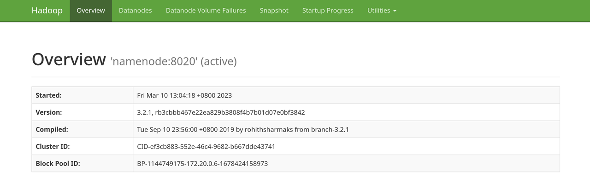
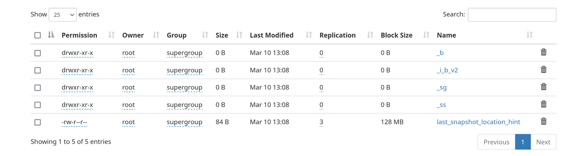

[Databend](https://github.com/datafuselabs/databend) is an open-source elastic and workload-aware modern cloud data warehouse that allows you to do blazing-fast data analytics on a variety of storage services.

This post shows you how to configure WebHDFS as a storage backend for Databend.

[WebHDFS](https://hadoop.apache.org/docs/current/hadoop-project-dist/hadoop-hdfs/WebHDFS.html) is a REST API that provides HTTP access to HDFS, a popular distributed file system in the big data ecosystem. By using WebHDFS, you can avoid the dependency on Java environment and specific jar packages that are required by native HDFS client.

## Step 1: Prepare HDFS Environment

Skip this step if you already have a deployed HDFS environment. Ensure that WebHDFS is enabled and accessible. Please note that in some public cloud platforms, managed HDFS services may not support WebHDFS.

If you don't have an HDFS environment, set up a local one for testing:

```bash
git clone https://github.com/PsiACE/databend-workshop.git
cd databend-workshop/webhdfs
docker-compose up
```

You can now access `http://127.0.0.1:9870`:



## Step 2: Deploy Databend

Before starting Databend, configure the settings `endpoint_url` and `root` in the file `databend-query.toml` as shown in the example below. Please note that you can also configure a delegation token for authentication.

```toml
[storage]
type = "webhdfs"
[storage.webhdfs]
endpoint_url = "http://127.0.0.1:9870"
# set your root
root = "/analyses/databend/storage"
# if your webhdfs needs authentication, uncomment and set with your value
# delegation = "<delegation-token>"
```

For more information about how to deploy Databend in standalone mode with WebHDFS, see [Deploying a Standalone Databend](https://databend.rs/doc/deploy/deploying-databend).

## Step 3: Test Functionality

Upload `books.csv` file from your directory to the specified path in HDFS.

```bash
curl -L -X PUT -T ../data/books.csv 'http://127.0.0.1:9870/webhdfs/v1/data-files/books.csv?op=CREATE&overwrite=true'
```

Upload the file `books.csv` to your HDFS:

```bash
$> mysql -uroot -h0.0.0.0 -P3307

mysql> DROP DATABASE IF EXISTS book_db;
Query OK, 0 rows affected (0.02 sec)

mysql> CREATE DATABASE book_db;
Query OK, 0 rows affected (0.02 sec)

mysql> use book_db;
Database changed

mysql> CREATE TABLE IF NOT EXISTS books (     title VARCHAR,     author VARCHAR,     date VARCHAR );
Query OK, 0 rows affected (0.02 sec)
```

Create a stage with your WebHDFS first, and then load data from the data file using the `COPY INTO` command:

```bash
mysql> CREATE STAGE IF NOT EXISTS whdfs URL='webhdfs://127.0.0.1:9870/data-files/' CONNECTION=(HTTPS='false');
Query OK, 0 rows affected (0.01 sec)

mysql> DESC STAGE whdfs;
+-------+------------+----------------------------------------------------------------------------------------------------------------------------------------+--------------------------------------------------------------------------------------------------------------------+-----------------------------------------------------------------------------------------------------------------------------------------------------------------------------------------------+-----------------+--------------------+---------+
| name  | stage_type | stage_params                                                                                                                           | copy_options                                                                                                       | file_format_options                                                                                                                                                                           | number_of_files | creator            | comment |
+-------+------------+----------------------------------------------------------------------------------------------------------------------------------------+--------------------------------------------------------------------------------------------------------------------+-----------------------------------------------------------------------------------------------------------------------------------------------------------------------------------------------+-----------------+--------------------+---------+
| whdfs | External   | StageParams { storage: Webhdfs(StorageWebhdfsConfig { endpoint_url: "http://127.0.0.1:9870", root: "/data-files/", delegation: "" }) } | CopyOptions { on_error: AbortNum(1), size_limit: 0, split_size: 0, purge: false, single: false, max_file_size: 0 } | FileFormatOptions { format: Parquet, skip_header: 0, field_delimiter: ",", record_delimiter: "\n", nan_display: "NaN", escape: "", compression: None, row_tag: "row", quote: "", name: None } |            NULL | 'root'@'127.0.0.1' |         |
+-------+------------+----------------------------------------------------------------------------------------------------------------------------------------+--------------------------------------------------------------------------------------------------------------------+-----------------------------------------------------------------------------------------------------------------------------------------------------------------------------------------------+-----------------+--------------------+---------+
1 row in set (0.01 sec)
Read 1 rows, 590.00 B in 0.002 sec., 414.67 rows/sec., 238.92 KiB/sec.

mysql> COPY INTO books FROM @whdfs FILES=('books.csv') file_format=(type=CSV field_delimiter=','  record_delimiter='\n' skip_header=0);
Query OK, 2 rows affected (1.83 sec)
```

After copying the data into the stage, you can run some SQL queries to check it. For example:

```sql
mysql> SELECT * FROM books;
+------------------------------+---------------------+------+
| title                        | author              | date |
+------------------------------+---------------------+------+
| Transaction Processing       | Jim Gray            | 1992 |
| Readings in Database Systems | Michael Stonebraker | 2004 |
+------------------------------+---------------------+------+
2 rows in set (0.02 sec)
Read 2 rows, 157.00 B in 0.015 sec., 137.21 rows/sec., 10.52 KiB/sec.
```

If you go to `127.0.0.1:9870` now, you can see the corresponding storage under `/analyses/databend/storage/`:



Congrats! You're all set.
