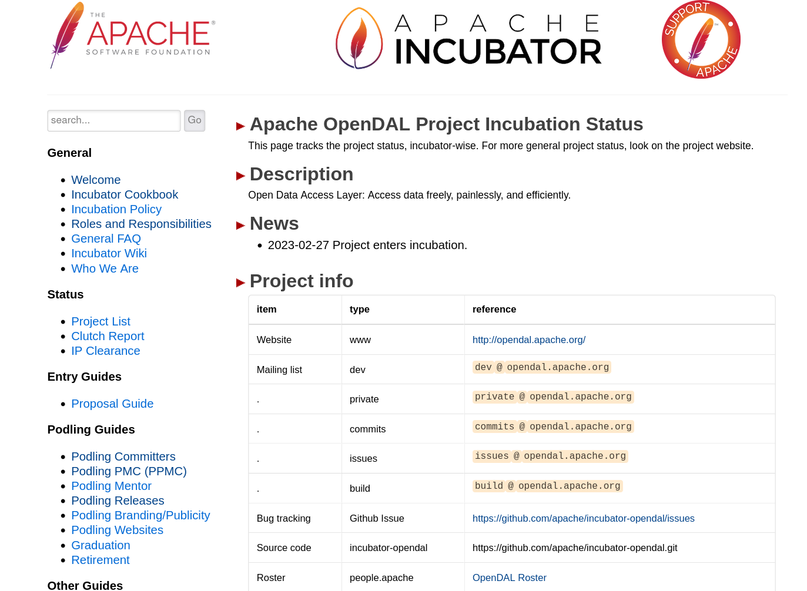
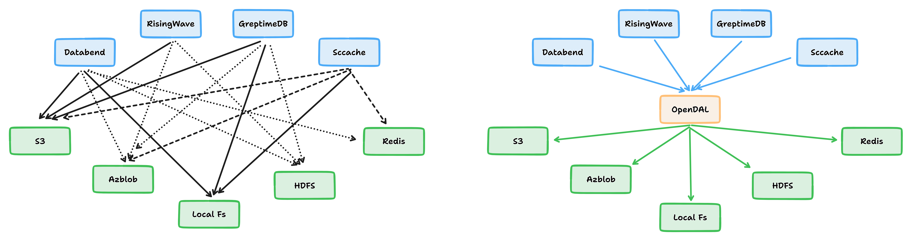

On February 27th, 2023, the [OpenDAL](https://github.com/apache/incubator-opendal) project achieved a milestone by winning the approval to join the incubator of the [Apache Software Foundation](https://www.apache.org/) (ASF), the world's leading open source software organization. On March 15th, the OpenDAL project was officially transferred to the Apache Software Foundation.

This is a significant moment for [Databend](https://github.com/datafuselabs/databend), as it means that OpenDAL's technology and vision have received wider recognition and support from the open source community.

> The Apache Incubator was established in October 2002 to provide a path for projects and codebases that aspire to become part of the Apache Software Foundation. Incubating projects need to follow ASF's governance and operational practices, and use ASF's infrastructure and resources. Incubating projects need to go through a series of stages and evaluations before they can graduate to become top-level projects (TLPs) of ASF.

_<https://incubator.apache.org/projects/opendal.html>_

## What is OpenDAL?

Data is one of the most important assets in the future, and data access is the key for realizing data value.

There are various kinds of storage services in the market, each with its own unique interfaces and features, which bring a lot of complexity and inconvenience to data access.

OpenDAL provides a unified, simple, efficient, reliable, and observable data access layer that allows developers to seamlessly use different storage services and enjoy the best user experience.

OpenDAL simplifies the process of interfacing different storage services, and provides features such as automatic retry, request optimization, and observability. With OpenDAL, developers can directly access a bunch of storage services, without having to understand and master the details of specific SDKs.

OpenDAL's features include but are not limited to:

- Support for dozens of storage services, including local file system, HDFS, S3, OSS, etc.
- Provide a unified data access interface, without worrying about the underlying storage details.
- Support for various common data operations, including `read`, `write`, `list`, etc.
- Support for automatic retry, request optimization, and observability mechanisms.
- Zero cost, directly mapped to API calls.
- Cross-language bindings: Python, Node.js, C (working on), etc.

## The Story about OpenDAL

### Born for Universal Data Access

OpenDAL originated from the vision of creating a universal, unified and user-friendly data access layer. It came into being in late 2021, initially as a component of the Databend project.

- On December 21, 2021, [Xuanwo](http://github.com/Xuanwo) embarked on the design and re-implementation of Databend's storage access layer, [dal2: Add basic operations of `read`, `write`, `stat`, `delete`](https://github.com/datafuselabs/databend/pull/3575).
- On December 27, 2021, the [proposal: Vision of Databend DAL](https://github.com/datafuselabs/databend/discussions/3662) was put forward and discussed. On December 29th, dal2's implementation was integrated into Databend.
- On February 14th 2022 , dal2 officially separated from Databend's code repository and became a standalone top-level project. It was formally renamed OpenDAL.

### From One to Multiple

Thanks to Xuanwo, [ClSlaid](https://github.com/ClSlaid) and many other contributors, OpenDAL quickly became a data access layer that supports mainstream storage services such as AWS S3 / Azure Blob / GCS / HDFS, and provided cross-cloud native storage and access support for Databend's `COPY INTO`, Stage, Storage.

[GreptimeDB](https://github.com/GreptimeTeam/greptimedb) was the first large-scale Rust database project to actively use OpenDAL after Databend. Later, with Xuanwo's efforts, [sccache](https://github.com/mozilla/sccache) under Mozilla also tried to use OpenDAL to take over the storage layer. In order to provide more comprehensive support, OpenDAL soon added support for GitHub Action Cache.

Then, [RisingWave](https://github.com/risingwavelabs/risingwave) and [Vector](https://github.com/vectordotdev/vector) were supported as well. The number of OpenDAL users started to grow. More and more users choose OpenDAL as their storage access layer.

### Sky's the Limit

OpenDAL has established a small community and formed a product matrix. In addition to the [Rust - opendal](https://crates.io/crates/opendal), it also provides [Python - opendal](https://pypi.org/project/opendal/) and [Nodejs - opendal](https://www.npmjs.com/package/opendal) bindings.

OpenDAL has released 99 versions since its open source, with 700+ Github stars, 349K downloads, and 48 developers. The project has been actively updated. We sincerely thank every contributor for their efforts and dedication.

Being a part of Apache incubator is an important milestone in OpenDAL's development history. We hope to leverage ASF's platform and resources to let OpenDAL focus on providing a neutral, vendor-free, painless, and efficient storage access layer, and better serve the developers.

We expect OpenDAL to be widely used in the following application scenarios:

- Data analysis: OpenDAL can help data analysts quickly read or write data from different storage services, and perform various format conversions and operations.
- Data science: OpenDAL can help data scientists easily get or save data from different storage services, and perform various preprocessing and postprocessing.
- Data engineering: OpenDAL can help data engineers efficiently build and manage data pipelines between different storage services, and perform various monitoring and tuning.

## Acknowledgements

**_From Xuanwo_**

Hello everyone, I'm Xuanwo, the Committer of Apache OpenDAL (Incubating).

The OpenDAL project embodies my personal dream. Now it has entered the Apache incubator with the collaboration of the community. I feel very happy at this moment. Thank you all contributors for your contributions, thank Databend Labs for your support, thank Champion tison for your guidance, thank Mentors ningjiang, wusheng, tedliu and hexiaoqiao for your advice.

Let us follow the guidance of Apache Way to build a community together and create value for users by providing free, painless and efficient data access experience!

## Join OpenDAL Community

We welcome developers and users who are interested in participating in OpenDAL project to join OpenDAL community and follow OpenDAL's latest news. You can get more information through the following ways:

- Visit OpenDAL official website: <https://opendal.apache.org>
- Explore OpenDAL GitHub repository: <https://github.com/apache/incubator-opendal>
- Join OpenDAL Discord channel: <https://discord.gg/XQy8yGR2dg>
- Subscribe to OpenDAL mailing list: <dev@opendal.apache.org>
