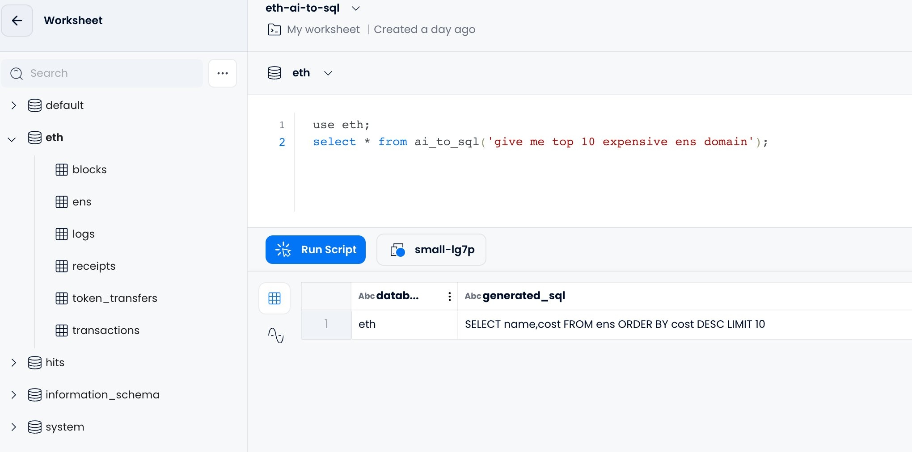

From Siri to ChatGPT, artificial intelligence has taken the world by storm in the past few years like magic. This benefits everyone by changing the way we live and work. We're getting used to giving instructions, in speech or by text, and expecting prompt replies. In one way or another, AI is becoming a loyal assistant or friend who is always offering help and will never turn you down. 

Recently we also successfully brought [OpenAI](https://openai.com/) into Databend to make the system smarter. Databend is rolling out a series of AI functions based on the latest OpenAI Codex model. This allows you to interact with Databend effortlessly and intelligently. 

You can now use your language to communicate with Databend using the function `AI_TO_SQL`. 

```sql
SELECT * FROM ai_to_sql('<natural-language-instruction>');
```
Through this function, instructions written in a natural language can be converted into SQL query statements that align with the table schema. For example, the function can be provided with a sentence like `Get all items that cost 10 dollars or less` as input and generate the corresponding SQL query `SELECT * FROM items WHERE price <= 10` as output. 


By the way, the function accepts multiple languages. For example, if you speak French, try `Obtenez tous les articles qui coûtent 10 dollars ou moins`. For more information about the function, refer to https://databend.rs/doc/sql-functions/ai-functions/ai-to-sql

Furthermore, the AI_TO_SQL function is now also available on [Databend Cloud](https://app.databend.com), and in case you do not provide an OpenAI API key, the platform will use a complimentary default key.



We believe this is not just an alternative way to write SQL statements. Integrating with AI will unlock more potentials to boost productivity and make Databend understand and serve you better. Databend plans to integrate AI with the Embedding Vector function in 2023, enabling users to convert certain columns into Vector format and store them as Vector data types. This will facilitate faster calculation of similarities between vectors, and advance Databend towards "Cloud Data Warehouse + Vector" capabilities.