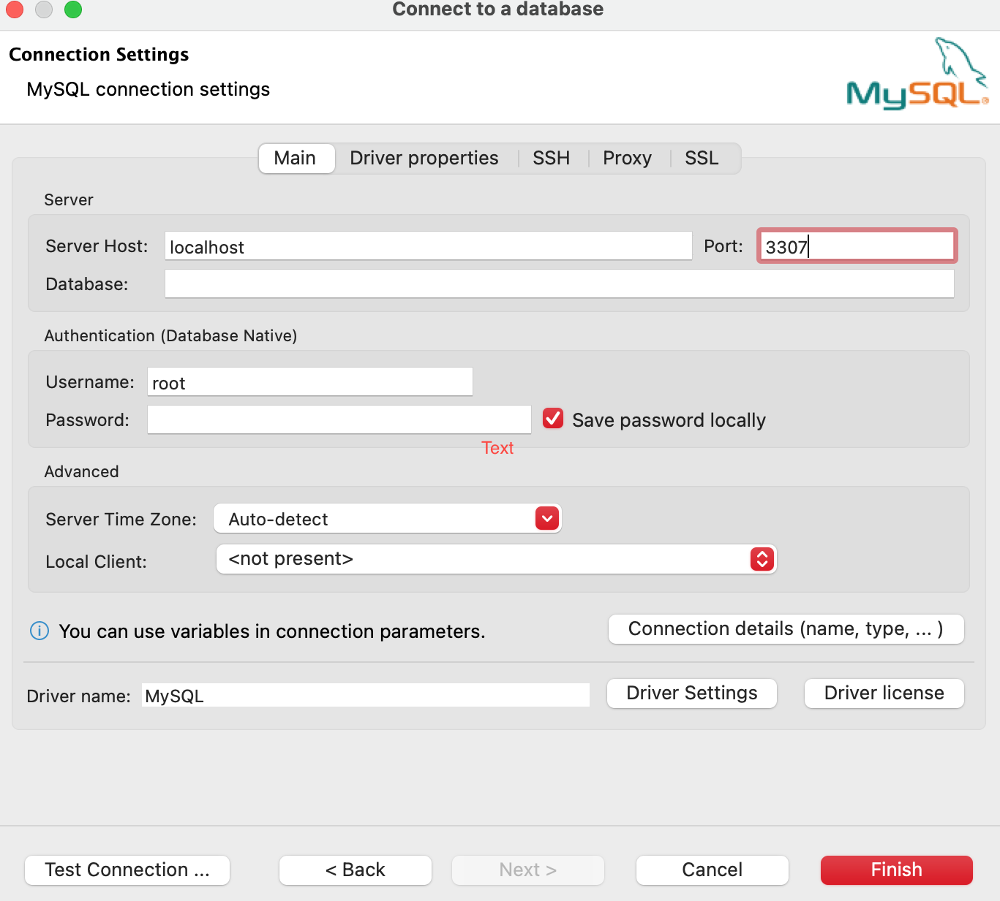
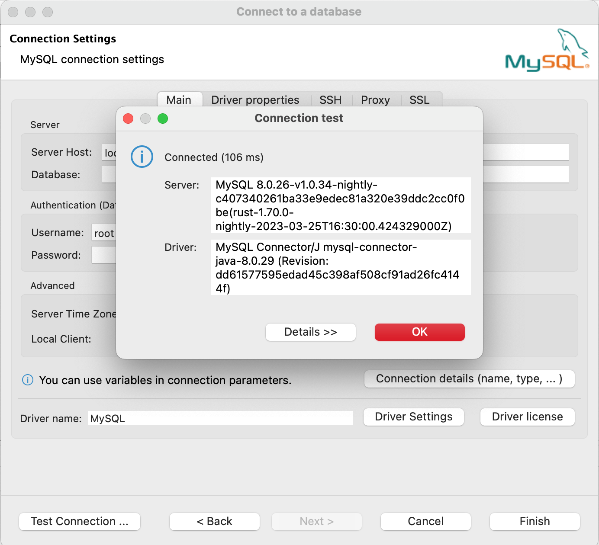
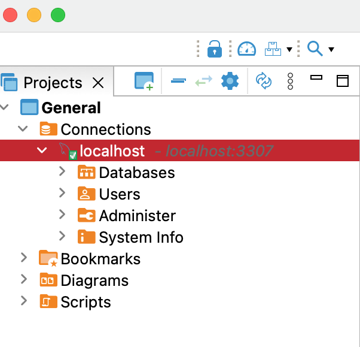

Early this month, I posted introducing bendsql, a CLI tool developed by the Databend team. The tool enables you to connect to your Databend instance, view your databases and tables, and even execute SQL queries in a command line window. For a more user-friendly experience, most of us prefer a GUI tool. 

[DBeaver](https://dbeaver.com) is one of the most popular data management tools. It is free, open-source, and supports connections to almost all databases. This post explains how to set up a Databend connection with DBeaver. If you're a new Databender and haven't used DBeaver before, I hope this post can get you started.

When you set up a connection in DBeaver, you need to select a database driver. To connect to Databend, you can use the pre-configured MySQL driver, or add the [Datebend JDBC driver](https://github.com/databendcloud/databend-jdbc) to DBeaver.

## Connecting with MySQL Driver

1. Open DBeaver, and select **Database** > **New Database Connection**.

    A database connection wizard opens up as follows:

2. Select **MySQL**, then click **Next**.

3. Change the port number to 3307, then set your host address. The settings on the image below connect to a local Databend:

4. Click **Test Connection** to check the connection.

All set! You can now find the connection in the Project Explorer. 

## Connecting with Datebend JDBC Driver

The [Datebend JDBC driver](https://github.com/databendcloud/databend-jdbc) is not a pre-configured database driver in DBeaver, so you have to add it to DBeaver using the Driver Manager before using it.

For how to add the driver to DBeaver, refer to https://databend.rs/doc/integrations/access-tool/jdbc#step-1-add-databend-jdbc-driver-to-dbeaver

After the driver is added to DBeaver, you can find and select it in the database connection wizard when creating a connection. The connection steps are the same as [Connecting with MySQL Driver](#connecting-with-mysql-driver), except that the port number is 8000, not 3307.