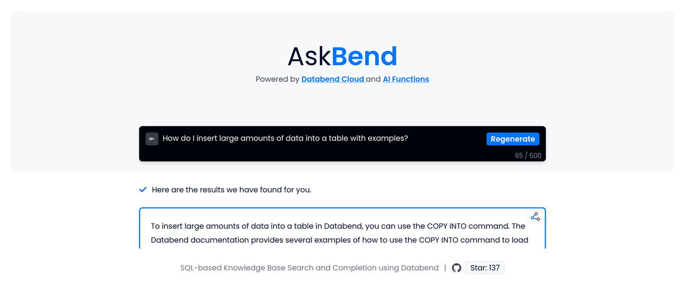

Databend v1.1.0 was officially released on April 14, 2023! This release marks the first major update of Databend since version 1.0. In comparison to v1.0.0, we have made over **1,616** commits, **505** optimizations and fixes, **2,069** changed files with **118,455** additions and **42,100** deletions in v1.1.0. We would like to thank all of our community partners who participated and ev*eryone who helped make Databend better!

In version 1.1.0, we introduced new data transformation capabilities to the `COPY INTO` command, allowing users to easily manipulate data during the loading process. Additionally, we have made significant enhancements to Databend, enabling it to run **all TPC-DS** queries successfully, along with other major performance optimizations and feature enhancements.

## New Features and Enhancements

Discover Databend's new features and find your perfect fit with a quick overview.

### COPY INTO now has ETL capabilities

COPY INTO is an important path for Databend to import data across multiple clouds. Now it also has basic data transformation capabilities, eliminating the need for temporary tables to store pre-transformed data. This includes support for column reordering, column omission, and transformation queries based on SELECT, enhancing its data manipulation capabilities.

```sql
CREATE TABLE my_table(id int, name string, time date);

COPY INTO my_table
FROM (SELECT t.id, t.name, to_date(t.timestamp) FROM @mystage t)
FILE_FORMAT = (type = parquet) PATTERN='.*parquet';
```

- [Docs - Load Data | Transforming Data During a Load](https://databend.rs/doc/load-data/data-load-transform)

### Full Support for TPC-DS Queries

Databend now supports all 99 TPC-DS queries!

TPC-DS is a decision support benchmark that includes multidimensional general application models for decision support systems. It models several universally applicable aspects of decision support systems, including queries and data maintenance. TPC-DS is widely used to measure the performance of decision support and analysis systems.

- [Blog - Benchmarking TPC-DS with Databend](https://databend.rs/blog/2023/04/11/benchmark-tpc-ds)

### REPLACE INTO

Databend now supports using REPLACE INTO statements to insert or update data.

This statement allows you to specify a conflict key to determine whether to insert a new row of data or update an existing row of data. If a row with the same conflict key already exists in the table, Databend will update this row with new data. Otherwise, new data will be added as a new record to the table.

You can use this statement to easily synchronize data from different sources or process duplicate records.

```sql
#> CREATE TABLE employees(id INT, name VARCHAR, salary INT);
#> REPLACE INTO employees (id, name, salary) ON (id) VALUES (1, 'John Doe', 50000);
#> SELECT  * FROM Employees;
+------+----------+--------+
| id   | name     | salary |
+------+----------+--------+
|    1 | John Doe |  50000 |
+------+----------+--------+
```

- [Docs - DML Commands | REPLACE](https://databend.rs/doc/sql-commands/dml/dml-replace)

### Window Functions

For each input row, a window function returns one output row that  depends on the specific row passed to the function and the values of the  other rows in the window. In analytical queries such as reports, window functions can elegantly express certain requirements and play an irreplaceable role.

```sql
-- use aggrerate window function
SELECT date, AVG(amount) over (partition by date)
FROM BookSold

June 21|544.0
June 21|544.0
June 22|454.5
June 22|454.5
June 23|643.0
June 23|643.0
```

Aggregate window functions can apply aggregate operations to each row of data in the window. All aggregate functions supported by Databend can be used as aggregate window functions.

- [Docs - SQL Functions | Window Functions](https://databend.rs/doc/sql-functions/window-functions/)

## Growing Ecosystem

Databend's ecosystem has been further improved. It's time to introduce Databend into your data insight workflow!

### Integration with Visualization Tools

Metabase, Redash and Grafana are all open source visualization tools that can query data from multiple sources and visualize it.

Databend now provides support for the above three tools. You can use Databend as a data source to easily build visualization dashboards and better understand and analyze your data.


- [Docs - Data Visualization | Metabase](https://databend.rs/doc/integrations/gui-tool/metabase)
- [Docs - Data Visualization | Redash](https://databend.rs/doc/integrations/gui-tool/redash)
- [Docs - Data Visualization | Connecting Databend With Grafana](https://databend.rs/doc/integrations/gui-tool/grafana)

### Support for Rust

In addition to supporting Python, Go, and Java, Databend now also has its own Rust driver. This means you can easily connect to Databend and execute SQL queries using Rust.

```rust
use databend_driver::new_connection;

let dsn = "databend://root:@localhost:8000/default?sslmode=disable";
let conn = new_connection(dsn).unwrap();

let sql_create = "CREATE TABLE books (
    title VARCHAR,
    author VARCHAR,
    date Date
);";
conn.exec(sql_create).await.unwrap();
```

- [crates.io - databend-driver](https://crates.io/crates/databend-driver)

## Databend x AI

When a cloud data warehouse intersects with cutting-edge AI models, what can you anticipate? Databend and OpenAI now work together to make you more productive.

### AI Functions

Databend now has a built-in practical AI function `ai_to_sql`, which supports converting natural language into SQL statements, making it easy to write high-quality SQL for complex analysis tasks.

```sql
SELECT * FROM ai_to_sql(
      'List the total amount spent by users from the USA who are older than 30 years, grouped by their names, along with the number of orders they made in 2022');
```

In addition, Databend also supports text embedding generation, similarity retrieval, text completion and other capabilities, one-stop easy to build SQL-based queries, AI-enabled productivity tools.

```sql
SELECT doc_id, text_content, cosine_distance(embedding, ai_embedding_vector('What is a subfield of artificial intelligence?')) AS distance
FROM embeddings
ORDER BY distance ASC
LIMIT 5;

SELECT ai_text_completion('Artificial intelligence is a fascinating field. What is a subfield of artificial intelligence?') AS completion;
```

- [Docs - SQL Functions | AI Functions](https://databend.rs/doc/sql-functions/ai-functions/)

### AskBend

Got a question? AskBend! Databend now has an AskBend knowledge base Q&A system that can answer questions about Databend.



P.S. AskBend is open source and powered by Databend Cloud and AI Functions. You can also create and deploy an intelligent assistant like AskBend with your own markdown files.

- [AskBend - asking for Databend documentation](https://ask.databend.rs/)
- [Github - datafuselabs/askbend](https://github.com/datafuselabs/askbend)

## Download Databend v1.1.0

If you are interested in Databend v1.1.0, go to <https://github.com/datafuselabs/databend/releases/tag/v1.1.0-nightly> to view all changelogs or download the release.

If you are using an old version of Databend, we recommend you upgrade to the latest version. For the upgrade process, please refer to:  <https://databend.rs/doc/operations/upgrade> .

## Feedback

If you need any help when working with the new release, submit an issue on GitHub Issue.

**GitHub:** <https://github.com/datafuselabs/databend/>
