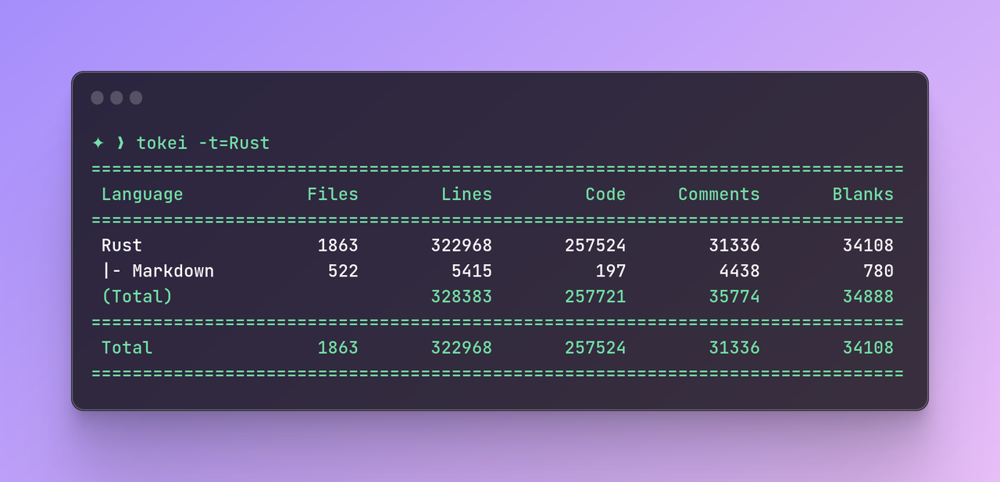
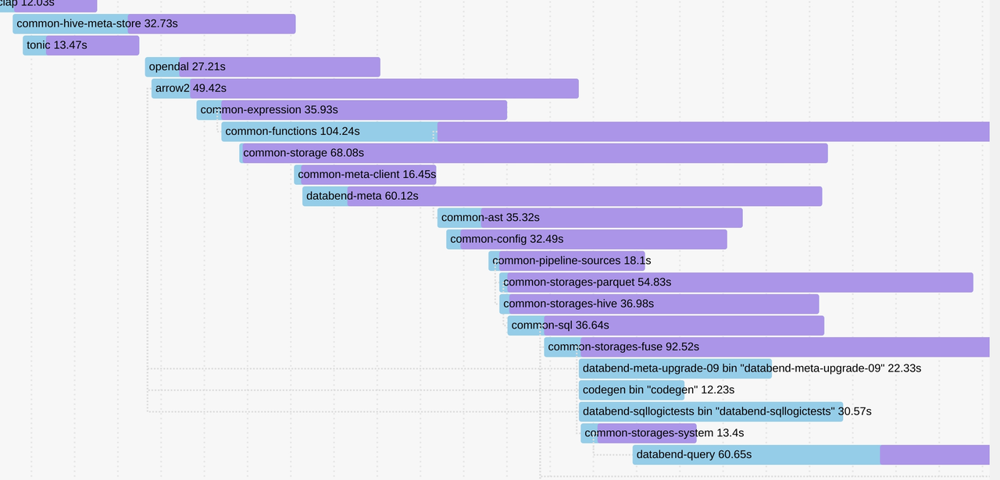
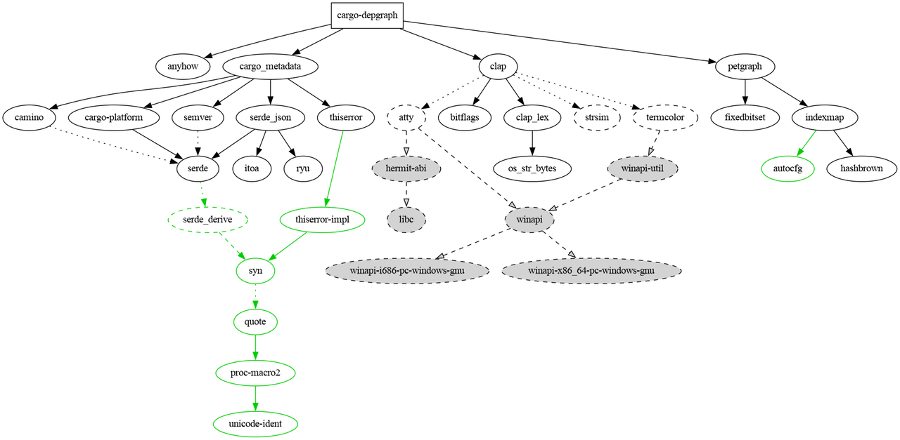
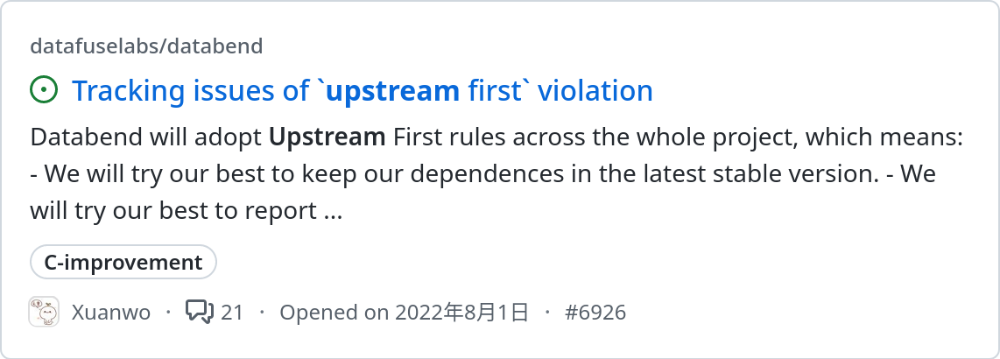
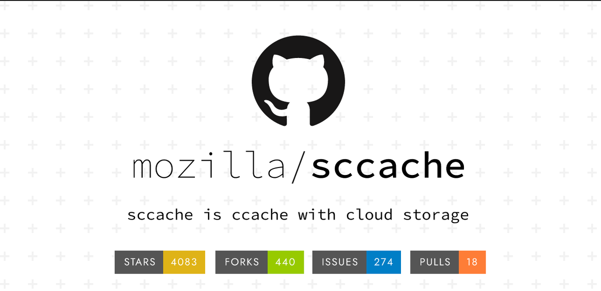
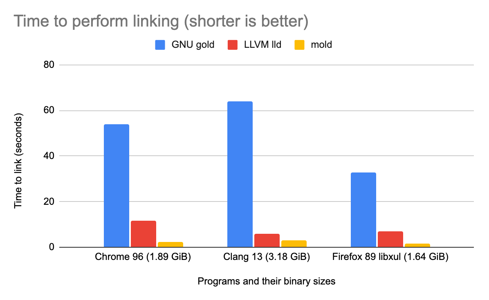
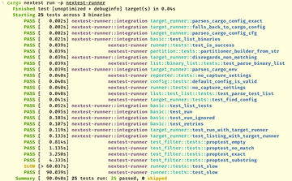
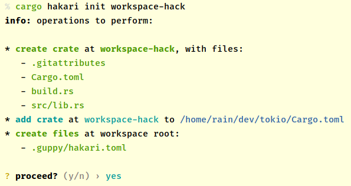

## Background

Compiling a medium to large Rust program is not a breeze due to the accumulation of complex project dependencies and boilerplate code. As noted in an article by Brian Anderson, "But Rust compile times are so, so bad." To maintain the stability of the build pipeline, it is necessary to introduce some techniques, but there is no "one-size-fits-all" solution. As the complexity of the workflow increases, it can become a loop.



The Databend team encountered similar challenges in compiling the product from hundreds of thousands of lines of code and in developing Docker-based build tools to enhance the developers/CI workflow. This article outlines the measures taken by the team to address the compilation challenges. If you're interested, check out these earlier posts to get a general idea of how we compile Databend:

- [Building Databend](​https://databend.rs/doc/contributing/building-from-source)
- [Optimizing Databend Binary Builds with Profile-guided Optimization](https://databend.rs/blog/profile-guided-optimization)

## Observability

While observability may not directly optimize compilation, it can aid in identifying where the bottleneck in the compilation process lies. This knowledge can help us determine the appropriate remedy to address the issue.

### `cargo build --timings`

This command visualizes the compilation process of Databend.

In Rust version 1.59 or earlier, you can use `cargo +nightly build -Ztimings`.

When opened in a web browser, the resulting HTML file shows a Gantt chart displaying the dependency relationships between crates in the program, the degree of parallelism in compilation, and the order of magnitude of code generation.

Based on the chart, we can decide whether to increase the number of code generation units for a particular module, or whether to further decompose to optimize the overall build process.



### `cargo-depgraph`

Although not commonly utilized, [cargo-depgraph](https://crates.io/crates/cargo-depgraph) can be employed to analyze dependency relationships. It helps to find potential optimization points, especially when you need to replace some similar dependencies or optimize the organization level of crates.



## Painless Optimization with Configuration Adjustments

The first step to improving the compilation experience does not involve directly altering the code. In many cases, only a few configuration adjustments are necessary to achieve significant improvement.

### Always Bump & Upstream First

As mentioned earlier, members of the Rust team were also early on aware that compile times are currently suboptimal. Therefore, the Databend team has plans to continually optimize for this issue. Improvements to compilation can often be found listed in the version update notes.

```toml
[toolchain]  
channel = "nightly-2023-03-10"  
components = ["rustfmt", "clippy", "rust-src", "miri"]
```

In addition, upstream projects may also improve unreasonable designs over time, and many of these improvements will ultimately be reflected in the impact on compilation.



One of the simplest ways to improve compile time is to always keep up with upstream changes and participate in ecosystem building with the philosophy of "upstream first". Databend has been a loyal follower of Rust nightly from the very beginning and provided [concise guidance](https://databend.rs/doc/contributing/routine-maintenance) for updating the toolchain and dependency relationships.

### Caching

Caching is a common compilation optimization technique. The idea is simple: store pre-built artifacts and reuse them the next time you build.

Initially, Databend employed the rust-cache action in CI to improve caching and achieved promising results. However, we had to manually update the key frequently to clear the cache and prevent misjudgment during the build.

Moreover, Rust's early support for incremental builds was terrible. For a while, we had to consider how to configure the pipeline to make some trade-offs.

Things have now changed.



[Sccache](https://github.com/mozilla/sccache) was revitalized and [OpenDAL](https://github.com/apache/incubator-opendal) was successfully integrated into it, becoming a crucial component that supports the Rust compilation cache ecosystem. Although it may not fully showcase its potential when building locally, it can still deliver great results in CI.

Another important change is that the Rust community realized that incremental compilation did not work well for CI. 

> CI builds often are closer to from-scratch builds, as changes are typically much bigger than from a local edit-compile cycle. For from-scratch builds, incremental adds an extra dependency-tracking overhead. It also significantly increases the amount of IO and the size of ./target, which make caching less effective. ([Fast Rust Builds](https://matklad.github.io/2021/09/04/fast-rust-builds.html))

## Remove Unused Dependencies

There is an interesting project in the Rust ecosystem known as [mTvare6/hello-world.rs](https://github.com/mTvare6/hello-world.rs), which demonstrates how to create a Rust project that is as poorly written as possible.


In particular: 

> in a few lines of code with few(1092) dependencies

Rust itself is not very good at automatically handling dependencies. It always downloads and compiles all dependencies in one go. Therefore, avoiding unnecessary introduction of dependencies becomes essential.

At first, Databend introduced [cargo-udeps](https://crates.io/crates/cargo-udeps) to check for unused dependencies. Most of the time it worked well. However, the major drawback was that every time dependencies were checked, it was equivalent to recompiling, which was undoubtedly inefficient in a CI environment.

[sundy-li](https://github.com/sundy-li) found another fast and easy to use tool called [cargo-machete](https://crates.io/crates/cargo-machete).


One significant benefit is that machete is fast as it only requires simple regular expressions to handle everything. Additionally, it supports automatic fixes, eliminating the need to search through files one by one and make manual edits.

However, machete is not a flawless tool. Due to its reliance on simple regular expression processing, it may not accurately identify some situations, but it is acceptable to ignore these instances. 

### Sparse Index

In order to determine which crates exist on [crates.io](https://crates.io/), Cargo needs to download and read the crates.io-index, which is located in a git repository hosted on GitHub and lists all versions of all crates.

However, as the index has grown significantly over time, the initial acquisition and updates have become painfully slow.

[RFC 2789](https://rust-lang.github.io/rfcs/2789-sparse-index.html) introduced a sparse index to improve Cargo's access to the index and is hosted at [https://index.crates.io/](https://index.crates.io/). 

```
[registries.crates-io]
protocol = "sparse" 
```

### Linker

If a project is relatively large and has many dependencies, it may waste a lot of time on linking. Few code changes may lead to a long compile time.

The simplest solution is to choose a faster linker than the default one.



Both lld and mold can improve link time. Databend eventually chose to use mold. In fact, the difference between the two linkers is not obvious for Databend. However, using mold has a potential benefit of saving some memory consumption during compilation.

```
[target.x86_64-unknown-linux-gnu] 
linker = "clang"  
rustflags = ["-C", "link-arg=-fuse-ld=/path/to/mold"]
```

### Compile-related Profile

First look at a common setting: `split-debuginfo` .

On macOS, rustc runs a tool called dsymutil which analyzes the binary and then builds a debug information directory. Configuring split-debuginfo skips dsymutil and speeds up the build. 

```
split-debuginfo = "unpacked"
```

Another example is `codegen-units`. 

Databend uses `codegen-units = 1` during compilation to enhance optimization and restrain the size of binaries. However, considering that some dependencies have particularly long code generation time during compilation (due to heavy macro dependencies), it is necessary to loosen some restrictions specifically. 

```
[profile.release.package]
arrow2 = { codegen-units = 4 }  
common-functions = { codegen-units = 16 }  
databend-query = { codegen-units = 4 }  
databend-binaries = { codegen-units = 4 }
```

## More Reasonable Code Structures

The above are some configuration adjustments. Next, we will explore the impact of refactoring on compile time. 

### Split into More Reasonable Crate Sizes

Refactoring a large all-in-one crate into smaller ones can be a highly beneficial strategy. It can not only improve parallelism, but also help Rust process code compilation faster by decoupling cross dependencies and circular dependencies.


Splitting crates also makes the boundaries of the code more apparent, which can result in easier maintenance.

### The Boundary between Unit Testing and Integration Testing

Common forms of unit test organization include maintaining `tests` mod in `src` and maintaining corresponding test code in the `tests` directory. 

Following the recommendation of [Delete Cargo Integration Tests](https://matklad.github.io/2021/02/27/delete-cargo-integration-tests.html), Databend has stripped all unit tests from the code very early and organized them in a similar form:

```
tests/  
  it/  
    main.rs  
    foo.rs  
    bar.rs  
```

This form avoids compiling each file under `tests/` into some separate binary files, thereby reducing the impact on compile time. 

In addition, Rust spends a lot of time processing tests mod and docs tests during compilation, especially docs tests which require building additional targets. After adopting the above organization form, they can be turned off in the configuration. 

However, this form is not elegant enough for us. All contents that need to be tested have to be set as public, which easily breaks the modular organization of the code. In-depth evaluation is recommended before use.

### More Elegant Testing Methods

We all know that the more code that needs to be compiled for unit tests, the slower the compilation time will be.

In addition, for Databend, a considerable part of the tests are end-to-end tests of input and output. If these tests are hardcoded in unit tests, much more format-related work needs to be added, which also requires substantially more effort to maintain.


The use of golden file testing and SQL logic testing in Databend replaces a large number of SQL query tests and output result checks embedded in unit tests, which further improves compile time.

## Cargo Snubs

### `cargo-nextest`

[cargo nextest](https://nexte.st/) makes testing as fast as lightning and provides finer statistics and elegant views. Many projects in the Rust community have greatly improved test pipeline time by introducing cargo nextest. 



However, Databend is currently unable to switch to this tool for two reasons. Firstly, configuration-related tests are not currently supported, so if you need to run cargo test separately, you have to recompile. Secondly, some tests related to timeouts are set to a specific execution time and must wait for completion.

### `cargo-hakari`

One typical example of improving the compilation of dependencies is workspace-hack, which places important public dependencies in a directory, avoiding the need to repeatedly recompile these dependencies. [cargo-hakari](https://crates.io/crates/cargo-hakari) can be used to automatically manage workspace-hack. 



Databend has a large number of common components, and the main binary programs are built on common components, implicitly in line with this optimization idea. In addition, with the support of dependencies inheritance in the workspace, the maintenance pressure has also been reduced.
