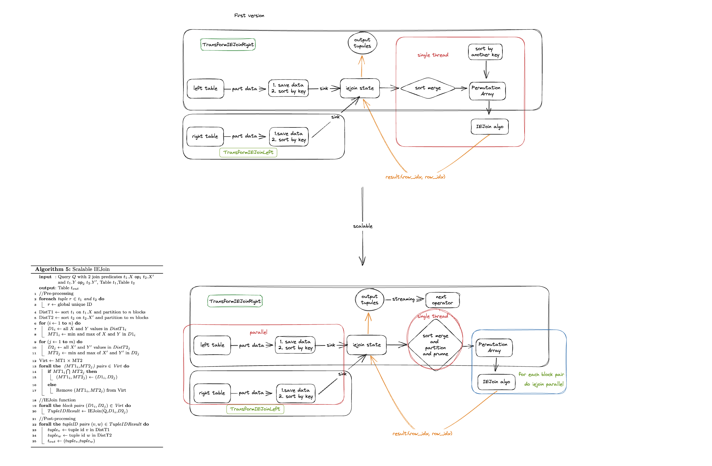

[Databend](https://github.com/datafuselabs/databend) is a modern cloud data warehouse, serving your massive-scale analytics needs at low cost and complexity. Open source alternative to Snowflake. Also available in the cloud: <https://app.databend.com> .

## What's On In Databend

Stay connected with the latest news about Databend.

### Native COS Support


Databend now offers native support for COS (Cloud Object Storage)! In comparison to the S3 compatibility provided by COS, our native support offers several advantages:

- Fixed Signing Errors: We have addressed signing errors that occurred in certain boundary cases by supporting COS's native signature algorithm.
- Enhanced Functionality: In the future, we plan to provide additional features such as append and other functions that are not supported by S3 but are available in COS.
- Integrated Authentication: With COS's native support, we can seamlessly integrate with Tencent Cloud's RAM (Resource Access Management), STS (Security Token Service), and other services. This integration enables us to provide authentication capabilities without relying on static keys.

If you are interested in learning more, please check out the resources listed below:

- [PR | feat(storage): Add native COS support](https://github.com/datafuselabs/databend/pull/11559)

### IEJoin

Databend has recently introduced support for IEJoin (Inequality Join), which is commonly used in various applications to join relational tables based on inequality conditions.



IEJoin is a fast algorithm specifically designed for inequality joins. The method sorts the columns that need to be joined into an array and uses a permutation array to indicate the position of tuples in one sorted array relative to another. Unlike sorted merge join, IEJoin utilizes space-efficient bit arrays that allow optimizations such as Bloom filter indexing for faster computation of join results.

If you are interested in learning more, please check out the resources listed below:

- [PR | feat: support IEJoin](https://github.com/datafuselabs/databend/pull/11412)
- [Paper | Lightning Fast and Space Efficient Inequality Joins](https://wayang.apache.org/assets/pdf/paper/iejoin.pdf)

## Code Corner

Discover some fascinating code snippets or projects that showcase our work or learning journey.

### Python Binding for Databend Rust Driver

PyO3 provides bindings between Rust and Python, along with a ready-to-use scaffolding tool called Maturin. With Maturin, it's easy to create Python extension modules based on Rust. 

This allows for code reorganization where performance-critical parts can be rewritten in Rust while the rest of the code can still use original Python code.

Based on PyO3, we can focus more conveniently on the Rust implementation logic itself without paying too much attention to FFI (Foreign Function Interface) and conversion details. This makes it possible to convert Rust into a Python module at a lower cost, and only maintain one set of code, greatly reducing maintenance costs. Databend is implementing Python bindings for Rust drivers, with the ultimate goal of replacing the current databend-py. 

Here are some code snippets that may help you understand how to use PyO3.

In `asyncio.rs`, a Struct called `AsyncDatabendDriver` can be defined as a Python class, and the Python module can be defined as `databend-driver`. 

```rust
/// `AsyncDatabendDriver` is the entry for all public async API
#[pyclass(module = "databend_driver")]
pub struct AsyncDatabendDriver(Connector);
```

The corresponding methods for `AsyncDatabendDriver` are implemented next, with underlying calls made to the methods implemented in Rust's Trait. For example, in this code snippet, we see that `exec` is used:

```rust
#[pymethods]
impl AsyncDatabendDriver {
    #[new]
    #[pyo3(signature = (dsn))]
    pub fn new(dsn: &str) -> PyResult<Self> {
        Ok(AsyncDatabendDriver(build_connector(dsn)?))
    }

    /// exec
    pub fn exec<'p>(&'p self, py: Python<'p>, sql: String) -> PyResult<&'p PyAny> {
        let this = self.0.clone();
        future_into_py(py, async move {
            let res = this.connector.exec(&sql).await.unwrap();
            Ok(res)
        })
    }
}
```

Finally, add `AsyncDatabendDriver` as a Python class in `lib.rs`:

```rust
#[pymodule]
fn _databend_driver(_py: Python, m: &PyModule) -> PyResult<()> {
    m.add_class::<AsyncDatabendDriver>()?;
    Ok(())
}
```

If you are interested in learning more, please check out the resources listed below:

- [PR | feat: Support python binding](https://github.com/datafuselabs/bendsql/pull/112)

## Highlights

We have also made these improvements to Databend that we hope you will find helpful:

- Added table lock for compact.
- Added `system.indexes` and `show indexes` command.
- Added support for azure openai api.
- Added new bitmap-related functions: `bitmap_and_count`, `bitmap_or_count`, `bitmap_xor_count`, `sub_bitmap`, `bitmap_subset_limit` and `bitmap_subset_in_range`.
- Added new window functions: `lag`, `lead`, `first_value`, `last_value` and `nth_value`.

## What's Up Next

We're always open to cutting-edge technologies and innovative ideas. You're more than welcome to join the community and bring them to Databend.

### Support for Custom Character Sets

A character set is a set of rules that defines how characters are represented, while collation determines the order of characters within the character set. Character sets are used to store data and can contain multiple collations.

It would be great to have support for custom character sets in the same way as MySQL, e.g., IBM z/OS uses EBCDIC encoding by default.

[Issue #11567 | Feature: Support custom character sets](https://github.com/datafuselabs/databend/issues/11567)

Please let us know if you're interested in contributing to this issue, or pick up a good first issue at <https://link.databend.rs/i-m-feeling-lucky> to get started.

## New Contributors

We always open arms to everyone and can't wait to see how you'll help our community grow and thrive.

* [@ZhengLin-Li](https://github.com/ZhengLin-li) made their first contribution in [#11563](https://github.com/datafuselabs/databend/pull/11563). Updated bendsql command.

## Changelog

You can check the changelog of Databend Nightly for details about our latest developments.

**Full Changelog**: <https://github.com/datafuselabs/databend/compare/v1.1.43-nightly...v1.1.51-nightly>
