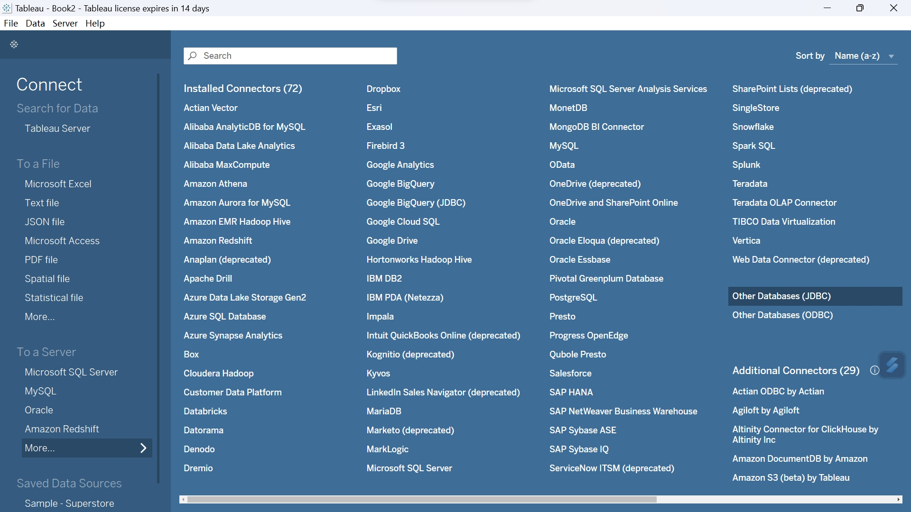
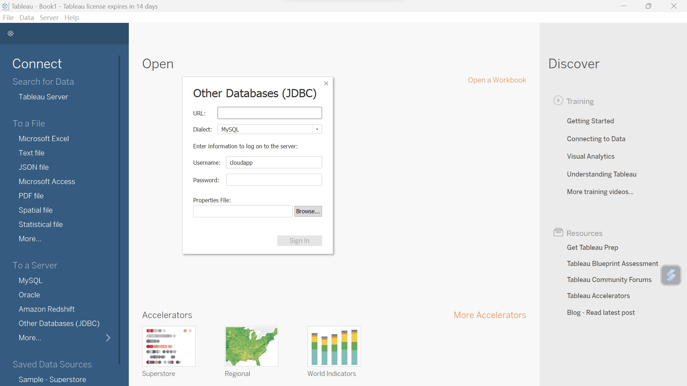
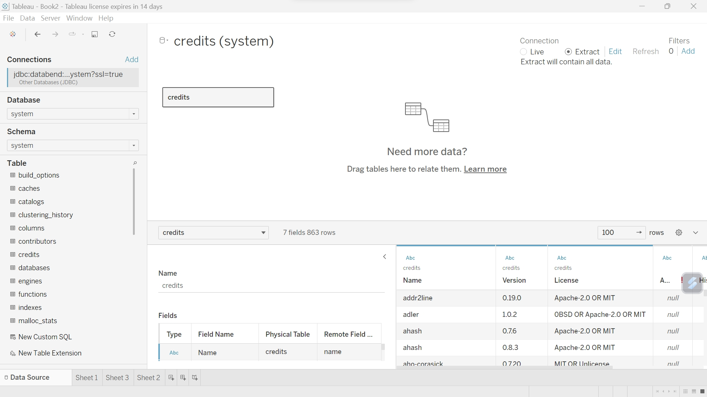
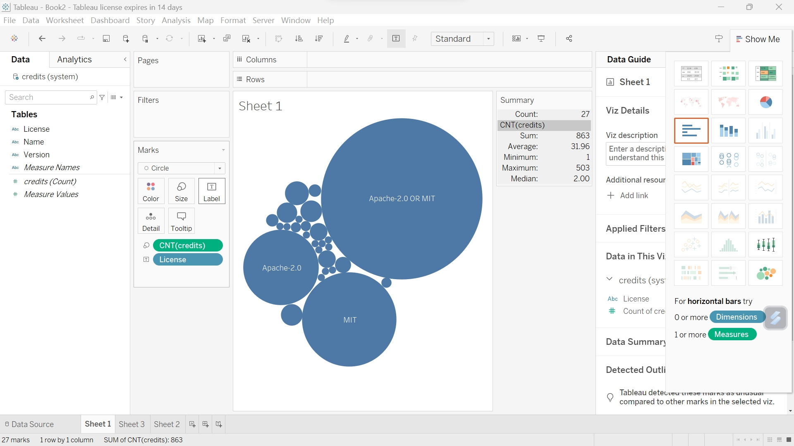

Tableau is a popular data visualization and business intelligence tool. It provides an intuitive, interactive way to explore, analyze, and present data, helping users better understand the meaning and insights of their data.

This tutorial helps users connect Databend for BI data analysis in Tableau.

## Databend JDBC

Tableau supports all data sources that implement the JDBC protocol, so you need to prepare the databend jdbc jar file first. You can compile it yourself or download it from the Maven repository as follows.

```bash
git clone https://github.com/databendcloud/databend-jdbc
cd databend-jdbc
mvn clean install -DskipTest
```

Then copy the compiled databend-jdbc.jar to Tableau's Driver directory:
- Windows: `C:\Program Files\Tableau\Drivers`
- Mac: `~/Library/Tableau/Drivers`
- Linux: `/opt/tableau/tableau_driver/jdbc`

## Connect to Tableau

Click **"Other Databases (JDBC)"** on the Tableau homepage.



JDBC URL: `jdbc:databend://{user}:{password}@{host}:{port}/database?ssl={status}`

Select MySQL as the dialect.



## Data Analysis

Select the database and table you want to operate on, and drag the table into the area.



This way, you can analyze and chart data in databend.



Please use version 2023.1.0 or above of Tableau, as other versions may have compatibility issues.

## Conclusion

The above is the basic process of using Tableau to analyze Databend data. For more information about connecting with JDBC in Tableau, please refer to [Other Databases (JDBC)](https://help.tableau.com/current/pro/desktop/en-us/examples_otherdatabases_jdbc.htm).