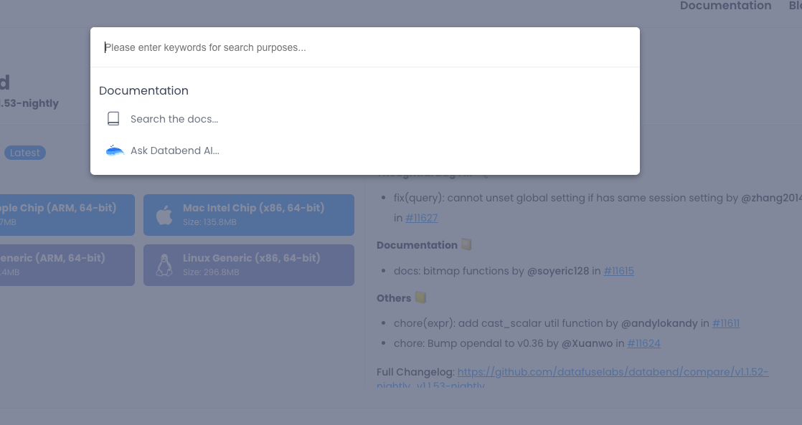
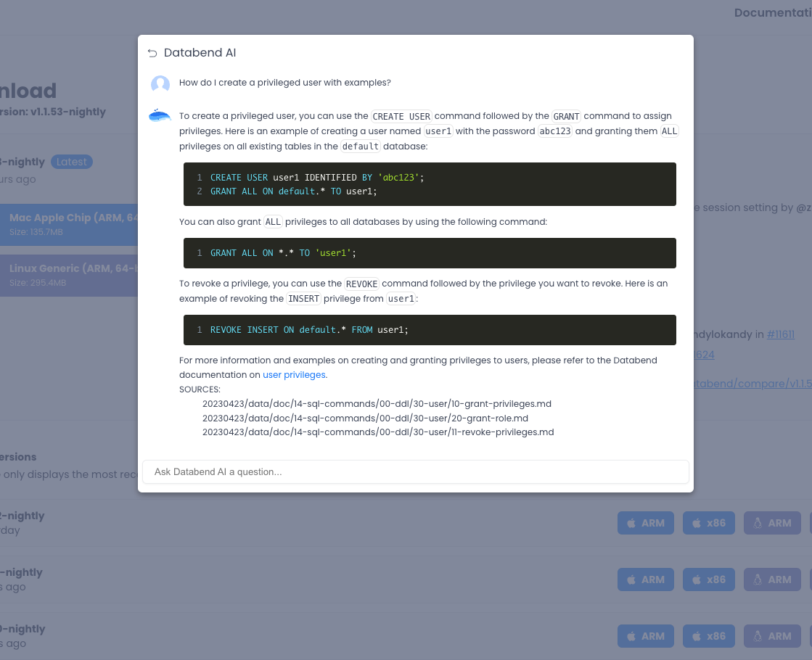

[Databend](https://github.com/datafuselabs/databend) is a modern cloud data warehouse, serving your massive-scale analytics needs at low cost and complexity. Open source alternative to Snowflake. Also available in the cloud: <https://app.databend.com> .

## What's On In Databend

Stay connected with the latest news about Databend.

### Virtual Column

One of the ways to optimize querying JSON internal fields is to create and generate virtual columns for these fields with the `CREATE VIRTUAL COLCUM` and `GENERATE VIRTUAL COLUMN` functions. This enables direct queries against the JSON internal fields through their corresponding virtual columns.

Databend now supports a series of syntax for creating, dropping, generating and altering virtual columns. Here is a simple example:

```sql
create table test (id int, val json);
insert into test values(1, '{"a":33,"b":44}'),(2, '{"a":55,"b":66}');
create virtual columns (val['a'], val['b']) for test;
generate virtual columns for test;

select val['a'], val['b'] from test;
+----------+----------+
| val['a'] | val['b'] |
+----------+----------+
| 33       | 44       |
| 55       | 66       |
+----------+----------+
```

If you are interested in learning more, please check out the resources listed below:

- [RFC | JSON Optimization - Virtual Column](https://databend.rs/doc/contributing/rfcs/json-optimization#virtual-column)
- [PR | feat(query): Support generate virtual columns](https://github.com/datafuselabs/databend/pull/11590)

## Code Corner

Discover some fascinating code snippets or projects that showcase our work or learning journey.

### Interactive Documents Powered by Askbend

Do you remember [AskBend](https://github.com/datafuselabs/askbend)? AskBend is a Rust project that spices up Databend by incorporating the power of OpenAI for a SQL-based knowledge base created from markdown files.

Now, we have integrated it into the official website of Databend, providing an interactive experience for document queries.





If you are interested in learning more, please check out the resources listed below:

- <https://databend.rs>
- [PR | feat(front search): Add AI searching](https://github.com/datafuselabs/databend/pull/11633)

## Highlights

We have also made these improvements to Databend that we hope you will find helpful:

- Added expression support to Windows function.
- Added range function & aliases in select list
- Added support for deduplication of insertion/mutation/update based on label.
- Added optimization hint support for COPY INTO.
- Read *[Docs | Deploying a Databend Cluster](https://databend.rs/doc/deploy/metasrv/metasrv-deploy)* to learn about the tips when manually deploying a Databend cluster.
- Read *[Docs | Data Types - BITMAP](https://databend.rs/doc/sql-reference/data-types/data-type-bitmap)* and *[Docs | Bitmap Functions](https://databend.rs/doc/sql-functions/bitmap-functions/)* to understand the usage of the BITMAP data type in Databend.

## What's Up Next

We're always open to cutting-edge technologies and innovative ideas. You're more than welcome to join the community and bring them to Databend.

### Optimize Sorting Algorithm with Loser Tree

Currently, Databend's sorting algorithm uses MergeSort based on a heap. 

There are three main algorithms for multiple merging: heap sort, winner tree, and loser tree. For all of them, each heap adjustment of the heap sorting requires comparison with the left and right child nodes. The number of comparisons is 2logN while the comparison times for winner tree and loser tree adjustments are logN.

The contrast lies in how the two trees operate. In a winner tree, each node must be compared with its sibling nodes and then update the parent node. On the other hand, in a loser tree, a node only requires comparison with the parent node, which leads to fewer instances of memory access.

[Issue #11604 | Feature: Update sort algorithm using Loser Tree](https://github.com/datafuselabs/databend/issues/11604)

Please let us know if you're interested in contributing to this issue, or pick up a good first issue at <https://link.databend.rs/i-m-feeling-lucky> to get started.

## Changelog

You can check the changelog of Databend Nightly for details about our latest developments.

**Full Changelog**: <https://github.com/datafuselabs/databend/compare/v1.1.51-nightly...v1.1.55-nightly>
