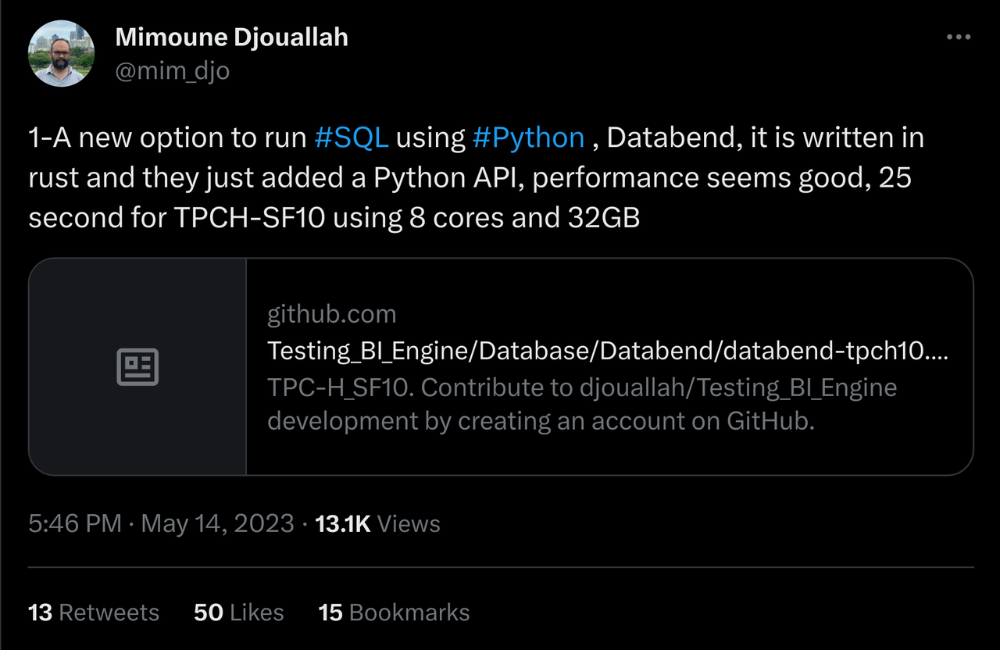
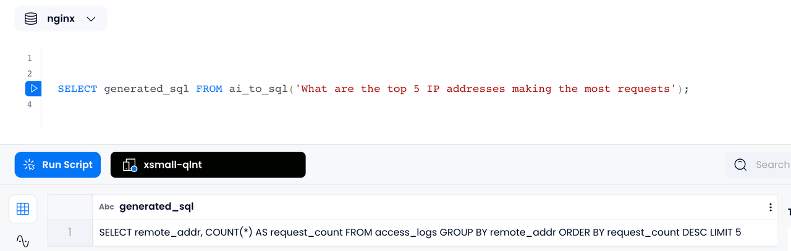
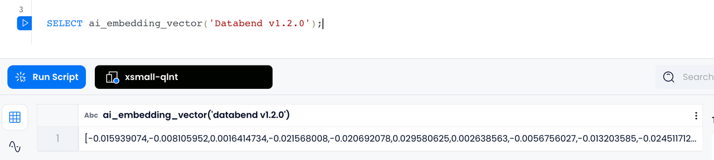
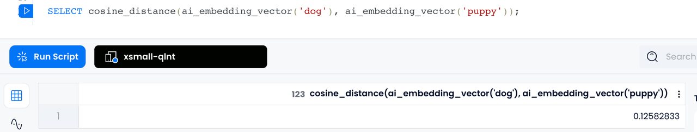
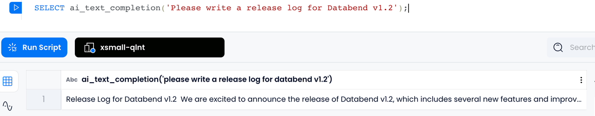
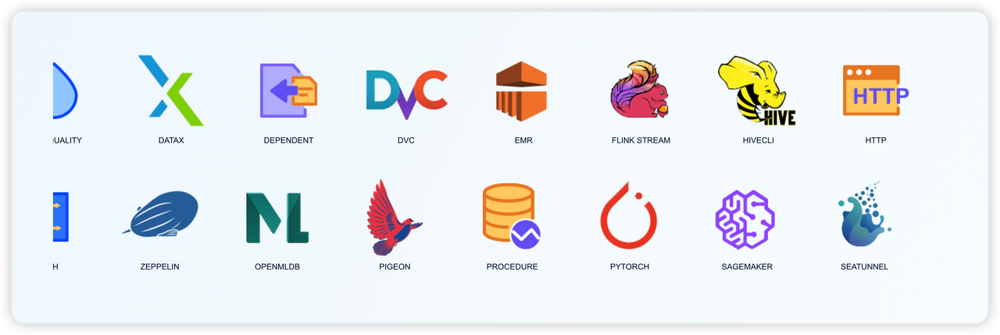
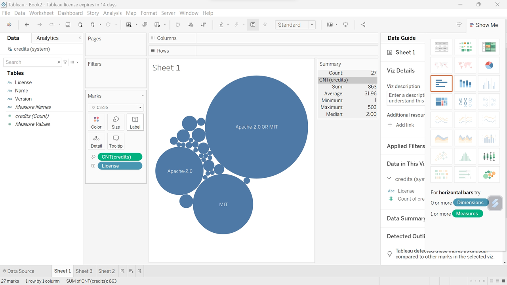

Databend v1.2.0 was officially released on June 29, 2023! In comparison to v1.1.0, we have made **600** optimizations and fixes, **3,083** changed files with **115,847** additions and **55,836** deletions in v1.2.0. We would like to thank all of our community partners who participated and everyone who helped make Databend better!

In version v1.2.0, Databend has added features such as **BITMAP data type** , **direct query of CSV/TSV/NDJSON files using column position** , and **AI Functions** . It has also **Designed and Implemented a New Hash Table** to significantly improve **Join** performance. This release brings Databend closer to realizing the vision of LakeHouse, allowing it to directly read and analyze CSV/TSV/NDJSON/Parquet format files stored on object storage. You can also perform ETL operations on these files within Databend for higher performance OLAP analysis.

In addition, we have designed and implemented enterprise features such as **Computed Columns**, **VACUUM TABLE**, and **Serverless Background Service**. If you are interested in these features, you can contact [Databend Support](https://www.databend.com/contact-us) for upgrade information or visit [Databend Cloud](http://app.databend.com/) for an instant experience.

## New Features and Enhancements

Discover Databend's new features and find your perfect fit with a quick overview.

### New Data Type: `BITMAP`

Databend has added support for the `BITMAP` datatype and implemented a series of related functions.

`BITMAP` is a type of compressed data structure that can be used to efficiently store and manipulate sets of boolean values. It has wide applications in data analysis and querying, providing fast set operations and aggregation capabilities. Common use cases include Distinct Count, Filtering & Selection, and Compressed Storage.

Our implementation of the BITMAP data type utilizes `RoaringTreemap`, which brings us improved performance and decreased memory usage in comparison to other bitmap implementations.

```sql
SELECT user_id, bitmap_count(page_visits) AS total_visits
FROM user_visits

+--------+------------+
|user_id |total_visits|
+--------+------------+
|       1|           4|
|       2|           3|
|       3|           4|
+--------+------------+
```

If you are interested in learning more, please check out the resources listed below:

- [Docs |  Data Types - BITMAP](https://databend.rs/doc/sql-reference/data-types/data-type-bitmap)
- [Docs | SQL Functions - Bitmap Functions](https://databend.rs/doc/sql-functions/bitmap-functions/)
- [Paper | Consistently faster and smaller compressed bitmaps with Roaring](https://arxiv.org/pdf/1603.06549.pdf)

### Direct Query of CSV/TSV/NDJSON Files Using Column Position

To query files such as CSV/TSV/NDJSON that do not have a schema, they have to be loaded into a table before querying. However, sometimes you do not know the specific details of the file in advance (such as how many columns a CSV file has), or they just want to make temporary queries.

To make it easier, Databend introduces **Column Position** and uses the `$N` syntax to represent the Nth column. All columns in CSV/TSV files are treated as `String` type. If the number of columns in a row is less than the column number used, it will be padded with an empty string. NDJSON files have only one column `$1`, which is of type `Variant` .

This capability allows you to selectively load specific columns using the COPY INTO command. Additionally, you can perform data conversion using functions during the loading process.

```sql
SELECT $1 FROM @my_stage (FILE_FORMAT=>'ndjson')

COPY INTO my_table FROM (SELECT TRIM($2) SELECT @my_stage t) FILE_FORMAT = (type = CSV)
```

If you are interested in learning more, please check out the resources listed below:

- [Docs | SELECT - Column Position](https://databend.rs/doc/sql-commands/query-syntax/query-select#column-position)

### New Hash Table: Improved Hash Join Performance

Initially, Databend's Hash table was specifically designed for aggregation operators. To further improve the Hash Join performance, we have designed and implemented a new Hash table optimized for Hash Join. Through parallelized design, Databend can now fully utilize computing resources while also becoming more precise in memory control, avoiding unnecessary memory overhead and significantly improving Hash Join performance.

Business intelligence analyst Mimoune Djouallah commented that Databend performs well and runs TPCH-SF10 in just 25 seconds under 8 cores and 32GB of memory. He also wrote a blog post titled *[Databend and the rise of Data warehouse as a code](https://datamonkeysite.com/2023/05/22/databend-and-the-rise-of-data-warehouse-as-a-code/)* .



If you are interested in learning more, please check out the resources listed below:

- [PR #11140 | feat(query): new hash table and parallel finalize for hash join](https://github.com/datafuselabs/databend/pull/11140)

### AI Functions

Databend introduced powerful AI capabilities in version v1.2.0, achieving seamless integration of Data and AI. We can use SQL to achieve:

1. Generating SQL with Natural Language
2. Embedding Vectorization
3. Similarity Calculation
4. Text Generation

#### Generating SQL from Natural Language

For example, if you ask a question in a nginx log database such as "What are the top 5 IP addresses making the most requests", using Databend's `AI_TO_SQL` function, you will get the corresponding SQL statement directly, which is very convenient.



#### Embedding Vectorization

With Databend's `AI_EMBEDDING_VECTOR` function, we can vectorize data and store it in Databend's `ARRAY` type. In this way, Databend actually becomes a vector database.



#### Similarity Calculation

Under vectorized representation, the similarity between two words, sentences or documents can be calculated. For example, suppose we have two words "dog" and "puppy" (or sentences), we first convert them into vectors `v1` and `v2` respectively, and then use cosine similarity to calculate their similarity.

```python
cos_sim = dot(v1, v2) / (norm(v1) * norm(v2))
```

The `COSINE_DISTANCE` function in Databend is an implementation of this formula.



#### Text Generation

Text Generation is very useful in many scenarios. Now you can use the `AI_TEXT_COMPLETION` function in SQL to complete it.



Currently, we have used the above Data + AI capabilities to perform Embedding processing on all documents of <https://databend.rs> and stored them in Databend, building an intelligent Q & A website: <https://ask.databend.rs> . On this website, you can ask any questions about Databend.

## Enterprise Features

New enterprise features are now available! Learn how Databend is driving more valuable data analysis services.

### Computed Columns

Computed columns are generated from other columns by a scalar expression. Using Computed Columns can store the data of the expression to speed up query speed and simplify some complex query expressions. There are two types of computed columns: stored and virtual.

- Stored Computed Columns generate data and store it on disk every time an insert or update occurs. The data does not need to be recalculated during queries, which can read data faster.
- Virtual Computed Columns do not store data and do not occupy additional space. They perform calculations in real-time during each query.

Computed Columns are particularly useful for reading JSON internal fields. By defining commonly used internal fields as computed columns, the time-consuming operation of extracting JSON data during each query can be greatly reduced. For example:

```sql
CREATE TABLE student (
    profile variant,
    id int64 null as (profile['id']::int64) stored,
    name string null as (profile['name']::string) stored
);

INSERT INTO student VALUES ('{"id":1, "name":"Jim", "age":20}'),('{"id":2, "name":"David", "age": 21}');

SELECT id, name FROM student;
+------+-------+
| id   | name  |
+------+-------+
|    1 | Jim   |
|    2 | David |
+------+-------+
```

If you are interested in learning more, please check out the resources listed below:

- [Docs | CREATE TABLE - COMPUTED COLUMNS](https://databend.rs/doc/sql-commands/ddl/table/ddl-create-table#computed-columns)

### VACUUM TABLE

The `VACUUM TABLE` command helps to optimize the system performance by freeing up storage space through the permanent removal of historical data files from a table. This includes:

- Snapshots associated with the table, as well as their relevant segments and blocks.
- Orphan files. Orphan files in Databend refer to snapshots, segments, and blocks that are no longer associated with the table. Orphan files might be generated from various operations and errors, such as during data backups and restores, and can take up valuable disk space and degrade the system performance over time.

If you are interested in learning more, please check out the resources listed below:

- [Docs | VACUUM TABLE](https://databend.rs/doc/sql-commands/ddl/table/vacuum-table)

### Serverless Background Service

Databend's internal storage `FuseTable` is similar to Apache Iceberg, a log-structured table that requires regular table compaction, re-clustering, and vacuuming to merge small data chunks. The process involves sorting the data by the cluster key or vacuuming unneeded branches.

To automate this process, different drivers are required, which increases the complexity of the infrastructure. And other services must be deployed and maintained to trigger driver events. To simplify this process, Databend has designed and implemented the **Serverless Background Service**, which can automatically discover tables that need to be compressed, reordered, and cleaned up after data is written without other services or manual user operations. It automatically triggers the corresponding table maintenance work, reduces the burden of user maintenance, improves the performance of table queries, and reduces the cost of data in object storage.

## Growing Ecosystem

Databend's ecosystem has been further improved. It's time to introduce Databend into your data insight workflow!

### Bind `databend` into Python

Databend now offers a Python binding that allows users to execute SQL queries against Databend using Python even without deploying a Databend instance.

To use this functionality, simply import `SessionContext` from `databend` module and create an instance of it:

```python
from databend import SessionContext

ctx = SessionContext()
df = ctx.sql("select number, number + 1, number::String as number_p_1 from numbers(8)")
```

The resulting DataFrame can be converted to PyArrow or Pandas format using the `to_py_arrow()` or `to_pandas()` methods respectively:

```python
df.to_pandas() # Or, df.to_py_arrow()
```

Feel free to integrate it with your data science workflow.

- [databend · PyPI](https://pypi.org/project/databend/)

### BendSQL - Databend Native Command Line Tool

BendSQL is a command-line tool specifically designed for Databend. It has been rewritten using Rust, which not only adds support for the REST API but also introduces Flight SQL functionality.

With BendSQL, you can easily and efficiently manage your databases, tables, and data, and perform a wide range of queries and operations with ease.

```sql
bendsql> select avg(number) from numbers(10);

SELECT
  avg(number)
FROM
  numbers(10);

┌───────────────────┐
│    avg(number)    │
│ Nullable(Float64) │
├───────────────────┤
│ 4.5               │
└───────────────────┘

1 row in 0.259 sec. Processed 10 rows, 10B (38.59 rows/s, 308B/s)
```

We are excited about the progress of BendSQL and look forward to sharing more updates with you! Feel free to try it out and give us feedback.

- [Docs | SQL Clients - BendSQL](https://databend.rs/doc/sql-clients/bendsql)
- [Crates.io - bendsql](https://crates.io/crates/bendsql)
- [Github - datafuselabs/databend-client | Rust](https://github.com/datafuselabs/databend-client)

### Data Integration & Business Intelligence

#### Apache DolphinScheduler

Apache DolphinScheduler is a distributed and extensible open-source workflow orchestration platform with powerful DAG visual interfaces. It supports 30+ task types, including Flink SQL, DataX, HiveCli, etc. It can execute millions of tasks with high concurrency, high throughput, low latency and stability. It can execute tasks in batches according to the planned time (special date range or special date list), and the workflow instance supports modification, rollback and re-execution without affecting the workflow template.



Apache DolphinScheduler now has added support for Databend as a data source. This enhancement enables you to leverage DolphinScheduler for managing DataX tasks and effortlessly load data from MySQL to Databend.

#### Apache Flink CDC

Databend now supports Apache Flink CDC (Change Data Capture), which allows you to capture and process real-time data changes from various sources using SQL-based queries. With Flink CDC, you can monitor and capture data modifications (inserts, updates, and deletes) happening in a database or streaming system and react to those changes in real-time.

[Databend's Flink SQL connector](https://github.com/databendcloud/flink-connector-databend) offers a connector that integrates Flink's stream processing capabilities with Databend. By configuring this connector, you can capture data changes from various databases as streams and load them into Databend for processing and analysis in real-time.

If you are interested in learning more, please check out the resources listed below:

- [Docs | Loading Data with Tools - Flink CDC](https://databend.rs/doc/load-data/load-db/flink-cdc)

#### Tableau

Tableau is a popular data visualization and business intelligence tool. It provides an intuitive, interactive way to explore, analyze, and present data, helping users better understand the meaning and insights of their data.

Refer to [Other Databases (JDBC)](https://help.tableau.com/current/pro/desktop/en-us/examples_otherdatabases_jdbc.htm) and add `databend-jdbc` to the Tableau driver path in order to analyze data from Databend using Tableau.



If you are interested in learning more, please check out the resources listed below:

- [Blog | Databend x Tableau](https://databend.rs/blog/2023-06-01-tableau)

## Download Databend v1.2.0

If you are interested in Databend v1.2.0, go to <https://github.com/datafuselabs/databend/releases/tag/v1.2.0-nightly> to view all changelogs or download the release.

If you are using an old version of Databend, we recommend you upgrade to the latest version. For the upgrade process, please refer to:  <https://databend.rs/doc/operations/upgrade> .

## Feedback

If you need help when working with the new release, submit an issue on GitHub Issues.

**GitHub:** <https://github.com/datafuselabs/databend/>
