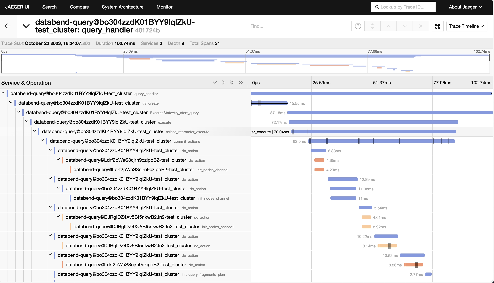

[Databend](https://github.com/datafuselabs/databend) is a modern cloud data warehouse, serving your massive-scale analytics needs at low cost and complexity. Open source alternative to Snowflake. Also available in the cloud: <https://app.databend.com> .

## What's New

Stay informed about the latest features of Databend.

### ATTACH TABLE READ_ONLY

Maintaining extensive resources for just a few large-scale queries can lead to high maintenance costs for enterprises. How about we combine local and cloud workloads, harness Databend Cloud's instant scaling computing capabilities, all while avoiding the additional storage costs associated with cloud usage?

Databend recently introduced the READ_ONLY argument to `ATTACH TABLE`**, allowing users with locally deployed Databend to share table data with Databend Cloud in read-only mode:

- All table data is shared in read-only mode.
- Changes made to a table, including data and schema changes, will be performed and tracked on the user's local platform.

```sql
ATTACH TABLE <target_table_name> '<source-table-data-URI>' CONNECTION=(<connection_parameters>) READ_ONLY
```

Adding the `READ_ONLY` parameter to the `ATTACH TABLE` statement will map the table data and schema using the latest snapshot hint file stored at the specified source table data URI, and the target table can only be accessed in a read-only manner.

Please [contact the Databend team](https://www.databend.com/contact-us) if you would like to learn more, or check out the resources below:

- [PR #13403 | feat: READ_ONLY attach table](https://github.com/datafuselabs/databend/pull/13403)
- [Docs | ATTACH TABLE](https://databend.rs/doc/sql-commands/ddl/table/attach-table)

## Code Corner

Discover some fascinating code snippets or projects that showcase our work or learning journey.

### Replacing Jaeger Agent with OpenTelemetry Collector

Jaeger is an open source, end-to-end distributed tracing tool originating from Uber that helps monitor and troubleshoot microservices-based applications.

Due to port changes in the latest Jaeger All-in-One Docker image, the original distributed tracing capabilities became unavailable. Upstream is also considering deprecating [opentelemetry-jaeger](https://crates.io/crates/opentelemetry-jaeger) and encouraging users to migrate to [opentelemetry-otlp](https://crates.io/crates/opentelemetry-otlp), see [Consider deprecating opentelemetry-jaeger #995](https://github.com/open-telemetry/opentelemetry-rust/issues/995).

We refactored the original trace export mechanism using `opentelemetry-otlp` while fixing the availability of distributed tracing capabilities. The corresponding environment variable also changes to `DATABEND_OTEL_EXPORTER_OTLP_ENDPOINT`.



If you are interested in learning more, please check out the resources below:

- [Docs | Monitor - Jaeger](https://databend.rs/doc/monitor/tools/jaeger)
- [PR #13381 | feat: migrate tracing reporter from jaeger agent to opentelemetry collector (otlp)](https://github.com/datafuselabs/databend/pull/13381/)

## Highlights

We have also made these improvements to Databend that we hope you will find helpful:

- Added new aggregate function `quantile_tdigest_weighted`.
- Recluster supports distributed execution.
- `DELETE` supports table aliases.
- SQLsmith supports `REPLACE INTO` and `HINT`. Read the latest blog [Leveraging Randomized Testing with SQLsmith to Uncover Bugs](https://databend.rs/blog/2023-10-24-sqlsmith-hero) to learn about Databend's SQLsmith design.
- Added JSON operators `->`, `->>`, `#>` and `#>>`. See [Docs | JSON Operators](https://databend.rs/doc/sql-functions/json-operators/) for details.

## What's Up Next

We're always open to cutting-edge technologies and innovative ideas. You're more than welcome to join the community and bring them to Databend.

### Support for Defining CONNECTION

To more elegantly handle the mapping between role access control models in compute cluster instances and storage services, Databend plans to provide the ability to define and manage `CONNECTION`s.

**CONNECTION** can hold identity credentials and access management (IAM) entities generated by external storage services, providing convenient and consistent access control experiences. Introducing **CONNECTION** can also simplify complex statements that includes a connection to object storages, such as creating an external stage, etc.


```sql
CREATE CONNECTION [IF NOT EXISTS]
    ENDPOINT_URL = 'http://localhost:9000',
    ACCESS_KEY_ID = 'ROOTUSER',
    SECRET_ACCESS_KEY = 'CHANGEME123'
...
```

[Issue #13489 | feat: CREATE CONNECTION](https://github.com/datafuselabs/databend/issues/13489)

Please let us know if you're interested in contributing to this feature, or pick up a good first issue at <https://link.databend.rs/i-m-feeling-lucky> to get started.

## Changelog

You can check the changelog of Databend Nightly for details about our latest developments.

**Full Changelog**: <https://github.com/datafuselabs/databend/compare/v1.2.174-nightly...v1.2.183-nightly>
